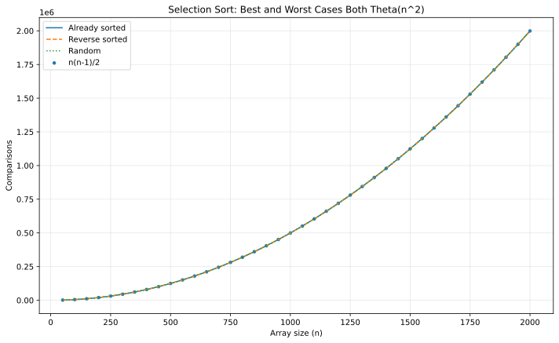

# Q6 - Loop Invariants in Selection Sort

The algorithm described in the sheet is **selection sort**.

## Pseudocode

```text
SELECTION-SORT(A, n)
    for i = 1 to n - 1
        minIndex = i
        for j = i + 1 to n
            if A[j] < A[minIndex]
                minIndex = j
        exchange A[i] with A[minIndex]
```

## Loop invariant

At the **start** of outer-loop iteration `i`, the prefix before `i` contains the smallest elements of the original array, in sorted order. Equivalently, in 1-based indexing, `A[1..i-1]` contains the `(i-1)` smallest original elements in their final sorted positions.

### 1. Initialization

Before the first iteration, the prefix `A[1..0]` is empty. An empty prefix is trivially sorted and contains the zero smallest elements, so the invariant holds.

### 2. Maintenance

The inner loop finds the minimum element of `A[i..n]`. Swapping it into `A[i]` places the next-smallest remaining element immediately after the already sorted prefix. Therefore `A[1..i]` now contains the `i` smallest elements in sorted order, so the invariant is preserved for the next iteration.

### 3. Termination

The outer loop stops after position `n-1` is fixed. At that point the first `n-1` positions contain the `n-1` smallest elements in sorted order. The only remaining element must be the largest, so the whole array is sorted.

## Why only n - 1 iterations?

Once the first `n-1` positions are correct, exactly one element remains. There is nowhere else for it to go, so it is automatically in its correct final position. A final `n`th selection would do no useful work.

## Running time

The number of element comparisons is independent of the initial order:

`(n-1) + (n-2) + ... + 1 = n(n-1)/2`.

Therefore:

- Worst case: `Theta(n^2)`
- Best case: `Theta(n^2)` as well

The best case may use fewer swaps, but it does **not** use fewer comparisons, so its asymptotic running time is not better.

## Experimental validation

The generator runs selection sort on already-sorted, reverse-sorted, and pseudo-random arrays. All three comparison curves coincide with `n(n-1)/2`.



## Representative run

```text
Input:
6
64 25 12 22 11 90

Output:
11 12 22 25 64 90
Comparisons = 15
Expected n(n-1)/2 = 15
Swaps = 3
Correctness check: PASSED
```

## Files

| File | Purpose |
|---|---|
| `selection_sort_invariant.c` | Interactive selection sort with comparison/swap counters |
| `selection_sort_generate_data.c` | Best/worst/random comparison experiment |
| `selection_sort_plot.gp` | GNUPlot script |
| `selection_sort_complexity.svg` | Final validation graph |

## Build

```bash
gcc -std=c17 -O2 -Wall -Wextra -pedantic selection_sort_invariant.c -o selection_sort_invariant
gcc -std=c17 -O2 -Wall -Wextra -pedantic selection_sort_generate_data.c -o selection_sort_generate_data
./selection_sort_generate_data
gnuplot selection_sort_plot.gp
```

[Back to Lab 03](../README.md)
