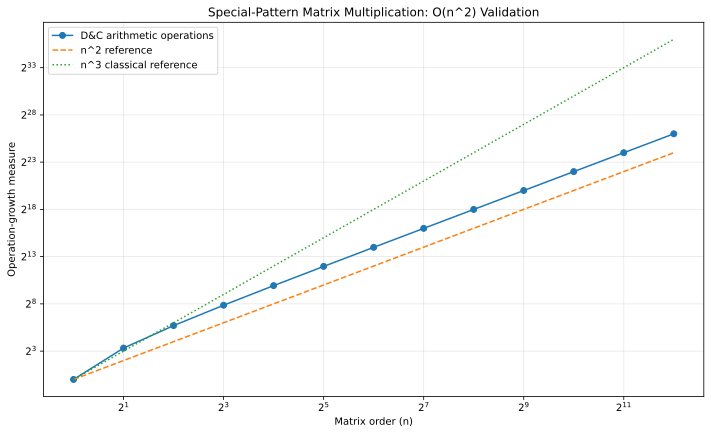

# Q5 - Multiply Special-Pattern Square Matrices in O(n^2)

The matrices recursively have the form

```text
    [ M1  M2 ]
M = [        ]
    [ M2  M1 ]
```

with `n = 2^k`.

## The key two-product trick

Let

```text
    [ A1 A2 ]        [ B1 B2 ]
A = [       ],   B = [       ].
    [ A2 A1 ]        [ B2 B1 ]
```

Their product must have the same structure:

```text
    [ C1 C2 ]
C = [       ]
    [ C2 C1 ]
```

where

```text
C1 = A1B1 + A2B2
C2 = A1B2 + A2B1
```

Computing those formulas directly would need **four** recursive products. Instead define

```text
P = (A1 + A2)(B1 + B2) = C1 + C2
Q = (A1 - A2)(B1 - B2) = C1 - C2
```

Therefore

```text
C1 = (P + Q) / 2
C2 = (P - Q) / 2
```

Only **two** recursive multiplications remain.

Because sums and differences of matrices with the required recursive structure retain the same structure, the same algorithm can be applied recursively.

## Complexity proof

At size `n`:

- 2 recursive multiplications of size `n/2`;
- `Theta(n^2)` additions, subtractions, divisions, and block assembly.

Thus

`T(n) = 2T(n/2) + Theta(n^2)`.

By the Master Theorem, the `Theta(n^2)` combine work dominates, so

**`T(n) = Theta(n^2)`**.

The implementation validates the result against ordinary `Theta(n^3)` matrix multiplication.



## Representative run

```text
n = 4
Validation against classical multiplication: PASSED
Recursive scalar multiplications = 4
Scalar additions/subtractions = 36
Divisions by 2 = 12
Recurrence: T(n) = 2T(n/2) + Theta(n^2) = Theta(n^2).
```

## Files

| File | Purpose |
|---|---|
| `special_matrix_dc.c` | Pattern validation, O(n^2) D&C product, classical cross-check |
| `special_matrix_generate_data.c` | Generates operation-growth data from the recurrence |
| `special_matrix_plot.gp` | GNUPlot script |
| `special_matrix_complexity.svg` | O(n^2) validation graph |

## Build

```bash
gcc -std=c17 -O2 -Wall -Wextra -pedantic special_matrix_dc.c -o special_matrix_dc
gcc -std=c17 -O2 -Wall -Wextra -pedantic special_matrix_generate_data.c -o special_matrix_generate_data
./special_matrix_generate_data
gnuplot special_matrix_plot.gp
```

[Back to Lab 03](../README.md)
