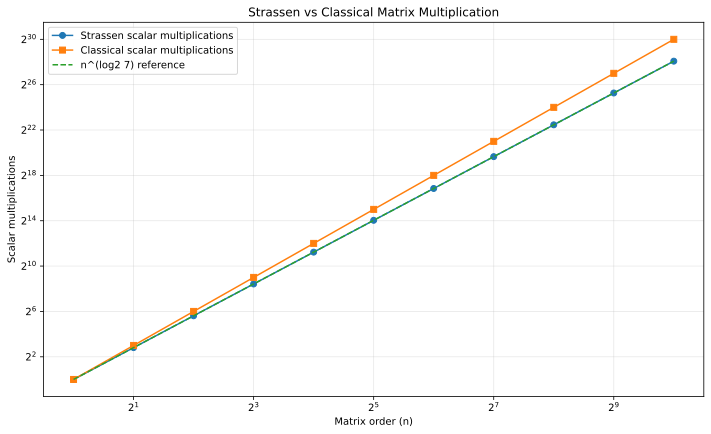

# Q4 - Matrix Multiplication using Strassen's Method

> Multiply two square matrices using Strassen's divide-and-conquer algorithm.

## Strassen's seven products

After splitting each matrix into four blocks, the implementation computes only seven recursive matrix products instead of the eight used by ordinary block multiplication:

```text
M1 = (A11 + A22)(B11 + B22)
M2 = (A21 + A22)B11
M3 = A11(B12 - B22)
M4 = A22(B21 - B11)
M5 = (A11 + A12)B22
M6 = (A21 - A11)(B11 + B12)
M7 = (A12 - A22)(B21 + B22)
```

Then:

```text
C11 = M1 + M4 - M5 + M7
C12 = M3 + M5
C21 = M2 + M4
C22 = M1 - M2 + M3 + M6
```

For a non-power-of-two input order, the code pads both matrices with zeros to the next power of two and prints only the original `n x n` result.

## Correctness validation

The program also computes the same product using the classical triple loop and checks every output entry.

## Complexity

`T(n) = 7T(n/2) + Theta(n^2)`

By the Master Theorem:

`T(n) = Theta(n^(log2 7)) ~= Theta(n^2.8074)`.



## Representative run

```text
Input matrices:
A =
1 2
3 4

B =
5 6
7 8

Product:
19 22
43 50

Validation against classical multiplication: PASSED
Strassen scalar multiplications: 7
Strassen scalar additions/subtractions: 18
```

## Files

| File | Purpose |
|---|---|
| `strassen.c` | Full Strassen implementation, padding, and correctness check |
| `strassen_generate_data.c` | Generates scalar-multiplication growth data |
| `strassen_plot.gp` | GNUPlot script |
| `strassen_growth.svg` | Strassen vs classical growth plot |

## Build

```bash
gcc -std=c17 -O2 -Wall -Wextra -pedantic strassen.c -o strassen
gcc -std=c17 -O2 -Wall -Wextra -pedantic strassen_generate_data.c -lm -o strassen_generate_data
./strassen_generate_data
gnuplot strassen_plot.gp
```

[Back to Lab 03](../README.md)
