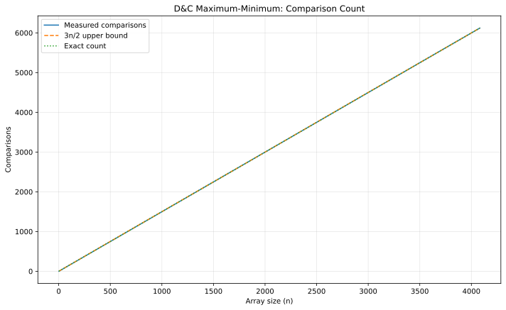

# Q3 - Maximum and Minimum using Divide and Conquer

> Find both extrema while keeping the comparison count within the required `3n/2` bound.

## Algorithm

The implementation first compares the elements in **pairs**. From each pair, the smaller element can still be the global minimum and the larger element can still be the global maximum. This costs one comparison per pair.

It then uses divide and conquer twice:

- recursively find the minimum among all pairwise smaller candidates;
- recursively find the maximum among all pairwise larger candidates.

If `n` is odd, the one unpaired element is compared once with the final minimum and once with the final maximum.

For even `n`:

`C(n) = n/2 + (n/2 - 1) + (n/2 - 1) = 3n/2 - 2`.

For odd `n > 1`:

`C(n) = (n-1)/2 + 2((n-1)/2 - 1) + 2 = 3(n-1)/2`.

Both are at most `3n/2`, so the required bound holds for **every positive n**, not only powers of two.

## Validation

The program counts every comparison used by the algorithm and prints the bound. The generator checks both odd and even sizes and plots the measured count against the `3n/2` upper bound and the exact formula used by this implementation.



## Representative run

```text
Input:
8
7 2 9 -1 5 4 10 3

Output:
Minimum = -1
Maximum = 10
Comparisons = 10
Required upper bound 3n/2 = 12.0
Validation: comparison bound satisfied.
```

## Complexity

- Time: `Theta(n)`
- Recursion depth: `Theta(log n)`
- Comparisons: `3n/2 - 2` for even `n`; `3(n-1)/2` for odd `n > 1`

## Files

| File | Purpose |
|---|---|
| `max_min_dc.c` | Interactive D&C implementation |
| `max_min_generate_data.c` | Comparison-count generator |
| `max_min_plot.gp` | GNUPlot script |
| `max_min_comparisons.svg` | Final validation graph |

## Build

```bash
gcc -std=c17 -O2 -Wall -Wextra -pedantic max_min_dc.c -o max_min_dc
gcc -std=c17 -O2 -Wall -Wextra -pedantic max_min_generate_data.c -o max_min_generate_data
./max_min_generate_data
gnuplot max_min_plot.gp
```

[Back to Lab 03](../README.md)
