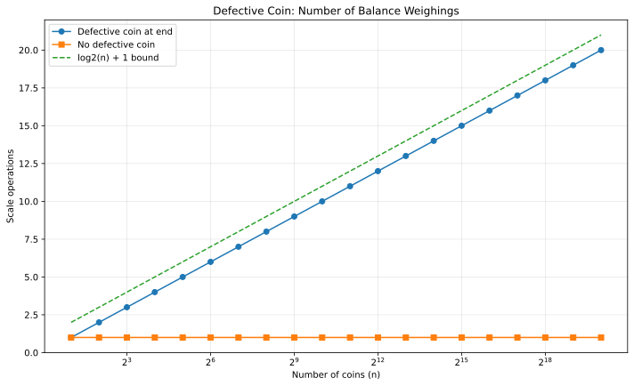

# Q2 - Search the Defective Coin

> Find one possible lighter coin, or prove that no lighter coin exists, using a balance scale and divide and conquer.

## Divide-and-conquer strategy

For the current group of `n` coins:

1. Split it into two equal groups of `floor(n/2)` coins.
2. Weigh the two groups once.
3. If one pan is lighter, the defective coin is definitely inside that lighter group; recurse there.
4. If both pans balance:
   - for even `n`, every coin in the current group is normal;
   - for odd `n`, exactly one coin was left out. Compare it once with a coin just proved normal.

The size of the only recursive subproblem is at most half of the current size.

## Why the required bound is logarithmic

Each balance operation discards at least half of the candidate set whenever recursion continues:

`T(n) = T(floor(n/2)) + Theta(1)`

Hence the number of scale operations is `Theta(log2 n)`. An odd-sized balanced split can require one final constant-time weighing, matching the requested `log2(n) + c` form.

> In the C simulation, prefix sums are used only to emulate an equal-pan balance operation in constant time. The algorithmic metric reported is the number of physical scale weighings.

## Validation

The generator places a lighter coin at the last position for powers of two and also tests the no-defect case.



## Representative runs

```text
Input:
8
100 100 100 100 100 100 100 99

Output:
Defective coin: position 8 (1-based), weight = 99
Balance-scale weighings used: 3
```

```text
Input:
7
100 100 100 100 100 100 100

Output:
No lighter coin exists.
Balance-scale weighings used: 2
```

## Files

| File | Purpose |
|---|---|
| `defective_coin.c` | Interactive D&C balance-scale simulation |
| `defective_coin_generate_data.c` | Generates weighing-count data |
| `defective_coin_plot.gp` | GNUPlot script |
| `defective_coin_complexity.svg` | Final complexity plot |

## Build

```bash
gcc -std=c17 -O2 -Wall -Wextra -pedantic defective_coin.c -o defective_coin
gcc -std=c17 -O2 -Wall -Wextra -pedantic defective_coin_generate_data.c -lm -o defective_coin_generate_data
./defective_coin_generate_data
gnuplot defective_coin_plot.gp
```

[Back to Lab 03](../README.md)
