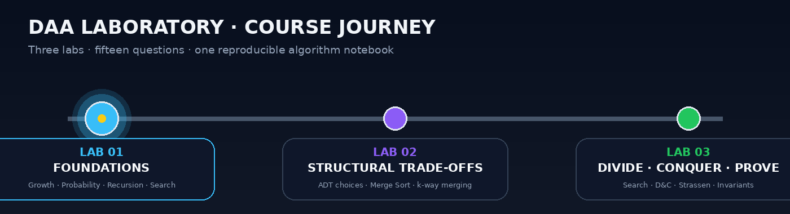

<p align="center">
  
</p>

<p align="center">
  <a href="lab1/README.md"></a>
  <a href="lab2/README.md"></a>
  <a href="lab3/README.md"></a>
</p>

<p align="center">
  
  
  
  
  
  
</p>

<h1 align="center">Design and Analysis of Algorithms Laboratory</h1>
<p align="center"><strong>Design → Implement → Measure → Validate → Visualize → Conclude</strong></p>
<p align="center">
  A course repository built as an <strong>algorithm notebook</strong>, not a folder of isolated programs.<br>
  Every lab keeps the implementation, complexity argument, experiment, visual evidence, and conclusion close together.
</p>

<p align="center">
  <strong>Satyam Dhal · B425050 · CSE · IIIT Bhubaneswar</strong>
</p>

<p align="center">
  
</p>

<p align="center">
  
</p>

---

## ✦ Repository Dashboard

<table>
<tr>
<td width="33%" valign="top" align="center">

### 01 · Foundations


Growth functions, probability simulation, sorting behaviour, recursion, binary search, and uniqueness.

**Core idea:** learn to *observe algorithmic growth*.

**[Open Lab 01 →](lab1/README.md)**

</td>
<td width="33%" valign="top" align="center">

### 02 · Structural Trade-offs


Dictionary representations, 2-way vs 3-way merge sort, and two strategies for merging `k` sorted arrays.

**Core idea:** same task, different structural costs.

**[Open Lab 02 →](lab2/README.md)**

</td>
<td width="33%" valign="top" align="center">

### 03 · Divide · Conquer · Prove


Binary/ternary search, defective coin, comparison-efficient min/max, Strassen, recursive matrices, and loop invariants.

**Core idea:** derive and validate stronger bounds.

**[Open Lab 03 →](lab3/README.md)**

</td>
</tr>
</table>

<p align="center">
  <a href="lab3/README.md"></a>
</p>

---

## ✦ Course Snapshot

| Field | Details |
|---|---|
| **Student** | Satyam Dhal |
| **Student ID** | B425050 |
| **Branch** | Computer Science and Engineering |
| **Institute** | International Institute of Information Technology, Bhubaneswar |
| **Course** | Design and Analysis of Algorithms Laboratory |
| **Instructor** | Dr. Ajaya Kumar Dash |
| **Semester** | 3rd Semester |
| **Primary language** | C17 |
| **Analysis style** | Theoretical derivation + experimental validation |
| **Visual evidence** | SVG plots + GIF animations + measured `.dat` files |
| **Repository philosophy** | Reproducible, question-wise, submission-ready |

### Laboratory timeline

| Lab | Date | Questions | Theme | Status |
|:---:|:---:|:---:|---|:---:|
| **[Lab 01](lab1/README.md)** | 28 Jul 2026 | 6 | Foundations of growth, probability, sorting, recursion and search | ✅ Complete |
| **[Lab 02](lab2/README.md)** | 04 Aug 2026 | 3 | Representation and divide-structure trade-offs | ✅ Complete |
| **[Lab 03](lab3/README.md)** | 11 Aug 2026 | 6 | Divide-and-conquer, comparison bounds, matrix recursion and correctness proofs | ✅ Complete |

---

## ✦ What Makes This Repository Different?

<p align="center">
  
</p>

A program that prints an answer is only the first layer. This repository is organized around **six connected layers**:

<table>
<tr>
<td width="16%" align="center"><strong>1<br>DESIGN</strong><br><sub>Choose the algorithmic idea</sub></td>
<td width="16%" align="center"><strong>2<br>IMPLEMENT</strong><br><sub>Write clean C code</sub></td>
<td width="16%" align="center"><strong>3<br>MEASURE</strong><br><sub>Count dominant operations</sub></td>
<td width="16%" align="center"><strong>4<br>VALIDATE</strong><br><sub>Cross-check correctness</sub></td>
<td width="16%" align="center"><strong>5<br>VISUALIZE</strong><br><sub>Plot / animate behaviour</sub></td>
<td width="16%" align="center"><strong>6<br>CONCLUDE</strong><br><sub>Connect evidence to theory</sub></td>
</tr>
</table>

The result is a repository where a reviewer can move from **question → implementation → evidence → final complexity** without hunting through unrelated files.

---

## ✦ Complete Laboratory Index

### Lab 01 · Foundations

| Question | Focus | Main idea / result |
|:---:|---|---|
| **[Q-1](lab1/Q-1/README.md)** | Growth of functions | Orders representative functions by increasing asymptotic growth and visualizes the separation |
| **[Q-2](lab1/Q-2/README.md)** | Fair vs biased coin | Experimental probability approaches the selected theoretical probability as trials increase |
| **[Q-3](lab1/Q-3/README.md)** | Bubble-sort behaviour | Compares early-exit and fixed-pass variants experimentally |
| **[Q-4](lab1/Q-4/README.md)** | Towers of Hanoi | Validates `2ⁿ − 1` moves and exponential growth |
| **[Q-5](lab1/Q-5/README.md)** | Partition point | Finds the first `1` in a sorted `0...01...1` array using binary search |
| **[Q-6](lab1/Q-6/README.md)** | Element uniqueness | Demonstrates the quadratic worst-case cost of pairwise duplicate detection |

### Lab 02 · Structural Trade-offs

| Question | Implementation | Evidence | Final conclusion |
|:---:|---|---|---|
| **[Q-1](lab2/Q-1/README.md)** | Seven dictionary operations across six representations | 42 operation/representation cases with theoretical + experimental SVGs | Representation determines whether an operation behaves like `O(1)`, `O(log n)` or `O(n)` |
| **[Q-2](lab2/Q-2/README.md)** | Interactive 2-way / 3-way merge-sort selector | Deterministic measured growth + separate theoretical and experimental plots | Both remain `Θ(n log n)` |
| **[Q-3](lab2/Q-3/README.md)** | Sequential vs balanced merging of `k` sorted arrays | Timings, counters and step-by-step merge animations | Sequential `Θ(nk²)` vs balanced `Θ(nk log k)` |

### Lab 03 · Divide · Conquer · Prove

<p align="center">
  
</p>

| Question | Algorithm | What is validated | Final result |
|:---:|---|---|---|
| **[Q-1](lab3/Q-1/README.md)** | Binary vs ternary search | Same sorted input, counted probes/comparisons, deterministic worst-case samples | Both `Θ(log n)`; binary has the smaller comparison constant in the usual comparison model |
| **[Q-2](lab3/Q-2/README.md)** | Defective coin with a balance scale | Every possible lighter-coin position plus the no-defect case | `⌈log₂ n⌉ + O(1)` weighings |
| **[Q-3](lab3/Q-3/README.md)** | Pairwise tournament for max + min | Exact comparison count against the required `3n/2` ceiling | At most `3n/2` comparisons; `3n/2 − 2` for even `n` |
| **[Q-4](lab3/Q-4/README.md)** | Strassen matrix multiplication | Recursive result cross-checked entry-by-entry against classical multiplication | `Θ(n^log₂7)` |
| **[Q-5](lab3/Q-5/README.md)** | Special recursive matrix multiplication | Pattern validity + recursive output + classical multiplication cross-check | `Θ(n²)` |
| **[Q-6](lab3/Q-6/README.md)** | Selection sort + loop invariant | Invariant tracing and identical comparison growth over different input orders | Best = worst = `Θ(n²)` |

---

## ✦ Lab 03 Visual Gallery

<table>
<tr>
<td width="50%" valign="top" align="center">

### Q1 · Binary vs Ternary Search

<a href="lab3/Q-1/README.md"></a>

**Observe:** how each method reduces the active search interval and how many comparisons a level can require.

</td>
<td width="50%" valign="top" align="center">

### Q2 · Defective Coin

<a href="lab3/Q-2/README.md"></a>

**Observe:** a balance-scale decision repeatedly eliminates a large portion of the candidate coins.

</td>
</tr>
<tr>
<td width="50%" valign="top" align="center">

### Q3 · Max + Min Tournament

<a href="lab3/Q-3/README.md"></a>

**Observe:** the first comparison in each pair decides which element belongs to the max side and which belongs to the min side.

</td>
<td width="50%" valign="top" align="center">

### Q4 · Strassen's Seven Products

<a href="lab3/Q-4/README.md"></a>

**Observe:** eight naive recursive block products are replaced by seven carefully combined products.

</td>
</tr>
<tr>
<td width="50%" valign="top" align="center">

### Q5 · Two-Product Transform

<a href="lab3/Q-5/README.md"></a>

**Observe:** the recursive symmetry lets multiplication collapse to two half-size products plus quadratic combination work.

</td>
<td width="50%" valign="top" align="center">

### Q6 · Selection-Sort Invariant

<a href="lab3/Q-6/README.md"></a>

**Observe:** after each outer iteration, the sorted prefix is fixed and contains the smallest elements seen so far.

</td>
</tr>
</table>

<p align="center">
  
</p>

---

## ✦ Complexity Landscape

<p align="center">
  
</p>

The labs deliberately move across very different growth classes. The important point is not merely memorizing the names; it is seeing **what structural decision creates each class**.

| Complexity | Seen in this repository | Structural reason |
|---|---|---|
| `Θ(log n)` | Binary search, ternary search, defective-coin reduction | A constant fraction of the candidate space disappears at every level |
| `Θ(n)` | Individual linear scans / merge-level work | Every element is touched a constant number of times |
| `Θ(n log n)` | 2-way and 3-way merge sort | Linear work is repeated over logarithmically many recursion levels |
| `Θ(n²)` | Selection sort, uniqueness baseline, special-pattern matrix multiplication | Either all relevant pairs are examined or quadratic output/combine work dominates |
| `Θ(n^log₂7)` | Strassen multiplication | Seven recursive subproblems of size `n/2` replace the classical eight |
| `Θ(2ⁿ)` | Towers of Hanoi move growth | Each larger instance recursively contains two copies of the previous instance plus one move |

> **Repository rule:** an asymptotic label is treated as a conclusion, not decoration. The corresponding folder contains the recurrence, dominant-operation count, experiment, or visualization used to justify it.

---

## ✦ Evidence Map · Theory Beside Measurement

| Lab | Question | Theoretical object | Measured / validated object | Visual artifact |
|:---:|:---:|---|---|---|
| 01 | Q1 | Relative growth classes | Sampled function values | Growth-rate plot |
| 01 | Q2 | Bernoulli probability | Empirical frequency | Probability plot |
| 01 | Q3 | Bubble-sort pass/comparison behaviour | Experimental comparisons | Comparative plot |
| 01 | Q4 | `2ⁿ − 1` | Recursive move count | Growth plot |
| 01 | Q5 | Binary-search interval reduction | Found partition index | Search visualization |
| 01 | Q6 | Quadratic pair checking | Comparison count | Complexity plot |
| 02 | Q1 | ADT operation complexity | 42 instrumented cases | Theoretical + experimental SVGs |
| 02 | Q2 | `Θ(n log n)` recurrence family | Deterministic timing/count data | Two SVGs |
| 02 | Q3 | Sequential vs balanced merge work | Comparisons + writes | Two merge animations |
| 03 | Q1 | Binary vs ternary comparison depth | Probe/comparison counts | SVG + GIF |
| 03 | Q2 | `log₂ n + O(1)` decision depth | Exhaustive defect scenarios | SVG + GIF |
| 03 | Q3 | `≤ 3n/2` comparison bound | Exact counted comparisons | SVG + GIF |
| 03 | Q4 | `T(n)=7T(n/2)+Θ(n²)` | Classical cross-check + recursive product counts | SVG + GIF |
| 03 | Q5 | `T(n)=2T(n/2)+Θ(n²)` | Structure check + classical cross-check | SVG + GIF |
| 03 | Q6 | Selection-sort loop invariant + `Θ(n²)` | Trace + input-order comparison count | SVG + GIF |

---

## ✦ Lab 03 · Deep-Dive Highlights

<table>
<tr>
<td width="33%" valign="top">

### Search decisions

**Q1** and **Q2** both shrink a candidate space recursively, but the primitive operation is different:

- Q1 asks questions about **array positions**.
- Q2 asks questions through a **balance comparison**.
- Both make logarithmic progress because each decision removes a constant fraction of the remaining possibilities.

</td>
<td width="33%" valign="top">

### Comparison economy

**Q3** shows that finding both extremes does not require two independent scans.

Pair elements first. Every pair comparison simultaneously produces:

- one max candidate,
- one min candidate.

This shared work is what pushes the total down to the required bound.

</td>
<td width="33%" valign="top">

### Correctness as a first-class result

**Q6** does more than sort. It connects code to the standard three-part loop-invariant proof:

- initialization,
- maintenance,
- termination.

The implementation trace makes the mathematical claim visible after each pass.

</td>
</tr>
</table>

### Matrix multiplication: two very different recursive victories

<table>
<tr>
<td width="50%" valign="top">

#### Q4 · Strassen

Classical block multiplication naturally creates **8** half-sized recursive products. Strassen trades additional additions/subtractions for only **7** recursive products.

```text
T(n) = 7T(n/2) + Θ(n²)
     = Θ(n^log₂7)
     ≈ Θ(n^2.807)
```

The implementation also zero-pads when necessary and verifies the result against ordinary multiplication before accepting a validation run.

</td>
<td width="50%" valign="top">

#### Q5 · Special-pattern matrices

For recursively structured matrices

```text
M = [ M1  M2 ]
    [ M2  M1 ]
```

symmetry allows the product to be reconstructed from only **two** half-sized recursive multiplications using sum/difference transforms.

```text
T(n) = 2T(n/2) + Θ(n²)
     = Θ(n²)
```

That is asymptotically optimal up to constants for explicitly writing an `n × n` output matrix.

</td>
</tr>
</table>

---

## ✦ Repository Structure

```text
DAA-Lab/
│
├── README.md                           ← this course-wide visual dashboard
├── .gitignore
├── .gitattributes
├── Makefile
│
├── assets/                             ← repository-level banners / animations
│   ├── daa-banner.svg
│   ├── animated-divider.svg
│   ├── footer-orbit.svg
│   ├── pipeline.svg
│   ├── lab2-showcase.svg
│   ├── course_journey.gif             ← NEW · animated lab timeline
│   ├── reproducibility_flow.gif       ← NEW · workflow animation
│   ├── complexity_spectrum.gif        ← NEW · growth-class animation
│   └── lab3_six_stories.gif           ← NEW · six-question Lab 03 overview
│
├── scripts/                            ← Lab 01 build/regeneration helpers
│
├── lab1/
│   ├── README.md
│   ├── Problem-Sheet-Lab-01.pdf
│   ├── Q-1/
│   ├── Q-2/
│   ├── Q-3/
│   ├── Q-4/
│   ├── Q-5/
│   └── Q-6/
│
├── lab2/
│   ├── README.md
│   ├── Problem-Sheet-Lab-02.pdf
│   ├── assets/
│   │   ├── lab2_banner.gif
│   │   ├── animated_divider.gif
│   │   └── pipeline.gif
│   ├── Q-1/                            ← dictionary representations
│   ├── Q-2/                            ← 2-way vs 3-way merge sort
│   └── Q-3/                            ← merging k sorted arrays
│
└── lab3/
    ├── README.md
    ├── Problem-Sheet-Lab-03.pdf
    ├── assets/
    │   ├── lab3_banner.gif
    │   ├── animated_divider.gif
    │   ├── pipeline.gif
    │   └── divide_conquer_gallery.gif
    │
    ├── Q-1/                            ← binary vs ternary search
    │   ├── README.md
    │   ├── q1_search_interactive.c
    │   ├── q1_experimental_comparison.c
    │   ├── q1_plot_comparison.c
    │   ├── q1_experimental_data.dat
    │   ├── q1_binary_vs_ternary.svg
    │   ├── q1_binary_vs_ternary.gif
    │   └── sample / experiment output
    │
    ├── Q-2/                            ← defective coin
    │   ├── README.md
    │   ├── q2_defective_coin.c
    │   ├── q2_experimental_validation.c
    │   ├── q2_plot_complexity.c
    │   ├── q2_experimental_data.dat
    │   ├── q2_defective_coin_complexity.svg
    │   ├── q2_balance_scale.gif
    │   └── sample / experiment output
    │
    ├── Q-3/                            ← max + min with D&C
    │   ├── README.md
    │   ├── q3_max_min_dc.c
    │   ├── q3_experimental_validation.c
    │   ├── q3_plot_comparisons.c
    │   ├── q3_experimental_data.dat
    │   ├── q3_max_min_comparisons.svg
    │   ├── q3_pairwise_tournament.gif
    │   └── sample / experiment output
    │
    ├── Q-4/                            ← Strassen multiplication
    ├── Q-5/                            ← special-pattern multiplication
    └── Q-6/                            ← selection sort + loop invariant
```

---

## ✦ File Design Inside a Question Folder

Lab 02 and Lab 03 deliberately separate responsibilities instead of making one giant program do everything.

| File type | Purpose |
|---|---|
| `*_interactive.c` / main algorithm `.c` | Human-readable implementation of the algorithm requested in the question |
| `*_experimental_*.c` | Deterministic measurement, operation counting, exhaustive validation, or independent correctness checking |
| `*_plot_*.c` | Generates the final SVG visualization directly from C |
| `*.dat` | Reproducible experimental dataset used by the visualizer |
| `*.svg` | Static high-resolution complexity / comparison evidence |
| `*.gif` | Algorithmic step animation for visual understanding |
| `*_sample_output.txt` | Example terminal interaction |
| `*_experiment_output.txt` | Captured validation / experiment summary |
| `README.md` | Question, idea, algorithm, proof/recurrence, files, experiment and conclusion |

This split makes each artifact independently reviewable and avoids hiding the important algorithm behind visualization code.

---

## ✦ Reproducibility Standards

### 1 · C-first implementation

The algorithm, experiment, and SVG generator are written in C wherever the lab structure permits it. The visual artifact is therefore connected directly to the implementation rather than being an unrelated hand-drawn graph.

### 2 · Deterministic experiments

Experiments use fixed generation rules / reproducible test sizes so a rerun produces comparable results.

### 3 · Correctness before performance

Where a fast algorithm is harder to trust, the repository validates it before reporting complexity evidence.

Examples:

- Strassen output is compared against classical matrix multiplication.
- The special-pattern matrix algorithm is compared against classical multiplication.
- Experimental sorting results are verified as sorted before accepting a data point.
- Defective-coin experiments include every defect location as well as the no-defect case.

### 4 · Count the right thing

Runtime can be noisy. Whenever possible, the experiments count the operation that actually reflects the analysis:

- comparisons,
- probes,
- writes,
- recursive products,
- merge work,
- weighings.

### 5 · Theory and evidence stay adjacent

Every question README explains what the plot or animation is supposed to prove. A visual is not included merely because it looks good; it should reveal the algorithmic structure.

---

## ✦ Verification Highlights

<p align="center">
  
  
  
</p>
<p align="center">
  
  
  
</p>

### Lab 03 verification matrix

| Q | Verification strategy | Why it matters |
|:---:|---|---|
| **1** | Count binary and ternary probes on the same family of sorted arrays | Separates asymptotic class from constant-factor comparison cost |
| **2** | Exhaust every possible defective position and include the no-defect case | Prevents a logarithmic-looking algorithm from silently failing on edge cases |
| **3** | Compare measured count against the exact pairwise-tournament formula | Directly validates the required `3n/2` bound |
| **4** | Compare every Strassen output entry against classical multiplication | Validates the more complicated recursive formulas independently |
| **5** | Check the recursive matrix pattern, then compare against classical multiplication | Confirms both the precondition and the output |
| **6** | Trace the sorted-prefix invariant and compare counts for sorted/reverse/random input | Links proof of correctness to the actual loop and validates equal asymptotic best/worst behaviour |

---

## ✦ Build & Run

All Lab 03 programs are standalone C17 programs. Lab 02 and Lab 03 SVG plotters write SVG directly and therefore do not require GNUPlot.

### Generic compilation pattern

```bash
gcc -std=c17 -O2 -Wall -Wextra -pedantic program.c -lm -o program
./program
```

### Example · Lab 03 Q1

```bash
cd lab3/Q-1

gcc -std=c17 -O2 -Wall -Wextra -pedantic q1_search_interactive.c -o q1_search_interactive
./q1_search_interactive

gcc -std=c17 -O2 -Wall -Wextra -pedantic q1_experimental_comparison.c -lm -o q1_experimental_comparison
./q1_experimental_comparison

gcc -std=c17 -O2 -Wall -Wextra -pedantic q1_plot_comparison.c -lm -o q1_plot_comparison
./q1_plot_comparison
```

### Example · Lab 03 Q4

```bash
cd lab3/Q-4

gcc -std=c17 -O2 -Wall -Wextra -pedantic q4_strassen.c -o q4_strassen
./q4_strassen

gcc -std=c17 -O2 -Wall -Wextra -pedantic q4_experimental_validation.c -lm -o q4_experimental_validation
./q4_experimental_validation

gcc -std=c17 -O2 -Wall -Wextra -pedantic q4_plot_multiplications.c -lm -o q4_plot_multiplications
./q4_plot_multiplications
```

<details>
<summary><strong>Suggested strict compile check for all Lab 03 C files</strong></summary>

From the repository root:

```bash
find lab3 -name '*.c' -print0 | while IFS= read -r -d '' file; do
    gcc -std=c17 -O2 -Wall -Wextra -pedantic -Werror "$file" -lm -o /tmp/daa_check
    echo "PASS  $file"
done
```

This treats compiler warnings as errors during the verification pass.

</details>

---

## ✦ Navigate by Concept

<table>
<tr>
<td width="25%" valign="top">

### Search
- [Lab 01 · Partition Search](lab1/Q-5/README.md)
- [Lab 03 · Binary vs Ternary](lab3/Q-1/README.md)
- [Lab 03 · Defective Coin](lab3/Q-2/README.md)

</td>
<td width="25%" valign="top">

### Sorting / Merging
- [Lab 01 · Bubble Sort](lab1/Q-3/README.md)
- [Lab 02 · Merge Sort](lab2/Q-2/README.md)
- [Lab 02 · Merge k Arrays](lab2/Q-3/README.md)
- [Lab 03 · Selection Sort](lab3/Q-6/README.md)

</td>
<td width="25%" valign="top">

### Divide & Conquer
- [Lab 02 · Merge Sort](lab2/Q-2/README.md)
- [Lab 03 · Max + Min](lab3/Q-3/README.md)
- [Lab 03 · Strassen](lab3/Q-4/README.md)
- [Lab 03 · Special Matrix](lab3/Q-5/README.md)

</td>
<td width="25%" valign="top">

### Analysis / Proof
- [Lab 01 · Growth Rates](lab1/Q-1/README.md)
- [Lab 01 · Towers of Hanoi](lab1/Q-4/README.md)
- [Lab 02 · Dictionary ADT](lab2/Q-1/README.md)
- [Lab 03 · Loop Invariant](lab3/Q-6/README.md)

</td>
</tr>
</table>

---

## ✦ Quick Reviewer Route

If the goal is to understand the repository quickly, this route shows the progression best:

```text
START
  │
  ├─► Lab 01 / Q1   Learn what growth classes look like
  │
  ├─► Lab 02 / Q2   See two different recursion trees reach Θ(n log n)
  │
  ├─► Lab 02 / Q3   See balancing reduce repeated merge work
  │
  ├─► Lab 03 / Q3   See comparisons shared between max and min
  │
  ├─► Lab 03 / Q4   See recursion count change matrix complexity
  │
  ├─► Lab 03 / Q5   Use structure to reach Θ(n²)
  │
  └─► Lab 03 / Q6   Finish by proving correctness with a loop invariant
```

<p align="center">
  
</p>

---

## ✦ Final Takeaways So Far

<table>
<tr>
<td width="33%" valign="top">

### Structure beats syntax

The biggest improvements in complexity come from changing *how work is organized*:

- balanced merge trees,
- pairwise tournaments,
- recursive matrix symmetry,
- fewer recursive products.

</td>
<td width="33%" valign="top">

### Asymptotics need context

Two algorithms can share the same `Θ(...)` class and still differ meaningfully in constants, operation types, memory behaviour, or implementation overhead.

Q1 of Lab 03 is built specifically to make that distinction visible.

</td>
<td width="33%" valign="top">

### Correctness is part of analysis

Fast code is not useful if the optimization breaks the answer.

That is why the later labs increasingly use:

- cross-check algorithms,
- exhaustive cases,
- invariants,
- exact operation bounds.

</td>
</tr>
</table>

---

## ✦ Current Repository Status

<p align="center">
  
  
  
</p>

<p align="center">
  <strong>15 questions documented · implementations separated from experiments · visual evidence committed beside the source</strong>
</p>

<p align="center">
  <a href="lab1/README.md">Lab 01</a>
  &nbsp;•&nbsp;
  <a href="lab2/README.md">Lab 02</a>
  &nbsp;•&nbsp;
  <a href="lab3/README.md">Lab 03</a>
  &nbsp;•&nbsp;
  <a href="lab3/Problem-Sheet-Lab-03.pdf">Latest Problem Sheet</a>
</p>

<p align="center">
  
</p>

<h3 align="center">B425050 · Computer Science and Engineering · IIIT Bhubaneswar</h3>
<p align="center">
  <sub><strong>Algorithms are easier to trust when the code, mathematics, experiment, and picture all tell the same story.</strong></sub>
</p>
