  

  
  
  
  

  <strong>Implement the algorithm. Verify the result. Measure the work. Visualize the growth.</strong>

  <a href="#-laboratory-index">Laboratory Index</a> ·
  <a href="#-lab-02-spotlight">Lab 02 Spotlight</a> ·
  <a href="#-experimental-workflow">Workflow</a> ·
  <a href="#-repository-design">Repository Design</a>

## 👨‍💻 Student & Course

<table>
<tr><td><strong>Student</strong></td><td><strong>Satyam Dhal</strong></td></tr>
<tr><td><strong>Student ID</strong></td><td>B425050</td></tr>
<tr><td><strong>Branch</strong></td><td>Computer Science and Engineering</td></tr>
<tr><td><strong>Institute</strong></td><td>International Institute of Information Technology, Bhubaneswar</td></tr>
<tr><td><strong>Course</strong></td><td>Design and Analysis of Algorithms Laboratory</td></tr>
<tr><td><strong>Instructor</strong></td><td>Dr. Ajaya Kumar Dash</td></tr>
<tr><td><strong>Semester</strong></td><td>3rd Semester</td></tr>
</table>

## 🧭 Laboratory Index

| Laboratory | Date | Core Ideas | Status |
|:--:|:--:|---|:--:|
| **[Lab 01](lab1/README.md)** | 28 July 2026 | Growth-rate comparison · probability simulation · bubble-sort analysis · Towers of Hanoi · binary search · uniqueness | ✅ Complete |
| **[Lab 02](lab2/README.md)** | 04 August 2026 | Dictionary ADT · 2-way and 3-way merge sort · merging k sorted arrays | ✅ Complete |

> Every laboratory is organized as a readable record of the algorithm, its analysis, the observed result, and the final visualization.

## ✨ Lab 02 Spotlight

  

| Question | Main Result | Visual Evidence |
|:--:|---|---|
| **[Q1 · Dictionary Operations](lab2/Q-1/README.md)** | Six representations produce trade-offs among **O(1)**, **O(log n)**, and **O(n)** operations. | Six-panel growth comparison |
| **[Q2 · Merge Sort](lab2/Q-2/README.md)** | 2-way: **T₂(n) = 2T₂(n/2) + Θ(n)** · 3-way: **T₃(n) = 3T₃(n/3) + Θ(n)** · both are **Θ(n log n)**. | Measured work and normalized growth |
| **[Q3 · Merging k Arrays](lab2/Q-3/README.md)** | Sequential merging is **Θ(nk²)**; balanced pairwise merging is **Θ(nk log k)**. | Growth in k and growth in n |

## 🔬 Experimental Workflow

  

For **Lab 02**, every question follows one deliberately simple contract:

<table>
<tr>
<td width="50%" valign="top">
<h3>① Solution program</h3>

The first C file contains the actual algorithmic answer. It prints the result, analysis, verification, and observations requested by the question.

</td>
<td width="50%" valign="top">
<h3>② Graph program</h3>

The second C file performs the experiment, creates temporary data, invokes the question's GNUPlot script, generates the SVG, and removes the temporary data after a successful plot.

</td>
</tr>
</table>

The graph description remains in a separate **.gp** file so the visualization is readable and editable without polluting the main solution program.

### Lab 02 file contract

| Artifact | Purpose |
|---|---|
| Solution `.c` file | Clean solution and required terminal output |
| Graph `.c` file | Measurement, temporary data generation, and graph launch |
| GNUPlot `.gp` file | GNUPlot styling and plotting instructions |
| SVG graph | Final vector visualization |

No **.dat** file is committed. It exists only while a graph is being generated.

## 🗂️ Repository Design

| Path | Role |
|---|---|
| `README.md` | Main navigation and course dashboard |
| `assets/` | Animated repository artwork and workflow graphics |
| `lab1/` | Laboratory 01 |
| `lab2/` | Laboratory 02 |
| `lab2/Q-1/` | Dictionary-operation complexity study |
| `lab2/Q-2/` | 2-way versus 3-way merge-sort study |
| `lab2/Q-3/` | Sequential versus balanced multi-array merging |

Lab 01 retains its original implementation style. Lab 02 uses the cleaner **two-C-file** structure shown above.

## 🧠 What This Repository Optimizes For

<table>
<tr>
<td width="50%" valign="top">
<h3>🧩 Readability</h3>

The algorithm a teacher reads is not buried under plotting code or file-generation noise.

</td>
<td width="50%" valign="top">
<h3>✅ Verification</h3>

Sorting and merging experiments validate their output before accepting measurements.

</td>
</tr>
<tr>
<td width="50%" valign="top">
<h3>📈 Reproducibility</h3>

Experiments use deterministic inputs or deterministic growth representatives wherever practical.

</td>
<td width="50%" valign="top">
<h3>🎨 Presentation</h3>

Plots are stored as SVG so curves, labels, symbols, and legends remain crisp at every zoom level.

</td>
</tr>
</table>

<strong>Why count algorithmic work instead of relying only on elapsed time?</strong>

 
Wall-clock time changes with CPU scheduling, caching, background processes, compiler behavior, and thermal state. Operation counts expose the algorithm's growth much more cleanly, which makes them especially useful for validating asymptotic analysis.

<strong>Why SVG?</strong>

 
SVG is vector-based. Titles, axes, curves, mathematical symbols, and annotations remain sharp in GitHub, browsers, reports, and presentations.

## 🛠️ Core Toolchain

  
  
  
  
  

  

  <strong>Satyam Dhal · B425050 · CSE · IIIT Bhubaneswar</strong> 
  Design · analyze · verify · visualize.

