<p align="center">
  
</p>

<p align="center">
  <a href="lab1/README.md"></a>
  <a href="lab2/README.md"></a>
  <a href="lab3/README.md"></a>
  <a href="lab4/README.md"></a>
  <a href="lab5/README.md"></a>
</p>

<p align="center">
  
  
  
  
  
  
</p>

<h1 align="center">Design and Analysis of Algorithms Laboratory</h1>
<p align="center"><strong>Design → Implement → Measure → Validate → Visualize → Conclude</strong></p>
<p align="center">
  A course repository built as an <strong>algorithm notebook</strong>, not a folder of isolated programs.<br>
  Every lab keeps the implementation, complexity argument, experiment, visual evidence, and conclusion close together.
</p>

<p align="center">
  <strong>Satyam Dhal · B425050 · CSE · IIIT Bhubaneswar</strong>
</p>

<p align="center">
  
</p>

<p align="center">
  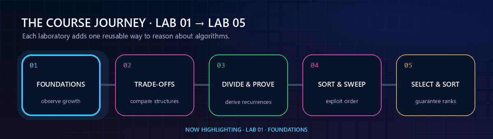
</p>

---

## ✦ Repository Dashboard

<table>
<tr>
<td width="50%" valign="top" align="center">

### 01 · Foundations


Growth functions, probability simulation, sorting behaviour, recursion, binary search, and uniqueness.

**Core idea:** learn to *observe algorithmic growth*.

**[Open Lab 01 →](lab1/README.md)**

</td>
<td width="50%" valign="top" align="center">

### 02 · Structural Trade-offs


Dictionary representations, 2-way vs 3-way merge sort, and two strategies for merging `k` sorted arrays.

**Core idea:** same task, different structural costs.

**[Open Lab 02 →](lab2/README.md)**

</td>
</tr>
<tr>
<td width="50%" valign="top" align="center">

### 03 · Divide · Conquer · Prove


Binary/ternary search, defective coin, comparison-efficient min/max, Strassen, recursive matrices, and loop invariants.

**Core idea:** derive and validate stronger bounds.

**[Open Lab 03 →](lab3/README.md)**

</td>
<td width="50%" valign="top" align="center">

### 04 · Sort · Search · Sweep


Stable colour distribution, pair sum, generalized k-sum, party attendance, interval union, and maximum overlap.

**Core idea:** *order data once, then exploit the order*.

**[Open Lab 04 →](lab4/README.md)**

</td>
</tr>
<tr>
<td colspan="2" valign="top" align="center">

### 05 · Select · Partition · Sort


Linear-time median and order-statistic selection, randomized three-way Quick Sort, and worst-case-guaranteed Heap Sort over reproducible file datasets.

**Core idea:** *ask only for the order information the problem actually needs*.

**[Open Lab 05 →](lab5/README.md)**

</td>
</tr>
</table>

<p align="center">
  <a href="lab5/README.md">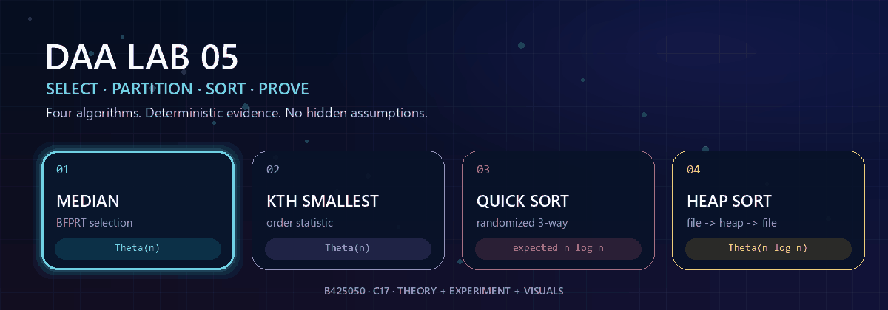</a>
</p>

---

## ✦ Course Snapshot

| Field | Details |
|---|---|
| **Student** | Satyam Dhal |
| **Student ID** | B425050 |
| **Branch** | Computer Science and Engineering |
| **Institute** | International Institute of Information Technology, Bhubaneswar |
| **Course** | Design and Analysis of Algorithms Laboratory |
| **Instructor** | Dr. Ajaya Kumar Dash |
| **Semester** | 3rd Semester |
| **Primary language** | C17 |
| **Analysis style** | Theoretical derivation + experimental validation |
| **Visual evidence** | SVG plots + GIF animations + measured `.dat` files |
| **Repository philosophy** | Reproducible, question-wise, submission-ready |

### Laboratory timeline

| Lab | Date | Questions | Theme | Status |
|:---:|:---:|:---:|---|:---:|
| **[Lab 01](lab1/README.md)** | 28 Jul 2026 | 6 | Foundations of growth, probability, sorting, recursion and search | ✅ Complete |
| **[Lab 02](lab2/README.md)** | 04 Aug 2026 | 3 | Representation and divide-structure trade-offs | ✅ Complete |
| **[Lab 03](lab3/README.md)** | 11 Aug 2026 | 6 | Divide-and-conquer, comparison bounds, matrix recursion and correctness proofs | ✅ Complete |
| **[Lab 04](lab4/README.md)** | 18 Aug 2026 | 6 | Sorting applications: stable distribution, complement search, event sweeps and interval geometry | ✅ Complete |
| **[Lab 05](lab5/README.md)** | 25 Aug 2026 | 4 | Linear-time selection, randomized partitioning, Quick Sort and Heap Sort over file datasets | ✅ Complete |

---

## ✦ What Makes This Repository Different?

<p align="center">
  
</p>

A program that prints an answer is only the first layer. This repository is organized around **six connected layers**:

<table>
<tr>
<td width="16%" align="center"><strong>1<br>DESIGN</strong><br><sub>Choose the algorithmic idea</sub></td>
<td width="16%" align="center"><strong>2<br>IMPLEMENT</strong><br><sub>Write clean C code</sub></td>
<td width="16%" align="center"><strong>3<br>MEASURE</strong><br><sub>Count dominant operations</sub></td>
<td width="16%" align="center"><strong>4<br>VALIDATE</strong><br><sub>Cross-check correctness</sub></td>
<td width="16%" align="center"><strong>5<br>VISUALIZE</strong><br><sub>Plot / animate behaviour</sub></td>
<td width="16%" align="center"><strong>6<br>CONCLUDE</strong><br><sub>Connect evidence to theory</sub></td>
</tr>
</table>

The result is a repository where a reviewer can move from **question → implementation → evidence → final complexity** without hunting through unrelated files.

---

## ✦ Complete Laboratory Index

### Lab 01 · Foundations

| Question | Focus | Main idea / result |
|:---:|---|---|
| **[Q-1](lab1/Q-1/README.md)** | Growth of functions | Orders representative functions by increasing asymptotic growth and visualizes the separation |
| **[Q-2](lab1/Q-2/README.md)** | Fair vs biased coin | Experimental probability approaches the selected theoretical probability as trials increase |
| **[Q-3](lab1/Q-3/README.md)** | Bubble-sort behaviour | Compares early-exit and fixed-pass variants experimentally |
| **[Q-4](lab1/Q-4/README.md)** | Towers of Hanoi | Validates `2ⁿ − 1` moves and exponential growth |
| **[Q-5](lab1/Q-5/README.md)** | Partition point | Finds the first `1` in a sorted `0...01...1` array using binary search |
| **[Q-6](lab1/Q-6/README.md)** | Element uniqueness | Demonstrates the quadratic worst-case cost of pairwise duplicate detection |

### Lab 02 · Structural Trade-offs

| Question | Implementation | Evidence | Final conclusion |
|:---:|---|---|---|
| **[Q-1](lab2/Q-1/README.md)** | Seven dictionary operations across six representations | 42 operation/representation cases with theoretical + experimental SVGs | Representation determines whether an operation behaves like `O(1)`, `O(log n)` or `O(n)` |
| **[Q-2](lab2/Q-2/README.md)** | Interactive 2-way / 3-way merge-sort selector | Deterministic measured growth + separate theoretical and experimental plots | Both remain `Θ(n log n)` |
| **[Q-3](lab2/Q-3/README.md)** | Sequential vs balanced merging of `k` sorted arrays | Timings, counters and step-by-step merge animations | Sequential `Θ(nk²)` vs balanced `Θ(nk log k)` |

### Lab 03 · Divide · Conquer · Prove

<p align="center">
  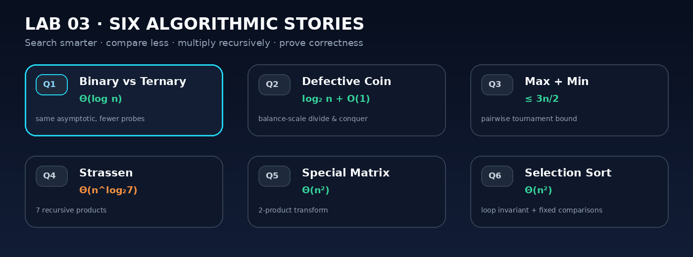
</p>

| Question | Algorithm | What is validated | Final result |
|:---:|---|---|---|
| **[Q-1](lab3/Q-1/README.md)** | Binary vs ternary search | Same sorted input, counted probes/comparisons, deterministic worst-case samples | Both `Θ(log n)`; binary has the smaller comparison constant in the usual comparison model |
| **[Q-2](lab3/Q-2/README.md)** | Defective coin with a balance scale | Every possible lighter-coin position plus the no-defect case | `⌈log₂ n⌉ + O(1)` weighings |
| **[Q-3](lab3/Q-3/README.md)** | Pairwise tournament for max + min | Exact comparison count against the required `3n/2` ceiling | At most `3n/2` comparisons; `3n/2 − 2` for even `n` |
| **[Q-4](lab3/Q-4/README.md)** | Strassen matrix multiplication | Recursive result cross-checked entry-by-entry against classical multiplication | `Θ(n^log₂7)` |
| **[Q-5](lab3/Q-5/README.md)** | Special recursive matrix multiplication | Pattern validity + recursive output + classical multiplication cross-check | `Θ(n²)` |
| **[Q-6](lab3/Q-6/README.md)** | Selection sort + loop invariant | Invariant tracing and identical comparison growth over different input orders | Best = worst = `Θ(n²)` |

### Lab 04 · Sort · Search · Sweep

<p align="center">
  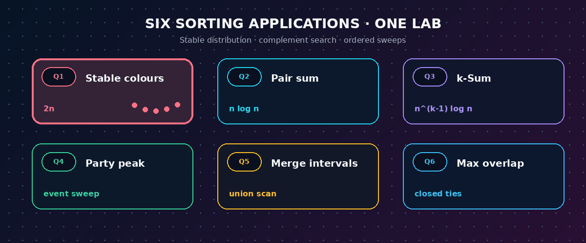
</p>

| Question | Algorithm | What is validated | Final result |
|:---:|---|---|---|
| **[Q-1](lab4/Q-1/README.md)** | Stable three-colour counting distribution | Colour blocks, stability, within-colour number order, exact two-pass work | `Θ(n)` |
| **[Q-2](lab4/Q-2/README.md)** | Merge-sort one set + binary-search complements | Worst-case no-solution families, sortedness and comparison growth | `O(n log n)` |
| **[Q-3](lab4/Q-3/README.md)** | Enumerate `k-1` indices + suffix binary search | Complete prefix exhaustion and distinct-index safety for `k=2,3,4` | `O(n^(k-1) log n)` |
| **[Q-4](lab4/Q-4/README.md)** | Chronological `+1/-1` attendance sweep | Distinct events, nonnegative count, exact peak and final zero | `O(n log n)` |
| **[Q-5](lab4/Q-5/README.md)** | Sort and merge interval union components | Sorted/disjoint output and complete input coverage | `O(n log n)` |
| **[Q-6](lab4/Q-6/README.md)** | Grouped closed-endpoint sweep | Tied endpoints and direct containment at the reported point | `O(n log n)` |

### Lab 05 · Select · Partition · Sort

<p align="center">
  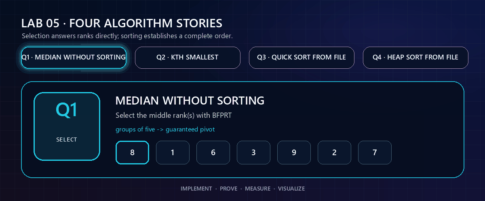
</p>

| Question | Algorithm | What is validated | Final result |
|:---:|---|---|---|
| **[Q-1](lab5/Q-1/README.md)** | Median via deterministic median-of-medians selection | Odd/even medians, duplicates, signed extremes, exact half-integer formatting, and independent sorted-oracle checks | `Θ(n)` worst-case |
| **[Q-2](lab5/Q-2/README.md)** | BFPRT `k`-th order statistic with three-way partitioning | Every rank on edge families plus 2,000 deterministic fuzz cases | `Θ(n)` worst-case |
| **[Q-3](lab5/Q-3/README.md)** | Seeded randomized three-way Quick Sort over a generated file | Input/output round trips, exact sorted oracle, multiset preservation, and bounded stack | Expected `Θ(n log n)`, worst `Θ(n²)` |
| **[Q-4](lab5/Q-4/README.md)** | Floyd max-heap construction + repeated maximum extraction over a generated file | Heap invariant, exact sorted oracle, multiset preservation, and edge families | `Θ(n log n)` in all cases |

---

## ✦ Lab 03 Visual Gallery

<table>
<tr>
<td width="50%" valign="top" align="center">

### Q1 · Binary vs Ternary Search

<a href="lab3/Q-1/README.md">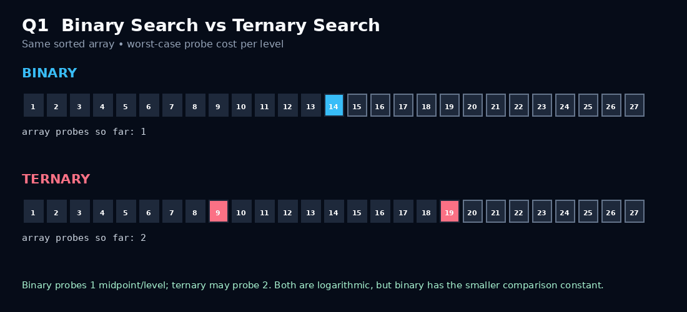</a>

**Observe:** how each method reduces the active search interval and how many comparisons a level can require.

</td>
<td width="50%" valign="top" align="center">

### Q2 · Defective Coin

<a href="lab3/Q-2/README.md">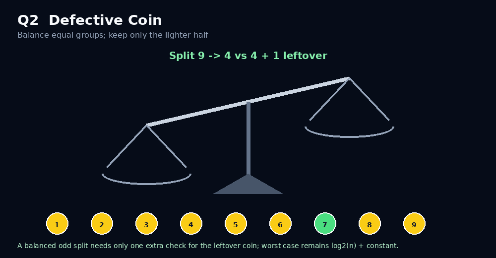</a>

**Observe:** a balance-scale decision repeatedly eliminates a large portion of the candidate coins.

</td>
</tr>
<tr>
<td width="50%" valign="top" align="center">

### Q3 · Max + Min Tournament

<a href="lab3/Q-3/README.md"></a>

**Observe:** the first comparison in each pair decides which element belongs to the max side and which belongs to the min side.

</td>
<td width="50%" valign="top" align="center">

### Q4 · Strassen's Seven Products

<a href="lab3/Q-4/README.md">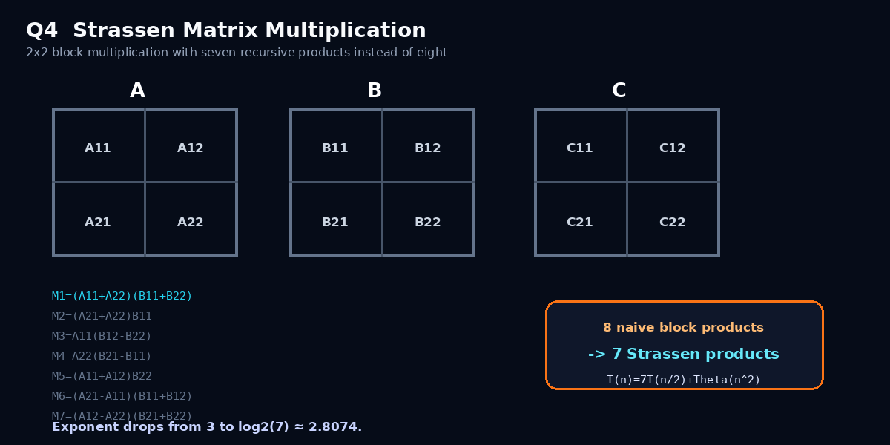</a>

**Observe:** eight naive recursive block products are replaced by seven carefully combined products.

</td>
</tr>
<tr>
<td width="50%" valign="top" align="center">

### Q5 · Two-Product Transform

<a href="lab3/Q-5/README.md">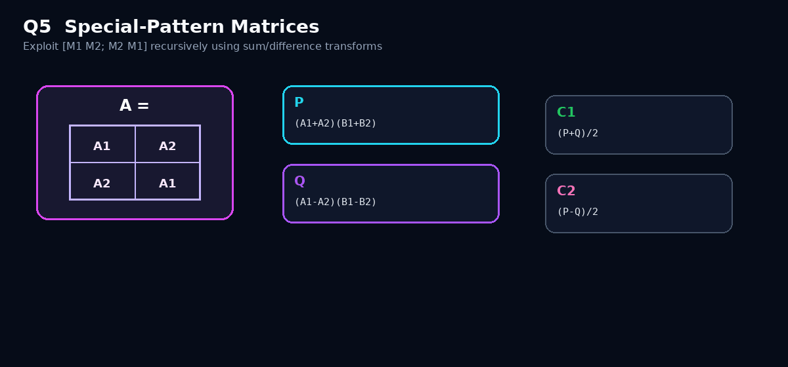</a>

**Observe:** the recursive symmetry lets multiplication collapse to two half-size products plus quadratic combination work.

</td>
<td width="50%" valign="top" align="center">

### Q6 · Selection-Sort Invariant

<a href="lab3/Q-6/README.md"></a>

**Observe:** after each outer iteration, the sorted prefix is fixed and contains the smallest elements seen so far.

</td>
</tr>
</table>

<p align="center">
  
</p>

---

## ✦ Lab 04 Visual Gallery

<table>
<tr>
<td width="50%" valign="top" align="center">

### Q1 · Stable Colour Distribution

<a href="lab4/Q-1/README.md">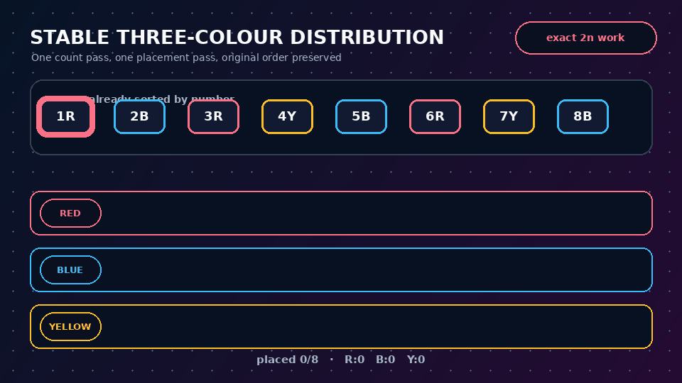</a>

**Observe:** the output blocks are fixed before placement, so every colour keeps its original number order.

</td>
<td width="50%" valign="top" align="center">

### Q2 · Complement Search

<a href="lab4/Q-2/README.md"></a>

**Observe:** sorting `S2` once turns every `x-a` membership test into a shrinking binary-search window.

</td>
</tr>
<tr>
<td width="50%" valign="top" align="center">

### Q3 · Generalized k-Sum

<a href="lab4/Q-3/README.md"></a>

**Observe:** only increasing indices are selected, and the complement is searched strictly in the remaining suffix.

</td>
<td width="50%" valign="top" align="center">

### Q4 · Peak Party Attendance

<a href="lab4/Q-4/README.md">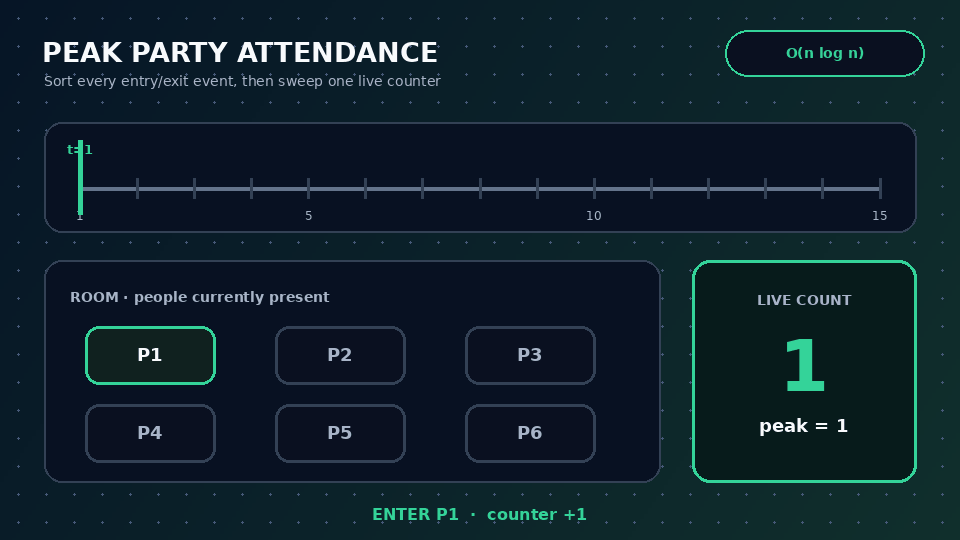</a>

**Observe:** each sorted entry/exit event changes one live counter, exposing the earliest maximum.

</td>
</tr>
<tr>
<td width="50%" valign="top" align="center">

### Q5 · Interval Union

<a href="lab4/Q-5/README.md"></a>

**Observe:** after sorting, only the final merged component can overlap the next interval.

</td>
<td width="50%" valign="top" align="center">

### Q6 · Closed-Endpoint Sweep

<a href="lab4/Q-6/README.md">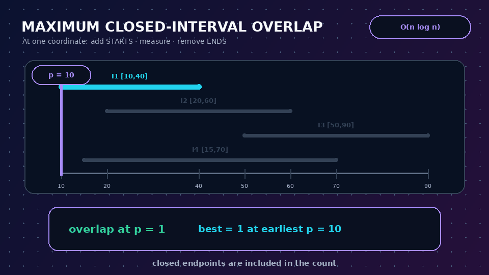</a>

**Observe:** starts are added and ends remain active while the overlap at the endpoint is measured.

</td>
</tr>
</table>

<p align="center">
  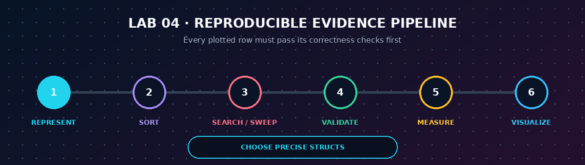
</p>

---

## ✦ Lab 05 Visual Gallery

<table>
<tr>
<td width="50%" valign="top" align="center">

### Q1 · Median without Full Sorting

<a href="lab5/Q-1/README.md"></a>

**Watch:** groups of five create a guaranteed pivot; only the band containing the middle rank survives.

</td>
<td width="50%" valign="top" align="center">

### Q2 · K-th Order Statistic

<a href="lab5/Q-2/README.md">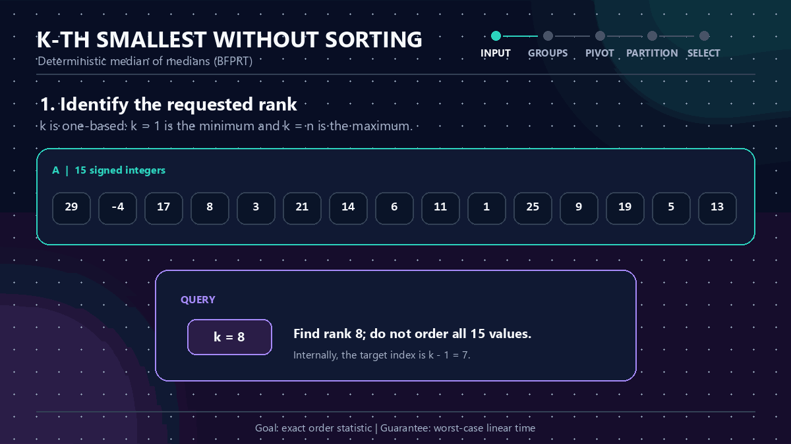</a>

**Watch:** three-way partitioning resolves duplicate pivot values in one step and preserves the requested rank.

</td>
</tr>
<tr>
<td width="50%" valign="top" align="center">

### Q3 · Randomized Three-Way Quick Sort

<a href="lab5/Q-3/README.md">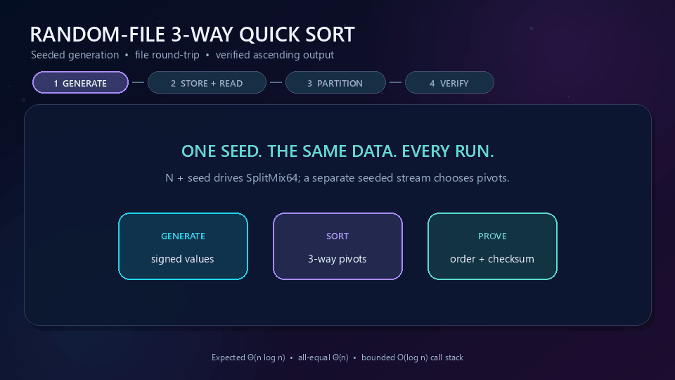</a>

**Watch:** the pivot splits a file-loaded array into smaller, equal, and larger bands before the strict sides continue.

</td>
<td width="50%" valign="top" align="center">

### Q4 · Heap Construction and Extraction

<a href="lab5/Q-4/README.md">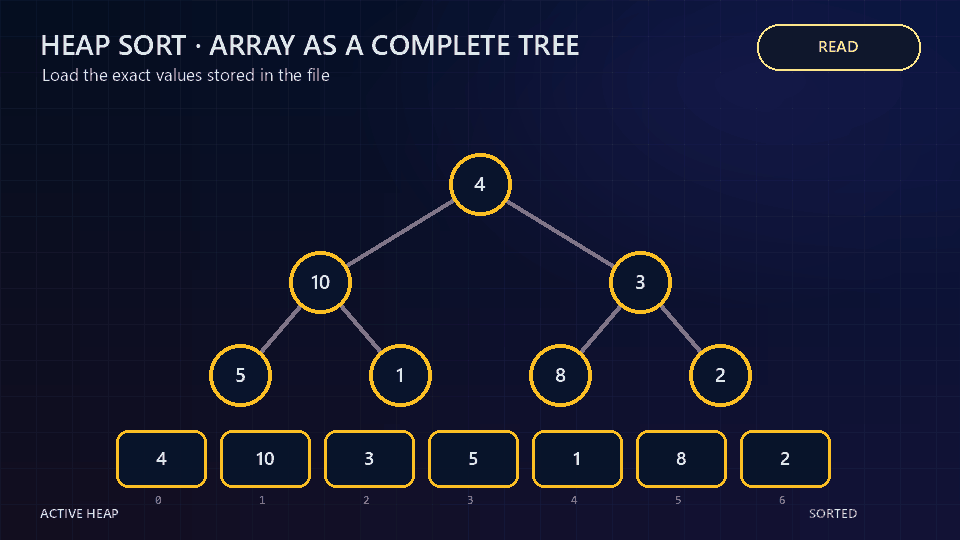</a>

**Watch:** the maximum repeatedly moves from the heap root into a final slot in the growing sorted suffix.

</td>
</tr>
</table>

<p align="center">
  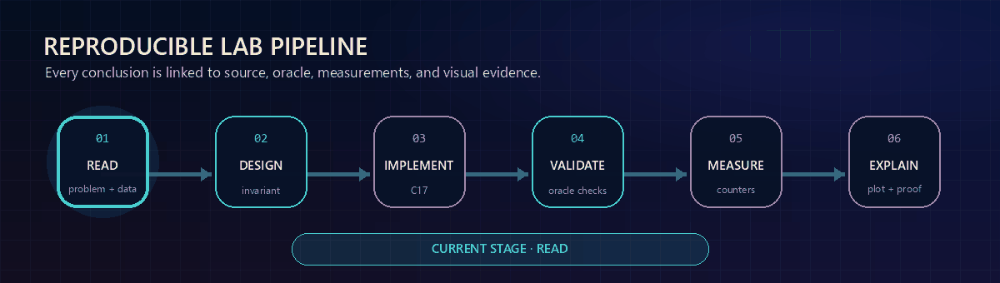
</p>

---

## ✦ Complexity Landscape

<p align="center">
  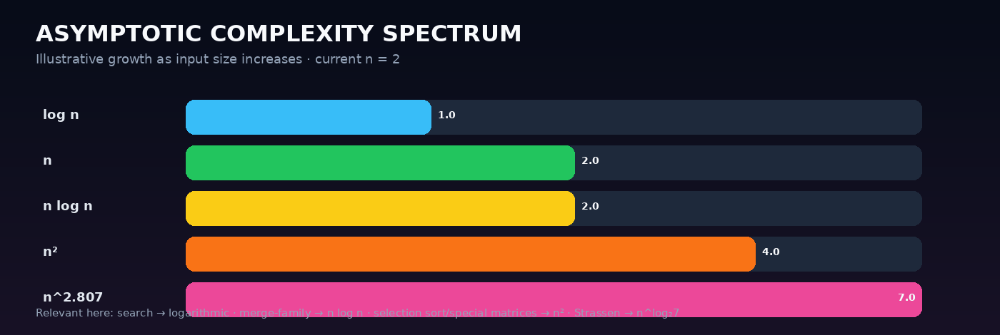
</p>

The labs deliberately move across very different growth classes. The important point is not merely memorizing the names; it is seeing **what structural decision creates each class**.

| Complexity | Seen in this repository | Structural reason |
|---|---|---|
| `Θ(log n)` | Binary search, ternary search, defective-coin reduction | A constant fraction of the candidate space disappears at every level |
| `Θ(n)` | Individual scans, stable three-colour distribution, BFPRT median and `k`-th selection | Every item is touched a bounded number of times; the guaranteed BFPRT pivot discards a fixed fraction after linear partition work |
| `Θ(n log n)` | Merge sort, file-based Heap Sort, expected randomized Quick Sort, pair sum, party sweep, interval merging, maximum overlap | Either logarithmic levels process linear total work or sorting creates an order reused by later work |
| `Θ(n²)` | Selection sort, uniqueness baseline, special-pattern matrix multiplication | Either all relevant pairs are examined or quadratic output/combine work dominates |
| `O(n^(k-1) log n)` | Generalized k-sum for fixed `k` | Enumerate `k-1` values and binary-search the final complement |
| `Θ(n^log₂7)` | Strassen multiplication | Seven recursive subproblems of size `n/2` replace the classical eight |
| `Θ(2ⁿ)` | Towers of Hanoi move growth | Each larger instance recursively contains two copies of the previous instance plus one move |

> **Repository rule:** an asymptotic label is treated as a conclusion, not decoration. The corresponding folder contains the recurrence, dominant-operation count, experiment, or visualization used to justify it.

---

## ✦ Evidence Map · Theory Beside Measurement

| Lab | Question | Theoretical object | Measured / validated object | Visual artifact |
|:---:|:---:|---|---|---|
| 01 | Q1 | Relative growth classes | Sampled function values | Growth-rate plot |
| 01 | Q2 | Bernoulli probability | Empirical frequency | Probability plot |
| 01 | Q3 | Bubble-sort pass/comparison behaviour | Experimental comparisons | Comparative plot |
| 01 | Q4 | `2ⁿ − 1` | Recursive move count | Growth plot |
| 01 | Q5 | Binary-search interval reduction | Found partition index | Search visualization |
| 01 | Q6 | Quadratic pair checking | Comparison count | Complexity plot |
| 02 | Q1 | ADT operation complexity | 42 instrumented cases | Theoretical + experimental SVGs |
| 02 | Q2 | `Θ(n log n)` recurrence family | Deterministic timing/count data | Two SVGs |
| 02 | Q3 | Sequential vs balanced merge work | Comparisons + writes | Two merge animations |
| 03 | Q1 | Binary vs ternary comparison depth | Probe/comparison counts | SVG + GIF |
| 03 | Q2 | `log₂ n + O(1)` decision depth | Exhaustive defect scenarios | SVG + GIF |
| 03 | Q3 | `≤ 3n/2` comparison bound | Exact counted comparisons | SVG + GIF |
| 03 | Q4 | `T(n)=7T(n/2)+Θ(n²)` | Classical cross-check + recursive product counts | SVG + GIF |
| 03 | Q5 | `T(n)=2T(n/2)+Θ(n²)` | Structure check + classical cross-check | SVG + GIF |
| 03 | Q6 | Selection-sort loop invariant + `Θ(n²)` | Trace + input-order comparison count | SVG + GIF |
| 04 | Q1 | Stable constant-key distribution + `Θ(n)` | Exact classification/placement counts + stability checks | SVG + GIF |
| 04 | Q2 | Sort once + `n` logarithmic membership queries | Worst-case unsuccessful complement searches | SVG + GIF |
| 04 | Q3 | `C(n,k-1)` prefixes × logarithmic suffix search | Complete no-solution enumeration for `k=2,3,4` | SVG + GIF |
| 04 | Q4 | Sort `2n` events + linear attendance sweep | Peak and counter-state invariants | SVG + GIF |
| 04 | Q5 | Sort intervals + linear union scan | Disjointness and union-coverage validation | SVG + GIF |
| 04 | Q6 | Sort/group closed endpoints | Direct containment count at the chosen point | SVG + GIF |
| 05 | Q1 | One/two BFPRT order statistics + linear partitioning | Odd/even oracle medians, preservation, edge cases and deterministic fuzz | SVG + GIF |
| 05 | Q2 | `T(n) ≤ T(n/5) + T(7n/10+6) + Θ(n)` | Every rank on edge families + 2,000 duplicate-heavy fuzz arrays | SVG + GIF |
| 05 | Q3 | Randomized three-way Quick Sort | Exact oracle, file round trips, fingerprints and recursion-stack bound | SVG + GIF |
| 05 | Q4 | Linear heap construction + logarithmic extractions | Exact oracle, max-heap invariant, fingerprints and file outputs | SVG + GIF |

---

## ✦ Lab 03 · Deep-Dive Highlights

<table>
<tr>
<td width="33%" valign="top">

### Search decisions

**Q1** and **Q2** both shrink a candidate space recursively, but the primitive operation is different:

- Q1 asks questions about **array positions**.
- Q2 asks questions through a **balance comparison**.
- Both make logarithmic progress because each decision removes a constant fraction of the remaining possibilities.

</td>
<td width="33%" valign="top">

### Comparison economy

**Q3** shows that finding both extremes does not require two independent scans.

Pair elements first. Every pair comparison simultaneously produces:

- one max candidate,
- one min candidate.

This shared work is what pushes the total down to the required bound.

</td>
<td width="33%" valign="top">

### Correctness as a first-class result

**Q6** does more than sort. It connects code to the standard three-part loop-invariant proof:

- initialization,
- maintenance,
- termination.

The implementation trace makes the mathematical claim visible after each pass.

</td>
</tr>
</table>

### Matrix multiplication: two very different recursive victories

<table>
<tr>
<td width="50%" valign="top">

#### Q4 · Strassen

Classical block multiplication naturally creates **8** half-sized recursive products. Strassen trades additional additions/subtractions for only **7** recursive products.

```text
T(n) = 7T(n/2) + Θ(n²)
     = Θ(n^log₂7)
     ≈ Θ(n^2.807)
```

The implementation also zero-pads when necessary and verifies the result against ordinary multiplication before accepting a validation run.

</td>
<td width="50%" valign="top">

#### Q5 · Special-pattern matrices

For recursively structured matrices

```text
M = [ M1  M2 ]
    [ M2  M1 ]
```

symmetry allows the product to be reconstructed from only **two** half-sized recursive multiplications using sum/difference transforms.

```text
T(n) = 2T(n/2) + Θ(n²)
     = Θ(n²)
```

That is asymptotically optimal up to constants for explicitly writing an `n × n` output matrix.

</td>
</tr>
</table>

---

## ✦ Lab 04 · Deep-Dive Highlights

<table>
<tr>
<td width="33%" valign="top">

### Stability is a proof obligation

Q1 does not merely place red before blue before yellow. The placement pass must retain the left-to-right order inside every colour block. Original indices are carried into the output so this property is checked, not assumed.

</td>
<td width="33%" valign="top">

### Sorted data becomes reusable

Q2 and Q3 spend `O(n log n)` once, then ask many fast complement questions. Q3 additionally restricts each binary search to a suffix, guaranteeing that no selected set position can be reused.

</td>
<td width="33%" valign="top">

### Endpoint semantics change answers

Q4 uses distinct entry/exit times and `[entry,exit)` presence. Q6 uses closed intervals and tied endpoints, so it must add all starts, measure the point, and only then remove ends.

</td>
</tr>
</table>

### Three sweep-line views of ordered data

| Question | Sorted objects | Maintained state | Answer event |
|:---:|---|---|---|
| Q4 | `2n` distinct entry/exit events | Number currently at the party | Counter reaches a new maximum |
| Q5 | Intervals ordered by left endpoint | Last connected union component | Next interval either extends it or begins a new one |
| Q6 | Grouped closed endpoints | Intervals active at the current coordinate | Starts added and ends retained during measurement |

---

## ✦ Lab 05 · Deep-Dive Highlights

<table>
<tr>
<td width="33%" valign="top">

### Selection is not sorting

Q1 and Q2 do not pay to establish every pairwise ordering. Small groups reveal a pivot, one linear partition identifies its rank band, and only the band containing the requested order statistic continues.

</td>
<td width="33%" valign="top">

### A pivot changes the guarantee

Randomized Quick Sort gives excellent expected behaviour. BFPRT spends more pivot-selection work to guarantee a fixed-fraction discard, while Heap Sort guarantees `Θ(n log n)` by maintaining a different structure entirely.

</td>
<td width="33%" valign="top">

### Files are part of correctness

Q3 and Q4 validate both round trips: generate → write → read and sort → write → read. Ordering checks, independent reference arrays, and multiset fingerprints ensure that file handling neither loses nor invents values.

</td>
</tr>
</table>

---

## ✦ Repository Structure

```text
DAA-Lab/
│
├── README.md                           ← this course-wide visual dashboard
├── .gitignore
├── .gitattributes
├── Makefile
│
├── assets/                             ← repository-level banners / animations
│   ├── daa-banner.svg
│   ├── animated-divider.svg
│   ├── footer-orbit.svg
│   ├── pipeline.svg
│   ├── lab2-showcase.svg
│   ├── course_journey.gif             ← Lab 01-03 animated timeline
│   ├── course_journey_lab4.gif        ← four-lab animated timeline
│   ├── course_journey_lab5.gif        ← current five-lab animated timeline
│   ├── reproducibility_flow.gif       ← NEW · workflow animation
│   ├── complexity_spectrum.gif        ← NEW · growth-class animation
│   └── lab3_six_stories.gif           ← NEW · six-question Lab 03 overview
│
├── scripts/                            ← Lab 01 build/regeneration helpers
│
├── lab1/
│   ├── README.md
│   ├── Problem-Sheet-Lab-01.pdf
│   ├── Q-1/
│   ├── Q-2/
│   ├── Q-3/
│   ├── Q-4/
│   ├── Q-5/
│   └── Q-6/
│
├── lab2/
│   ├── README.md
│   ├── Problem-Sheet-Lab-02.pdf
│   ├── assets/
│   │   ├── lab2_banner.gif
│   │   ├── animated_divider.gif
│   │   └── pipeline.gif
│   ├── Q-1/                            ← dictionary representations
│   ├── Q-2/                            ← 2-way vs 3-way merge sort
│   └── Q-3/                            ← merging k sorted arrays
│
├── lab3/
│   ├── README.md
│   ├── Problem-Sheet-Lab-03.pdf
│   ├── assets/                         ← banner, pipeline and D&C gallery
│   ├── Q-1/                            ← binary vs ternary search
│   ├── Q-2/                            ← defective coin
│   ├── Q-3/                            ← max + min with D&C
│   ├── Q-4/                            ← Strassen multiplication
│   ├── Q-5/                            ← special-pattern multiplication
│   └── Q-6/                            ← selection sort + loop invariant
│
├── lab4/
│   ├── README.md
│   ├── Problem-Sheet-Lab-04.pdf
│   ├── Makefile
│   ├── build_windows.bat
│   ├── common/svg_plot.h               ← shared C-only SVG theme
│   ├── assets/                         ← banner, divider, gallery, pipeline
│   ├── Q-1/                            ← stable three-colour distribution
│   ├── Q-2/                            ← pair sum across two sets
│   ├── Q-3/                            ← generalized k-sum
│   ├── Q-4/                            ← peak party attendance
│   ├── Q-5/                            ← merge overlapping intervals
│   └── Q-6/                            ← maximum closed-interval overlap
│
└── lab5/
    ├── README.md                       ← latest visual laboratory dashboard
    ├── Problem-Sheet-Lab-05.jpeg
    ├── Makefile
    ├── build_windows.bat
    ├── common/svg_plot.h               ← shared C-only SVG theme
    ├── assets/                         ← banner, divider, gallery, pipeline
    ├── Q-1/                            ← median without full sorting
    ├── Q-2/                            ← k-th smallest without full sorting
    ├── Q-3/                            ← randomized Quick Sort over a file
    └── Q-4/                            ← Heap Sort over a file
```

---

## ✦ File Design Inside a Question Folder

Labs 02 through 05 deliberately separate responsibilities instead of making one giant program do everything.

| File type | Purpose |
|---|---|
| `*_interactive.c` / main algorithm `.c` | Human-readable implementation of the algorithm requested in the question |
| `*_experimental_*.c` | Deterministic measurement, operation counting, exhaustive validation, or independent correctness checking |
| `*_plot_*.c` | Generates the final SVG visualization directly from C |
| `*.dat` | Reproducible experimental dataset used by the visualizer |
| `*.svg` | Static high-resolution complexity / comparison evidence |
| `*.gif` | Algorithmic step animation for visual understanding |
| `*_sample_output.txt` | Example terminal interaction |
| `*_experiment_output.txt` | Captured validation / experiment summary |
| `README.md` | Question, idea, algorithm, proof/recurrence, files, experiment and conclusion |

This split makes each artifact independently reviewable and avoids hiding the important algorithm behind visualization code.

---

## ✦ Reproducibility Standards

### 1 · C-first implementation

The algorithm, experiment, and SVG generator are written in C wherever the lab structure permits it. The visual artifact is therefore connected directly to the implementation rather than being an unrelated hand-drawn graph.

### 2 · Deterministic experiments

Experiments use fixed generation rules / reproducible test sizes so a rerun produces comparable results.

### 3 · Correctness before performance

Where a fast algorithm is harder to trust, the repository validates it before reporting complexity evidence.

Examples:

- Strassen output is compared against classical matrix multiplication.
- The special-pattern matrix algorithm is compared against classical multiplication.
- Experimental sorting results are verified as sorted before accepting a data point.
- Defective-coin experiments include every defect location as well as the no-defect case.

### 4 · Count the right thing

Runtime can be noisy. Whenever possible, the experiments count the operation that actually reflects the analysis:

- comparisons,
- probes,
- writes,
- recursive products,
- merge work,
- weighings.

### 5 · Theory and evidence stay adjacent

Every question README explains what the plot or animation is supposed to prove. A visual is not included merely because it looks good; it should reveal the algorithmic structure.

---

## ✦ Verification Highlights

<p align="center">
  
  
  
</p>
<p align="center">
  
  
  
</p>

### Lab 04 verification matrix

| Q | Verification strategy | Why it matters |
|:---:|---|---|
| **1** | Carry original indices through the output and require exact `n+n` work | Proves stability and the requested linear time independently |
| **2** | Use impossible odd targets over even sets, forcing every complement search | Exercises the actual worst-case search path rather than early success |
| **3** | Exhaust all `(k-1)`-prefixes for no-solution instances at three k values | Shows the parameterized growth and proves the suffix is completely tested |
| **4** | Require a nonnegative sweep, expected peak, and final zero | Catches malformed chronological event handling |
| **5** | Require sorted pairwise-disjoint output that covers every input interval | Validates that merging neither loses nor invents covered points |
| **6** | Generate tied endpoints and compare the peak with direct containment | Specifically tests the closed-endpoint tie rule |

### Lab 05 verification matrix

| Q | Verification strategy | Why it matters |
|:---:|---|---|
| **1** | Check odd/even medians against a sorted oracle across edge families, fuzz cases, and scaling inputs | Catches off-by-one errors in the two middle ranks while keeping the submitted algorithm selection-only |
| **2** | Check every rank on duplicate/extreme arrays plus 2,000 deterministic fuzz cases | Exercises all three partition bands and one-based `k` boundaries |
| **3** | Re-read both files, compare with an exact oracle, verify fingerprints, and enforce the smaller-side recursion bound | Separates Quick Sort correctness from file I/O and prevents worst-case stack growth |
| **4** | Validate the built max-heap and compare every measured result byte-for-byte with an independent sort | Checks both the structural invariant and the final permutation/order result |

---

## ✦ Build & Run

All Lab 05 algorithms and validators are standalone C17 programs. Their SVG plotters share only the header-only theme in `lab5/common/svg_plot.h`; GNUPlot is not required.

### Generic compilation pattern

```bash
gcc -std=c17 -O2 -Wall -Wextra -Wpedantic program.c -lm -o program
./program
```

### Build and regenerate every Lab 05 artifact

```bash
cd lab5
make all
make evidence
make strict
```

### Example · Lab 05 Q2

```bash
cd lab5/Q-2
gcc -std=c17 -O2 -Wall -Wextra -Wpedantic q2_kth_smallest.c -o q2_kth_smallest
./q2_kth_smallest
```

<details>
<summary><strong>Windows / MSYS2 native executables</strong></summary>

From Windows Command Prompt with GCC on `PATH`:

```bat
cd lab5
build_windows.bat
```

The script compiles all 12 Lab 05 programs into the four `output` folders.

</details>

---

## ✦ Navigate by Concept

<table>
<tr>
<td width="25%" valign="top">

### Search
- [Lab 01 · Partition Search](lab1/Q-5/README.md)
- [Lab 03 · Binary vs Ternary](lab3/Q-1/README.md)
- [Lab 03 · Defective Coin](lab3/Q-2/README.md)
- [Lab 04 · Cross-Set Pair Sum](lab4/Q-2/README.md)
- [Lab 04 · Generalized k-Sum](lab4/Q-3/README.md)
- [Lab 05 · Median Selection](lab5/Q-1/README.md)
- [Lab 05 · K-th Order Statistic](lab5/Q-2/README.md)

</td>
<td width="25%" valign="top">

### Sorting / Merging
- [Lab 01 · Bubble Sort](lab1/Q-3/README.md)
- [Lab 02 · Merge Sort](lab2/Q-2/README.md)
- [Lab 02 · Merge k Arrays](lab2/Q-3/README.md)
- [Lab 03 · Selection Sort](lab3/Q-6/README.md)
- [Lab 04 · Stable Colour Sort](lab4/Q-1/README.md)
- [Lab 04 · Merge Intervals](lab4/Q-5/README.md)
- [Lab 05 · Randomized Quick Sort](lab5/Q-3/README.md)
- [Lab 05 · Heap Sort](lab5/Q-4/README.md)

</td>
<td width="25%" valign="top">

### Divide & Conquer
- [Lab 02 · Merge Sort](lab2/Q-2/README.md)
- [Lab 03 · Max + Min](lab3/Q-3/README.md)
- [Lab 03 · Strassen](lab3/Q-4/README.md)
- [Lab 03 · Special Matrix](lab3/Q-5/README.md)
- [Lab 04 · Party Event Sweep](lab4/Q-4/README.md)
- [Lab 04 · Maximum Overlap](lab4/Q-6/README.md)
- [Lab 05 · BFPRT Selection](lab5/Q-2/README.md)

</td>
<td width="25%" valign="top">

### Analysis / Proof
- [Lab 01 · Growth Rates](lab1/Q-1/README.md)
- [Lab 01 · Towers of Hanoi](lab1/Q-4/README.md)
- [Lab 02 · Dictionary ADT](lab2/Q-1/README.md)
- [Lab 03 · Loop Invariant](lab3/Q-6/README.md)
- [Lab 04 · Stability Proof](lab4/Q-1/README.md)
- [Lab 04 · Closed-Endpoint Semantics](lab4/Q-6/README.md)
- [Lab 05 · BFPRT Recurrence](lab5/Q-1/README.md)
- [Lab 05 · Quick Sort Guarantees](lab5/Q-3/README.md)

</td>
</tr>
</table>

---

## ✦ Quick Reviewer Route

If the goal is to understand the repository quickly, this route shows the progression best:

```text
START
  │
  ├─► Lab 01 / Q1   Learn what growth classes look like
  │
  ├─► Lab 02 / Q2   See two different recursion trees reach Θ(n log n)
  │
  ├─► Lab 02 / Q3   See balancing reduce repeated merge work
  │
  ├─► Lab 03 / Q3   See comparisons shared between max and min
  │
  ├─► Lab 03 / Q4   See recursion count change matrix complexity
  │
  ├─► Lab 03 / Q5   Use structure to reach Θ(n²)
  │
  ├─► Lab 03 / Q6   Prove correctness with a loop invariant
  │
  ├─► Lab 04 / Q1   Turn a three-value key into an exact linear algorithm
  │
  ├─► Lab 04 / Q3   Reuse sorted order for generalized complement search
  │
  ├─► Lab 04 / Q5   Convert interval union into one ordered scan
  │
  ├─► Lab 04 / Q6   Finish with precise closed-endpoint sweep semantics
  │
  ├─► Lab 05 / Q1   Find a median without paying for a complete ordering
  │
  ├─► Lab 05 / Q2   Generalize selection to any requested rank
  │
  ├─► Lab 05 / Q3   Partition file data with expected-fast randomized pivots
  │
  └─► Lab 05 / Q4   Replace pivot risk with a worst-case heap guarantee
```

<p align="center">
  
</p>

---

## ✦ Final Takeaways Through Lab 05

<table>
<tr>
<td width="33%" valign="top">

### Structure beats syntax

The biggest improvements in complexity come from changing *how work is organized*:

- balanced merge trees,
- pairwise tournaments,
- recursive matrix symmetry,
- fewer recursive products,
- sorting once and reusing the order for searches and sweeps,
- selecting only the rank that is actually needed,
- choosing a heap when a deterministic sorting bound matters.

</td>
<td width="33%" valign="top">

### Asymptotics need context

Two algorithms can share the same `Θ(...)` class and still differ meaningfully in constants, operation types, memory behaviour, or implementation overhead.

Lab 03 Q1 makes constant factors visible; Lab 04 shows that many `O(n log n)` algorithms maintain different state; Lab 05 separates expected guarantees, worst-case guarantees, and the lower cost of selecting one rank instead of sorting everything.

</td>
<td width="33%" valign="top">

### Correctness is part of analysis

Fast code is not useful if the optimization breaks the answer.

That is why the later labs increasingly use:

- cross-check algorithms,
- exhaustive cases,
- invariants,
- exact operation bounds,
- direct property checks for stability, union coverage, and endpoint inclusion,
- independent sorted oracles and file round-trip fingerprints.

</td>
</tr>
</table>

---

## ✦ Current Repository Status

<p align="center">
  
  
  
  
  
</p>

<p align="center">
  <strong>25 questions documented · implementations separated from experiments · visual evidence committed beside the source</strong>
</p>

<p align="center">
  <a href="lab1/README.md">Lab 01</a>
  &nbsp;•&nbsp;
  <a href="lab2/README.md">Lab 02</a>
  &nbsp;•&nbsp;
  <a href="lab3/README.md">Lab 03</a>
  &nbsp;•&nbsp;
  <a href="lab4/README.md">Lab 04</a>
  &nbsp;•&nbsp;
  <a href="lab5/README.md">Lab 05</a>
  &nbsp;•&nbsp;
  <a href="lab5/Problem-Sheet-Lab-05.jpeg">Latest Problem Sheet</a>
</p>

<p align="center">
  
</p>

<h3 align="center">B425050 · Computer Science and Engineering · IIIT Bhubaneswar</h3>
<p align="center">
  <sub><strong>Algorithms are easier to trust when the code, mathematics, experiment, and picture all tell the same story.</strong></sub>
</p>
