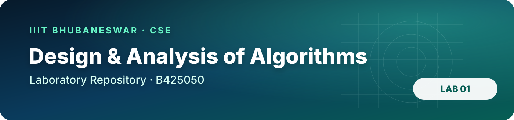
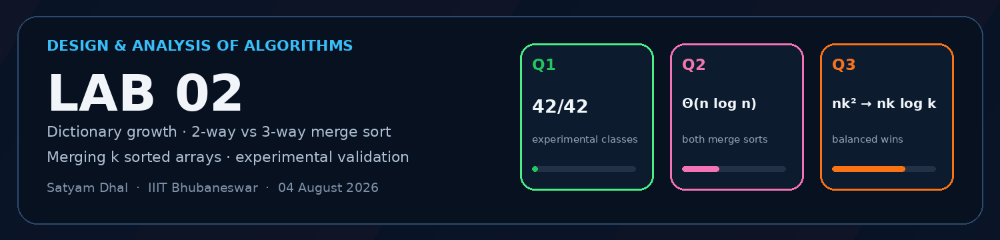
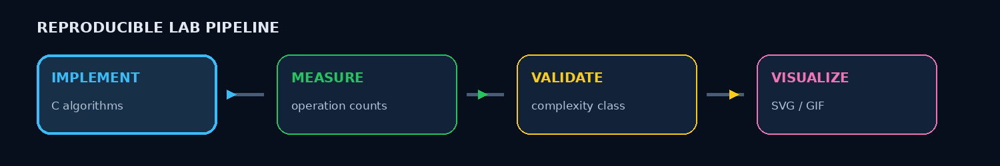

<p align="center">
  
</p>

<p align="center">
  
  
  
  
  
</p>

<h1 align="center">Design and Analysis of Algorithms Laboratory</h1>
<p align="center"><strong>Algorithms · experiments · asymptotic analysis · reproducible visualizations</strong></p>
<p align="center">B425050 · Computer Science and Engineering · IIIT Bhubaneswar</p>

<p align="center">
  
</p>

## Repository dashboard

<table>
<tr>
<td width="50%" valign="top">

### Lab 01 · Foundations

Six experiments covering growth rates, probability simulation, sorting analysis, recursion, binary search, and uniqueness.

**[Open Lab 01 →](lab1/README.md)**

</td>
<td width="50%" valign="top">

### Lab 02 · Structural Trade-offs

Dictionary representations, 2-way vs 3-way merge sort, and two strategies for merging `k` sorted arrays — with theoretical and experimental validation.

**[Open Lab 02 →](lab2/README.md)**

</td>
</tr>
</table>

<p align="center">
  <a href="lab2/README.md"></a>
</p>

## Student and course details

| Field | Information |
|---|---|
| **Student** | Satyam Dhal |
| **Student ID** | B425050 |
| **Branch** | Computer Science and Engineering |
| **Institute** | International Institute of Information Technology, Bhubaneswar |
| **Course** | Design and Analysis of Algorithms Laboratory |
| **Instructor** | Dr. Ajaya Kumar Dash |
| **Semester** | 3rd Semester |

<p align="center">
  
</p>

## Laboratory index

| Lab | Date | Questions | Core ideas | Status |
|:---:|:---:|:---:|---|:---:|
| **[Lab 01](lab1/README.md)** | 28 Jul 2026 | 6 | Growth functions, coin simulation, bubble-sort analysis, Towers of Hanoi, partition search, uniqueness | ✅ Complete |
| **[Lab 02](lab2/README.md)** | 04 Aug 2026 | 3 | Dictionary ADT complexity, 2-way vs 3-way merge sort, merging `k` sorted arrays | ✅ Complete |

## Repository structure

```text
DAA-Lab/
│
├── README.md                      ← course-wide dashboard
├── .gitignore
├── .gitattributes
├── Makefile
├── assets/                        ← repository-level visual assets
├── scripts/                       ← Lab 01 build/regeneration helpers
│
├── lab1/
│   ├── README.md
│   ├── Problem-Sheet-Lab-01.pdf
│   ├── Q-1/
│   ├── Q-2/
│   ├── Q-3/
│   ├── Q-4/
│   ├── Q-5/
│   └── Q-6/
│
└── lab2/
    ├── README.md
    ├── Problem-Sheet-Lab-02.pdf
    ├── assets/
    │   ├── lab2_banner.gif
    │   ├── animated_divider.gif
    │   └── pipeline.gif
    ├── Q-1/                       ← dictionary operations
    ├── Q-2/                       ← 2-way vs 3-way merge sort
    └── Q-3/                       ← merging k sorted arrays
```

<p align="center">
  
</p>

## Lab 01 at a glance

| Question | Main result |
|---|---|
| **[Q-1](lab1/Q-1/README.md)** | Functions ordered by increasing asymptotic growth |
| **[Q-2](lab1/Q-2/README.md)** | Fair-coin probability approaches `0.5`; biased coin approaches its selected bias |
| **[Q-3](lab1/Q-3/README.md)** | Early-exit and fixed-pass bubble sort are compared experimentally |
| **[Q-4](lab1/Q-4/README.md)** | Towers of Hanoi uses `2ⁿ − 1` moves and exhibits exponential growth |
| **[Q-5](lab1/Q-5/README.md)** | The `0 → 1` transition point is found with binary search |
| **[Q-6](lab1/Q-6/README.md)** | Pairwise uniqueness checking has quadratic worst-case growth |

## Lab 02 at a glance

| Question | Implementation | Experimental / visual result | Final complexity |
|---|---|---|---|
| **[Q-1](lab2/Q-1/README.md)** | Seven dictionary operations across six representations | 42 measured cases; separate theoretical + experimental SVGs | `O(1)`, `O(log n)`, `O(n)` trade-offs |
| **[Q-2](lab2/Q-2/README.md)** | Interactive 2-way / 3-way merge-sort selector | 80 deterministic input sizes; separate theoretical + experimental SVGs | Both `Θ(n log n)` |
| **[Q-3](lab2/Q-3/README.md)** | Interactive sequential / balanced `k`-array merger | Timings, counters, and two detailed step-by-step GIF animations | `Θ(nk²)` vs `Θ(nk log k)` |

<p align="center">
  
</p>

## Reproducibility philosophy

The repository deliberately keeps the **answer**, the **measurement**, and the **visual evidence** close to one another.

<table>
<tr>
<td width="50%" valign="top">

### Lab 01 workflow

The original Lab 01 programs preserve the submission format already used there. Where a graph is required, the C program generates data and drives GNUPlot to produce the SVG deliverable.

</td>
<td width="50%" valign="top">

### Lab 02 workflow

Lab 02 separates responsibilities more aggressively. Interactive algorithm programs remain clean; experiment programs generate deterministic data; standalone C plotting programs create SVG directly; Q3 uses animations instead of graphs because the question asks for algorithmic validation rather than a plot.

</td>
</tr>
</table>

### Common standards

- **C-first implementation:** the algorithms and experiments are implemented in C.
- **Theory beside evidence:** asymptotic conclusions are accompanied by either measured growth or an explicit step-by-step validation.
- **Deterministic experiments:** fixed data generation is used where reproducibility matters.
- **Readable mathematical notation:** results use forms such as `Θ(n log n)`, `Θ(nk²)`, `Θ(nk log k)`, and `2ⁿ − 1` directly.
- **Submission-ready artifacts:** generated `.dat`, `.svg`, `.gif`, and sample-output files are kept beside the source that produced or explains them.
- **Question-wise navigation:** every laboratory and every question has its own README so the repository can be reviewed without hunting through source files.

## Lab 02 verification highlights

<p align="center">
  
  
  
</p>

- **Dictionary operations:** the instrumented experiment classifies all 42 operation/representation combinations and reproduces the theoretical worst-case table.
- **Merge-sort modification:** both recursion schemes remain `Θ(n log n)`; the experimental visualization also normalizes the measurements by `n log n` to expose the shared asymptotic class.
- **Merging `k` sorted arrays:** sequential accumulation repeatedly reprocesses an increasingly large result, while balanced merging limits the work to logarithmically many merge levels.

<details>
<summary><strong>Build examples</strong></summary>

### Lab 01

Use the existing root build/regeneration workflow documented in [Lab 01](lab1/README.md).

### Lab 02 · Q1 example

```bash
cd lab2/Q-1
gcc -std=c17 -O2 -Wall -Wextra -pedantic q1_experimental_complexity.c -lm -o q1_experimental_complexity
./q1_experimental_complexity

gcc -std=c17 -O2 -Wall -Wextra -pedantic q1_plot_experimental.c -lm -o q1_plot_experimental
./q1_plot_experimental
```

Lab 02 does **not** require GNUPlot for its SVG generation.

</details>

<p align="center">
  
</p>

<p align="center">
  <strong>B425050 · CSE · IIIT Bhubaneswar</strong><br>
  <sub>Design → implement → measure → visualize → conclude.</sub>
</p>
