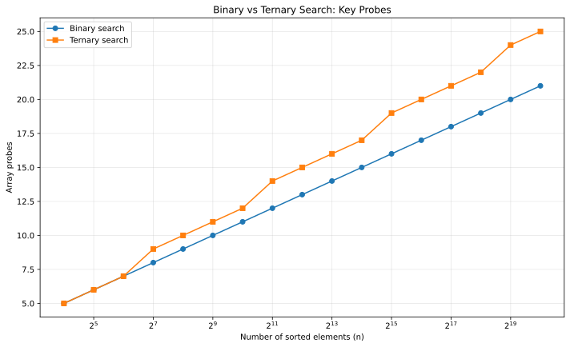

# Q1 - Binary Search vs Ternary Search

> Compare binary and ternary search on a sorted list and validate why binary search is preferable.

## Core idea

Binary search inspects one middle element and reduces the search interval to about `n/2`.
Ternary search inspects up to two middle elements and reduces the interval to about `n/3`.

If one array access/key probe is treated as the basic operation:

- Binary search: about `log2(n)` probes.
- Ternary search: up to `2 log3(n)` probes.

The constants matter:

`1 / ln(2) ~= 1.4427`, while `2 / ln(3) ~= 1.8205`.

So both are `Theta(log n)`, but binary search performs fewer key probes asymptotically on an ordinary sorted array.

## Implementation

`binary_ternary_search.c`:

1. Reads a sorted array and target.
2. Runs both searches on the same input.
3. Counts array probes.
4. Prints CPU time only as secondary information.
5. Verifies both algorithms return the same index.

## Validation experiment

`binary_ternary_generate_data.c` tests increasing powers of two with an unsuccessful search to the right of the array. This produces a stable comparison of probe counts without relying on tiny timing differences.



## Complexity

| Method | Recurrence/idea | Time | Extra space |
|---|---|---:|---:|
| Binary | `T(n)=T(n/2)+Theta(1)` | `Theta(log2 n)` | `Theta(1)` |
| Ternary | `T(n)=T(n/3)+Theta(1)` | `Theta(log3 n)` iterations, more probes | `Theta(1)` |

## Representative run

```text
Binary Search vs Ternary Search
Enter number of elements: 9
Enter 9 elements in sorted order:
1 3 5 7 9 11 13 15 17
Enter element to search: 11

Method             Index      Probes
Binary search      5          3
Ternary search     5          4

Validation: both searches agree on whether the target exists.
```

## Files

| File | Purpose |
|---|---|
| `binary_ternary_search.c` | Interactive implementation and validation |
| `binary_ternary_generate_data.c` | Generates experimental probe-count data |
| `binary_ternary_plot.gp` | GNUPlot script |
| `binary_vs_ternary.svg` | Final graph for GitHub |

## Build

```bash
gcc -std=c17 -O2 -Wall -Wextra -pedantic binary_ternary_search.c -o binary_ternary_search
gcc -std=c17 -O2 -Wall -Wextra -pedantic binary_ternary_generate_data.c -o binary_ternary_generate_data
./binary_ternary_generate_data
gnuplot binary_ternary_plot.gp
```

[Back to Lab 03](../README.md)
