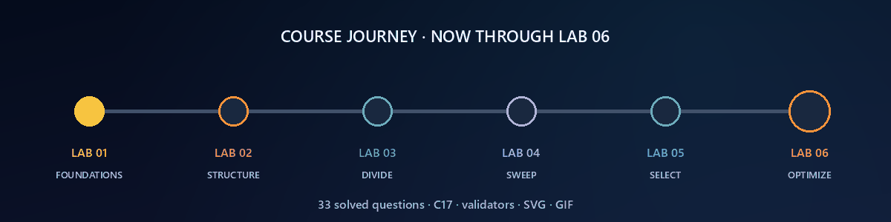

<p align="center">
  
</p>

<p align="center">
  <a href="lab1/README.md"></a>
  <a href="lab2/README.md"></a>
  <a href="lab3/README.md"></a>
  <a href="lab4/README.md"></a>
  <a href="lab5/README.md"></a>
  <a href="lab6/README.md"></a>
</p>

<p align="center">
  
  
  
  
  
  
</p>

<h1 align="center">Design and Analysis of Algorithms Laboratory</h1>
<p align="center"><strong>Design → Implement → Measure → Validate → Visualize → Conclude</strong></p>
<p align="center">
  A course repository built as an <strong>algorithm notebook</strong>, not a folder of isolated programs.<br>
  Every lab keeps implementation, complexity argument, experiment, visual evidence, and conclusion together.
</p>
<p align="center"><strong>Satyam Dhal · B425050 · CSE · IIIT Bhubaneswar</strong></p>

<p align="center"></p>
<p align="center"></p>

---

## ✦ Repository dashboard

<table>
<tr>
<td width="33%" valign="top" align="center"><h3>01 · Foundations</h3><p>Growth, probability, bubble sort, Hanoi, binary partition search, uniqueness.</p><p><strong>Observe algorithmic growth.</strong></p><p><a href="lab1/README.md"><strong>Open Lab 01 →</strong></a></p></td>
<td width="33%" valign="top" align="center"><h3>02 · Structural Trade-offs</h3><p>Dictionary representations, 2-way/3-way merge sort, merging `k` arrays.</p><p><strong>Structure changes cost.</strong></p><p><a href="lab2/README.md"><strong>Open Lab 02 →</strong></a></p></td>
<td width="33%" valign="top" align="center"><h3>03 · Divide · Conquer · Prove</h3><p>Search, defective coin, extrema, Strassen, recursive matrices, invariants.</p><p><strong>Reduce and justify.</strong></p><p><a href="lab3/README.md"><strong>Open Lab 03 →</strong></a></p></td>
</tr>
<tr>
<td width="33%" valign="top" align="center"><h3>04 · Sort · Search · Sweep</h3><p>Stable colour sort, pair/k-sum, event sweeps, interval union and overlap.</p><p><strong>Order once; exploit order.</strong></p><p><a href="lab4/README.md"><strong>Open Lab 04 →</strong></a></p></td>
<td width="33%" valign="top" align="center"><h3>05 · Select · Partition · Sort</h3><p>BFPRT median/order statistic, three-way Quick Sort, guaranteed Heap Sort.</p><p><strong>Ask only for needed order.</strong></p><p><a href="lab5/README.md"><strong>Open Lab 05 →</strong></a></p></td>
<td width="33%" valign="top" align="center"><h3>06 · Structure · Transform · Optimize</h3><p>Array/matrix kernels, FFT, reversal cost, Fibonacci, knapsack, LCS, matrix chain.</p><p><strong>Reuse solved structure.</strong></p><p><a href="lab6/README.md"><strong>Open Lab 06 →</strong></a></p></td>
</tr>
</table>

<p align="center"><a href="lab6/README.md"></a></p>

---

## ✦ Course snapshot

| Field | Details |
|---|---|
| **Student** | Satyam Dhal |
| **Student ID** | B425050 |
| **Branch** | Computer Science and Engineering |
| **Institute** | International Institute of Information Technology, Bhubaneswar |
| **Course** | Design and Analysis of Algorithms Laboratory |
| **Instructor** | Dr. Ajaya Kumar Dash |
| **Semester** | 3rd Semester |
| **Primary language** | C17 |
| **Analysis style** | theoretical derivation + deterministic experimental validation |
| **Visual evidence** | measured `.dat` + high-resolution SVG + algorithmic GIF |
| **Repository philosophy** | reproducible, question-wise, submission-ready |

### Laboratory timeline

| Lab | Date | Questions | Theme | Status |
|:---:|:---:|:---:|---|:---:|
| **[01](lab1/README.md)** | 28 Jul 2026 | 6 | foundations of growth, probability, sorting, recursion and search | ✅ Complete |
| **[02](lab2/README.md)** | 04 Aug 2026 | 3 | representation and divide-structure trade-offs | ✅ Complete |
| **[03](lab3/README.md)** | 11 Aug 2026 | 6 | divide-and-conquer bounds, matrix recursion and correctness proofs | ✅ Complete |
| **[04](lab4/README.md)** | 18 Aug 2026 | 6 | sorting applications, complement search, event sweeps and intervals | ✅ Complete |
| **[05](lab5/README.md)** | 25 Aug 2026 | 4 | linear selection, randomized partitioning, Quick Sort and Heap Sort | ✅ Complete |
| **[06](lab6/README.md)** | 31 Aug 2026 | 8 | array/matrix operations, FFT/reversal transforms and dynamic programming | ✅ Complete |

---

## ✦ What makes this repository different?

<p align="center"></p>

<table>
<tr>
<td width="16%" align="center"><strong>1<br>DESIGN</strong><br><sub>choose the idea</sub></td>
<td width="16%" align="center"><strong>2<br>IMPLEMENT</strong><br><sub>write clean C17</sub></td>
<td width="16%" align="center"><strong>3<br>MEASURE</strong><br><sub>count dominant work</sub></td>
<td width="16%" align="center"><strong>4<br>VALIDATE</strong><br><sub>use an oracle/invariant</sub></td>
<td width="16%" align="center"><strong>5<br>VISUALIZE</strong><br><sub>plot and animate</sub></td>
<td width="16%" align="center"><strong>6<br>CONCLUDE</strong><br><sub>connect proof to evidence</sub></td>
</tr>
</table>

An asymptotic label is treated as a conclusion, not decoration. The corresponding question folder contains the recurrence, counted operation, independent check, or visualization that supports it.

---

## ✦ Complete laboratory index

| Lab | Q | Focus | Main result |
|:---:|:---:|---|---|
| 01 | [1](lab1/Q-1/README.md) · [2](lab1/Q-2/README.md) · [3](lab1/Q-3/README.md) · [4](lab1/Q-4/README.md) · [5](lab1/Q-5/README.md) · [6](lab1/Q-6/README.md) | growth, probability, bubble sort, Hanoi, partition point, uniqueness | first experimental view of `log n`, `n²`, and `2ⁿ` |
| 02 | [1](lab2/Q-1/README.md) · [2](lab2/Q-2/README.md) · [3](lab2/Q-3/README.md) | dictionaries, 2/3-way merge sort, merge `k` arrays | representation and merge shape determine constants and classes |
| 03 | [1](lab3/Q-1/README.md) · [2](lab3/Q-2/README.md) · [3](lab3/Q-3/README.md) · [4](lab3/Q-4/README.md) · [5](lab3/Q-5/README.md) · [6](lab3/Q-6/README.md) | divide/conquer and proofs | comparison bounds, Strassen `Θ(n^log₂7)`, loop invariants |
| 04 | [1](lab4/Q-1/README.md) · [2](lab4/Q-2/README.md) · [3](lab4/Q-3/README.md) · [4](lab4/Q-4/README.md) · [5](lab4/Q-5/README.md) · [6](lab4/Q-6/README.md) | sorting applications | stable distribution, complement search, sweep lines, interval geometry |
| 05 | [1](lab5/Q-1/README.md) · [2](lab5/Q-2/README.md) · [3](lab5/Q-3/README.md) · [4](lab5/Q-4/README.md) | selection and sorting | worst-case linear selection, expected Quick Sort, guaranteed Heap Sort |
| 06 | [1](lab6/Q-1/README.md) · [2](lab6/Q-2/README.md) · [3](lab6/Q-3/README.md) · [4](lab6/Q-4/README.md) · [5](lab6/Q-5/README.md) · [6](lab6/Q-6/README.md) · [7](lab6/Q-7/README.md) · [8](lab6/Q-8/README.md) | structure, transforms and DP | `O(n log n)` convolution, reversal-cost proof, state reuse and optimal substructure |

---

## ✦ Lab 06 spotlight

<p align="center"></p>

| Structural move | Questions | What it buys |
|---|---|---|
| Create one deterministic ordered copy | array median, mode, unique values | one `Θ(n log n)` preparation supports several exact queries |
| Change representation | FFT convolution | pairwise coefficient work becomes frequency-domain multiplication |
| Restrict legal mutation | reversal sorting | block rotations remain possible through three reversals |
| Store solved subproblems | Fibonacci, knapsack, LCS, matrix chain | repeated recursion collapses to a state table or two-state stream |

Lab 06 deliberately preserves both supplied sources: Q1–Q4 come from the official PDF and Q5–Q8 from the attached dynamic-programming supplement. See the [Lab 06 source map](lab6/README.md#source-map).

---

## ✦ Complexity landscape

| Complexity | Representative questions | Structural cause |
|---|---|---|
| `Θ(log n)` | binary/ternary search, defective coin | a constant fraction disappears per decision |
| `Θ(n)` | scans, BFPRT selection, Fibonacci DP | each relevant element/state contributes bounded work |
| `Θ(n log n)` | merge sort, Heap Sort, FFT-style levels | linear work repeated over logarithmically many levels |
| `O(n log² n)` | Lab 06 reversal-length sort | `O(n log n)` rotate-merge cost across outer merge levels |
| `Θ(n²)` | uniqueness baseline, selection sort, equal-length LCS | pair/prefix grid is explicitly examined |
| `Θ(nW)` | 0/1 knapsack | item-capacity state space |
| `Θ(n³)` | classical matrix multiply, elimination, matrix chain | three indices or an interval split choice |
| `Θ(n^log₂7)` | Strassen | seven half-size products replace eight |
| `Θ(2ⁿ)` | Towers of Hanoi | two copies of the previous instance plus one move |

---

## ✦ Reproducibility standards

1. **C-first solutions.** The requested algorithms, validators, and SVG plotters are C17 wherever the lab permits.
2. **Deterministic experiments.** Fixed generators make reruns comparable.
3. **Correctness before performance.** A data row is written only after its oracle or invariant passes.
4. **Count the right primitive.** Comparisons, probes, writes, butterflies, DP states, reversed length, and candidate splits replace noisy wall-clock claims.
5. **Theory beside evidence.** Every question README explains what its plot and animation demonstrate.
6. **Strict compilation.** Current labs build under `-Wall -Wextra -Wpedantic`; Lab 06 passes all 24 sources under `-Werror` too.

---

## ✦ Build and run

### Current labs from the repository root

```bash
make all       # Labs 04–06
make evidence  # rerun validators and regenerate SVGs
make strict    # warnings become errors
```

### One Lab 06 program

```bash
cd lab6/Q-8
gcc -std=c17 -O2 -Wall -Wextra -Wpedantic q8_matrix_chain_dp.c -lm -o q8
./q8
```

### Native Windows build

```bat
cd lab6
build_windows.bat
```

Every question folder already includes its measured dataset, SVG, GIF, sample output, experiment transcript, and README. A compiler is needed only to rerun or modify the work.

---

## ✦ Repository structure

```text
DAA-Lab/
├── README.md
├── Makefile
├── assets/                    ← course-wide banners and journey animations
├── scripts/                   ← legacy Lab 01 regeneration helpers
├── lab1/ ... lab5/            ← completed earlier laboratories
└── lab6/
    ├── README.md
    ├── two supplied problem sheets
    ├── Makefile + Windows build
    ├── common/ + tools/
    ├── assets/
    └── Q-1/ ... Q-8/          ← solution + validation + evidence + explanation
```

<p align="center"></p>
<p align="center"><strong>33 questions · 6 labs · one continuous evidence-backed algorithm notebook.</strong></p>
