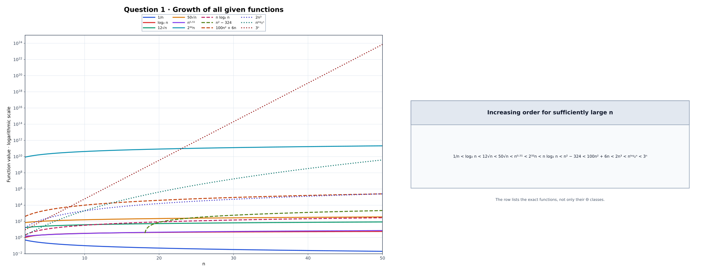

# Q-1 · Put Them in Order

[← Lab 01](../README.md) · [Main repository](../../README.md)

## Answer

For sufficiently large values of `n`, the increasing order of growth is:

<p align="center"><strong>
1/n &lt; log₂ n &lt; 12√n &lt; 50√n &lt; n⁰·⁵¹ &lt; 2³²n &lt; n log₂ n &lt; n² − 324 &lt; 100n² + 6n &lt; 2n³ &lt; n<sup>log₂ n</sup> &lt; 3ⁿ
</strong></p>

### Reason

- `1/n` decreases toward zero.
- `log₂ n` grows more slowly than every positive power of `n`.
- `12√n` and `50√n` are both `Θ(√n)`, with `12√n < 50√n`.
- `n⁰·⁵¹` eventually grows faster than every constant multiple of `√n`.
- `2³²n` is `Θ(n)`, while `n log₂ n` eventually grows faster than every constant multiple of `n`.
- `n² − 324` and `100n² + 6n` are both `Θ(n²)`; their leading coefficients determine their numerical order for large `n`.
- `2n³` grows faster than the quadratic functions.
- n<sup>log₂ n</sup> grows faster than every fixed-degree polynomial but slower than `3ⁿ`.

## Graph

All twelve functions are plotted in **one graph**. The program generates 481 points from `n = 2` to `n = 50` with a step of `0.1`. A logarithmic vertical scale keeps the smallest and largest functions visible together, while the selected input range makes their curvature easy to see. A one-row table on the right repeats the complete increasing order using mathematical symbols.

The portion of `n² − 324` that is not positive is omitted because a logarithmic axis cannot display zero or negative values.

<p align="center"></p>

The graph illustrates finite values and curve shapes. The final ordering above is asymptotic, so functions containing very large constants may cross only at values beyond the plotted range.

## Files

| File | Purpose |
|---|---|
| `q1_growth_order.c` | C implementation, data generator, automatic GNUPlot runner and SVG opener |
| `q1_growth_order.exe` | Compiled executable |
| `growth_order.dat` | 481 plotting points |
| `growth_order.svg` | One detailed graph containing all functions and the ordered-complexity table |

The GNUPlot commands are embedded in the C source, so no separate `.plt` file or plotting folder is needed.

## Run

Run the executable from its question folder:

```text
q1_growth_order.exe
```

The program automatically regenerates `growth_order.dat`, uses the GNUPlot commands embedded in the C program to create `growth_order.svg`, and opens the SVG in the default viewer. GNUPlot must be installed and available in `PATH`; no external `.plt` file is required.
