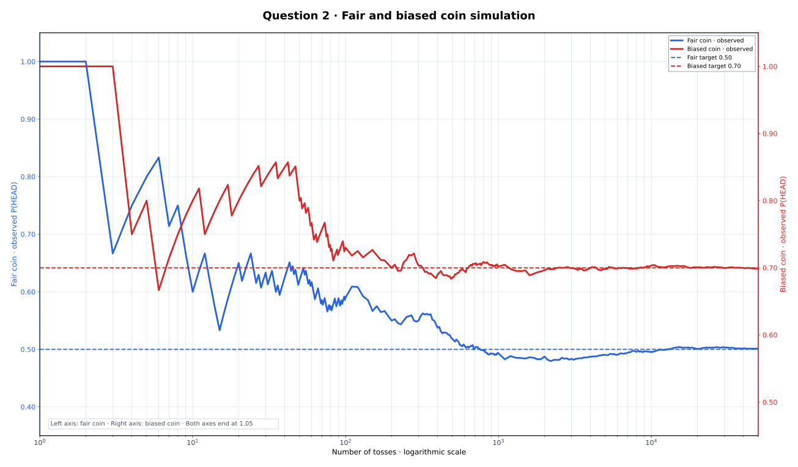

# Q-2 · Fair vs Biased Coin

[← Lab 01](../README.md) · [Main repository](../../README.md)

## Simulation setup

- Fair coin: `P(HEAD) = 0.50`
- Biased coin used for comparison: `P(HEAD) = 0.70`
- One reproducible simulation using a fixed seed
- Maximum tosses: 50,000
- Dense observations at the beginning and gradually wider checkpoints later

The fair and biased simulations are drawn in the **same plotting plane** with a logarithmic horizontal axis. The fair coin uses the left probability axis, while the biased coin uses the right probability axis. This keeps the initial jumps and long-run stabilization visible together. Both vertical axes end at `1.05`, so a probability of `1.00` appears below the top border instead of looking as if the curve exceeds the valid probability range. The observed curves use plain lines, without special markers on the early jumps.

## Result

After 50,000 tosses, the program reports:

| Experiment | Theoretical probability | Simulated probability |
|---|---:|---:|
| Fair coin | 0.50 | 0.501220 |
| Biased coin | 0.70 | 0.698780 |

The fair-coin result stabilizes near `0.5`. The biased-coin result stabilizes near the selected probability `0.70`. Fluctuations are large during the first few tosses and become progressively smaller as the number of tosses increases.

<p align="center"></p>

## Files

| File | Purpose |
|---|---|
| `q2_coin_toss.c` | Fair and biased coin simulation, automatic GNUPlot runner and SVG opener |
| `q2_coin_toss.exe` | Compiled executable |
| `coin_toss.dat` | Observed probabilities |
| `coin_comparison.svg` | One dual-axis graph showing early variation and later stabilization |

The GNUPlot commands are embedded in the C source, so no separate `.plt` file or plotting folder is needed.

## Run

Run the executable from its question folder:

```text
q2_coin_toss.exe
```

The program automatically regenerates `coin_toss.dat`, uses the GNUPlot commands embedded in the C program to create `coin_comparison.svg`, and opens the SVG in the default viewer. GNUPlot must be installed and available in `PATH`; no external `.plt` file is required.
