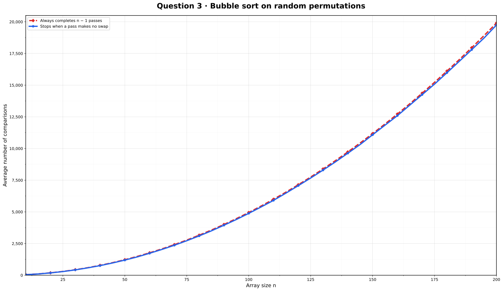

# Q-3 · Performance Analysis of Bubble Sort

[← Lab 01](../README.md) · [Main repository](../../README.md)

## Implemented versions

1. **Early-termination bubble sort:** stops when a complete pass performs no swap.
2. **Always-complete bubble sort:** always performs all `n − 1` passes.

For every trial, the program first creates the values `0` through `n − 1` and shuffles them with the Fisher–Yates method. Therefore, the input is a genuinely random permutation rather than a nearly sorted array. Both bubble-sort versions receive separate copies of exactly the same permutation.

The graph uses array sizes from 10 to 200 in steps of 5. Every point is averaged over 100 independently shuffled permutations so that random variation does not hide the comparison.

## Observation

At `n = 200`:

| Version | Average comparisons |
|---|---:|
| Early termination | 19,746.340 |
| Always `n − 1` passes | 19,900.000 |

<p align="center"></p>

Both results are displayed in one graph using different colours, line styles and point shapes. The early-termination curve is slightly lower, but the difference is naturally modest for random permutations because a no-swap pass usually occurs only near the end of sorting.

The always-complete version performs exactly `n(n − 1)/2` comparisons. Both versions have `Θ(n²)` worst-case growth. The early-termination version additionally has a best case of `Θ(n)` when the input is already sorted.

## Files

| File | Purpose |
|---|---|
| `q3_bubble_sort.c` | Both bubble-sort implementations, experiment, automatic GNUPlot runner and SVG opener |
| `q3_bubble_sort.exe` | Compiled executable |
| `bubble_sort.dat` | Average comparison counts |
| `bubble_comparisons.svg` | One detailed graph containing both curves |

The GNUPlot commands are embedded in the C source, so no separate `.plt` file or plotting folder is needed.

## Run

Run the executable from its question folder:

```text
q3_bubble_sort.exe
```

The program automatically regenerates `bubble_sort.dat`, uses the GNUPlot commands embedded in the C program to create `bubble_comparisons.svg`, and opens the SVG in the default viewer. GNUPlot must be installed and available in `PATH`; no external `.plt` file is required.
