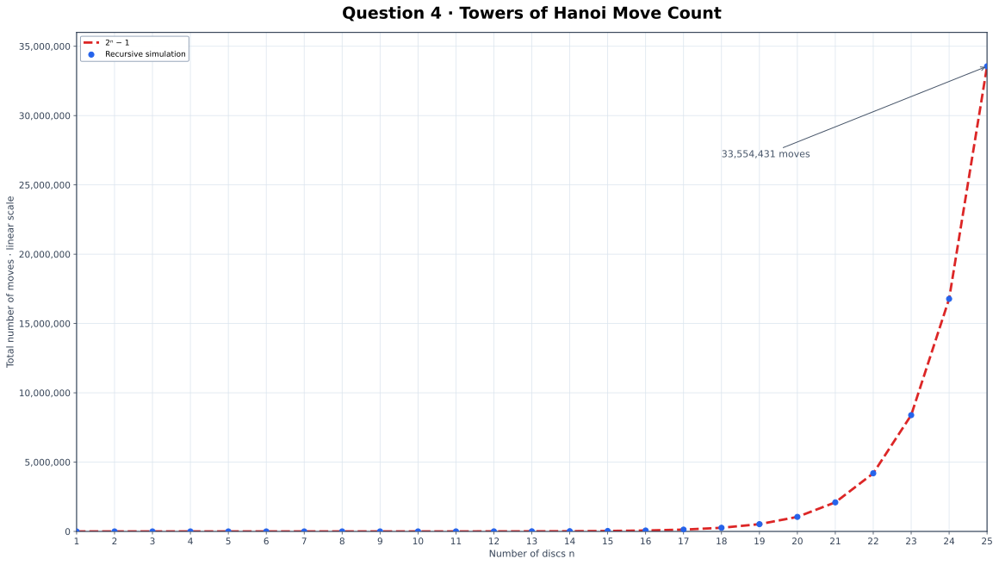

# Q-4 · Towers of Hanoi

[← Lab 01](../README.md) · [Main repository](../../README.md)

## Method

The recursive solution moves `n − 1` discs to the helper rod, moves the largest disc to the destination rod, and then moves the `n − 1` discs from the helper rod to the destination rod.

The program prints the complete move sequence for 3 discs and counts moves for 1 through 25 discs.

## Result and conclusion

The measured move count exactly matches:

<p align="center"><strong>M(n) = 2ⁿ − 1</strong></p>

For 25 discs, the algorithm requires **33,554,431 moves**.

<p align="center"></p>

The plot uses an ordinary linear scale and rises exponentially. Adding one disc approximately doubles the previous work, so the recursive algorithm has `Θ(2ⁿ)` time growth.

## Files

| File | Purpose |
|---|---|
| `q4_towers_of_hanoi.c` | Recursive simulation, move counter, automatic GNUPlot runner and SVG opener |
| `q4_towers_of_hanoi.exe` | Compiled executable |
| `hanoi.dat` | Simulated and theoretical move counts |
| `hanoi_moves.svg` | Final linear-scale graph |

The GNUPlot commands are embedded in the C source, so no separate `.plt` file or plotting folder is needed.

## Run

Run the executable from its question folder:

```text
q4_towers_of_hanoi.exe
```

The program automatically regenerates `hanoi.dat`, uses the GNUPlot commands embedded in the C program to create `hanoi_moves.svg`, and opens the SVG in the default viewer. GNUPlot must be installed and available in `PATH`; no external `.plt` file is required.
