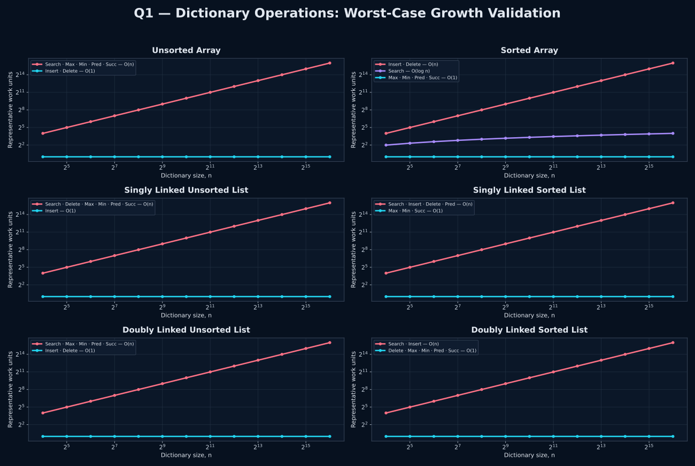

<p align="center">
  
</p>

<p align="center">
  
  
  
</p>

<p align="center"><strong>Worst-case asymptotic behavior of seven dictionary operations across six representations.</strong></p>

<p align="center"></p>

## 🎯 Problem

For a dictionary D, determine the worst-case running time of:

**Search · Insert · Delete · Maximum · Minimum · Predecessor · Successor**

when D is represented by:

**unsorted array · sorted array · singly linked unsorted list · singly linked sorted list · doubly linked unsorted list · doubly linked sorted list**

Then validate the resulting growth classes graphically.

## 🧠 Final Complexity Table

| Representation | Search | Insert | Delete | Maximum | Minimum | Predecessor | Successor |
|---|:---:|:---:|:---:|:---:|:---:|:---:|:---:|
| **Unsorted array** | O(n) | O(1) | O(1) | O(n) | O(n) | O(n) | O(n) |
| **Sorted array** | O(log n) | O(n) | O(n) | O(1) | O(1) | O(1) | O(1) |
| **Singly linked unsorted list** | O(n) | O(1) | O(n) | O(n) | O(n) | O(n) | O(n) |
| **Singly linked sorted list** | O(n) | O(n) | O(n) | O(1) | O(1) | O(n) | O(1) |
| **Doubly linked unsorted list** | O(n) | O(1) | O(1) | O(n) | O(n) | O(n) | O(n) |
| **Doubly linked sorted list** | O(n) | O(n) | O(1) | O(1) | O(1) | O(1) | O(1) |

### Important implementation assumptions

> **Delete(D, x)** receives a direct pointer or reference to x, exactly as stated in the problem. An unsorted array can therefore delete in O(1) by replacing the removed slot with the final occupied element.

> For sorted linked lists, a tail pointer is maintained. Maximum is therefore O(1). Updating that tail does not worsen the listed update bounds: a doubly linked list can update it directly, while a singly linked list can charge the required predecessor search to an operation that is already O(n).

## 🔎 Why the Bounds Look Like This

<details open>
<summary><strong>Unsorted array</strong></summary>
<br>
Search, maximum, minimum, predecessor, and successor may inspect all n items, so each is O(n). Insertion appends in O(1). Because deletion is given the item directly and order does not need to be preserved, the hole can be filled with the last item in O(1).
</details>

<details>
<summary><strong>Sorted array</strong></summary>
<br>
Binary search gives O(log n) search. Ordered neighbors and endpoints give predecessor, successor, minimum, and maximum in O(1). Insertion and deletion can shift Θ(n) items, so both are O(n).
</details>

<details>
<summary><strong>Singly linked lists</strong></summary>
<br>
There is no random access, so sorting does not make search logarithmic. Deleting a known node can still require finding its physical predecessor, which is O(n). In a sorted singly linked list, successor is the next link and is O(1), while predecessor remains O(n).
</details>

<details>
<summary><strong>Doubly linked lists</strong></summary>
<br>
A node stores both next and previous links. Deleting a known node is therefore O(1). In a sorted doubly linked list, predecessor and successor are both direct links and are O(1).
</details>

<p align="center"></p>

## 📈 Growth Validation

<p align="center">
  
</p>

The six panels reproduce the table visually. Operations in the same asymptotic class share the same representative curve:

- **O(1)** stays flat.
- **O(log n)** grows slowly.
- **O(n)** grows proportionally with n.

The graph uses logarithmic axes so all three classes remain visible across a wide range of dictionary sizes.

## 🧩 Files

| File | Purpose |
|---|---|
| `q1_dictionary_operations.c` | Clean answer program: prints the complete table and reasoning |
| `q1_graph.c` | Creates temporary growth data, invokes GNUPlot, generates the SVG, then removes the temporary data |
| `q1_dictionary_operations.gp` | Separate GNUPlot design and six-panel plotting instructions |
| `q1_dictionary_operations.svg` | Final graph |

Exactly **two C programs** are used. The answer program contains no file-writing or plotting logic.

## ▶️ Run the Answer Program

```bash
gcc -std=c17 -O2 -Wall -Wextra -pedantic q1_dictionary_operations.c -o q1_dictionary_operations
./q1_dictionary_operations
```

## 🎨 Generate the Graph

```bash
gcc -std=c17 -O2 -Wall -Wextra -pedantic q1_graph.c -o q1_graph
./q1_graph
```

`q1_graph` creates the temporary data, runs `q1_dictionary_operations.gp`, writes `q1_dictionary_operations.svg`, and removes the temporary .dat file after a successful plot.

<p align="center"></p>

## ✅ Final Observation

> **Dictionary design is a trade-off.** A representation that makes one operation cheap can make another expensive. Unsorted structures favor updates, sorted arrays favor search and ordered access, and doubly linked lists make pointer-based deletion and neighbor traversal especially efficient.

<p align="center"><strong>Q1 · Complete</strong></p>
