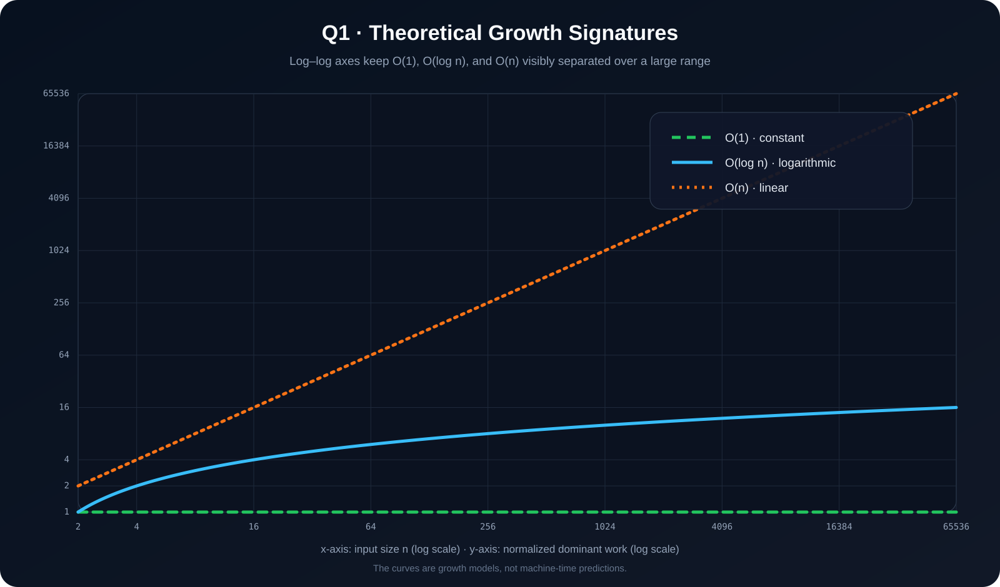
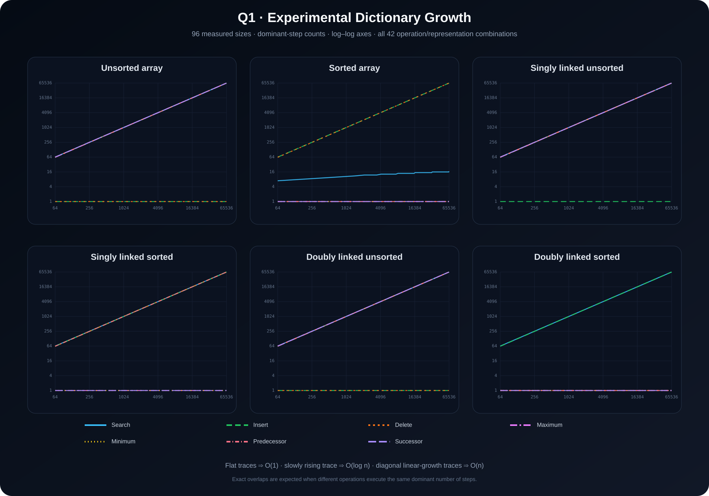

<p align="center">
  
</p>

<p align="center"><a href="../README.md">← Lab 02</a> · <a href="../../README.md">Main repository</a></p>

# Q1 · Dictionary Operations

<p align="center">
  
  
  
</p>

The dictionary supports **Search, Insert, Delete, Maximum, Minimum, Predecessor, and Successor**. The question asks for worst-case asymptotic running times under six representations and asks that those claims be validated experimentally.

## Final theoretical table

| Representation | Search | Insert | Delete | Maximum | Minimum | Predecessor | Successor |
|---|---:|---:|---:|---:|---:|---:|---:|
| Unsorted array | `O(n)` | `O(1)` | `O(1)` | `O(n)` | `O(n)` | `O(n)` | `O(n)` |
| Sorted array | `O(log n)` | `O(n)` | `O(n)` | `O(1)` | `O(1)` | `O(1)` | `O(1)` |
| Singly linked unsorted | `O(n)` | `O(1)` | `O(n)` | `O(n)` | `O(n)` | `O(n)` | `O(n)` |
| Singly linked sorted | `O(n)` | `O(n)` | `O(n)` | `O(1)*` | `O(1)` | `O(n)` | `O(1)` |
| Doubly linked unsorted | `O(n)` | `O(1)` | `O(1)` | `O(n)` | `O(n)` | `O(n)` | `O(n)` |
| Doubly linked sorted | `O(n)` | `O(n)` | `O(1)` | `O(1)*` | `O(1)` | `O(1)` | `O(1)` |

`*` The implementation maintains both head and tail pointers. That is constant-size metadata and lets a sorted list expose both ends directly. If your classroom convention defines a linked list as **head-only**, change `Maximum` for the ascending sorted linked-list rows to `O(n)`; the rest of the analysis is unchanged.

### Why `Delete` differs between singly and doubly linked lists

`Delete(D, x)` is given a pointer to `x`. A doubly linked node stores `x->prev`, so its neighbors can be re-linked directly. A singly linked node does not store its physical predecessor; in the worst case the program must walk from the head to find it. Hence worst-case deletion is `O(1)` for the doubly linked representation and `O(n)` for the singly linked representation.

## Program 1 · Experimental complexity inference

**File:** `q1_experimental_complexity.c`

This is the validation program, not a hard-coded answer printer. It:

1. builds the six representations for each input size;
2. performs the seven operations in worst-case configurations;
3. counts **dominant algorithmic steps** rather than noisy clock ticks;
4. records 96 rows from `n = 64` through `n = 65,536` in `q1_experimental_data.dat`;
5. fits each observed series against the models `1`, `log₂ n`, and `n`;
6. chooses the model with the smallest normalized fit error;
7. prints the final experimentally inferred 6 × 7 table.

The generated run concludes with:

```text
Agreement with theoretical worst-case table: 42/42 operations (FULL AGREEMENT)
```

Compile and run:

```bash
gcc -std=c17 -O2 -Wall -Wextra -pedantic q1_experimental_complexity.c -lm -o q1_experimental_complexity
./q1_experimental_complexity
```

## Program 2 · Theoretical complexity plot

**File:** `q1_plot_theoretical.c`

It directly creates `q1_theoretical_complexity.svg`. The graph uses log-log axes so the logarithmic curve is not visually flattened beneath the linear curve.

```bash
gcc -std=c17 -O2 -Wall -Wextra -pedantic q1_plot_theoretical.c -lm -o q1_plot_theoretical
./q1_plot_theoretical
```

<p align="center"></p>

## Program 3 · Experimental data plot

**File:** `q1_plot_experimental.c`

This program reads the measured `q1_experimental_data.dat` produced by Program 1 and creates a **six-panel** SVG. Every panel corresponds to one representation and contains all seven measured operations. Log-log axes make the three signatures easy to tell apart:

- flat trace → `O(1)`;
- slowly rising trace → `O(log n)`;
- diagonal linear-growth trace → `O(n)`.

```bash
gcc -std=c17 -O2 -Wall -Wextra -pedantic q1_plot_experimental.c -lm -o q1_plot_experimental
./q1_plot_experimental
```

<p align="center"></p>

## What to submit / explain in viva

The important experimental claim is not “the machine took X milliseconds.” Clock time depends on the CPU, compiler, caches, OS scheduler, and background tasks. **Operation count** is reproducible and its rate of increase is what asymptotic analysis predicts. The measured series therefore validates the order of growth directly.
