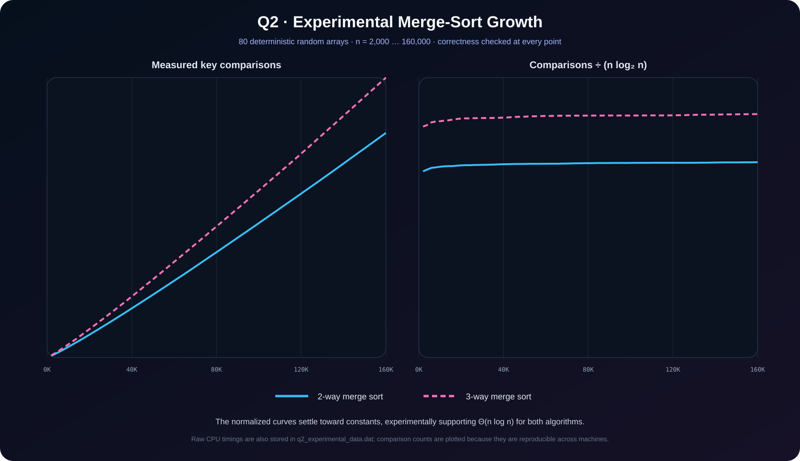
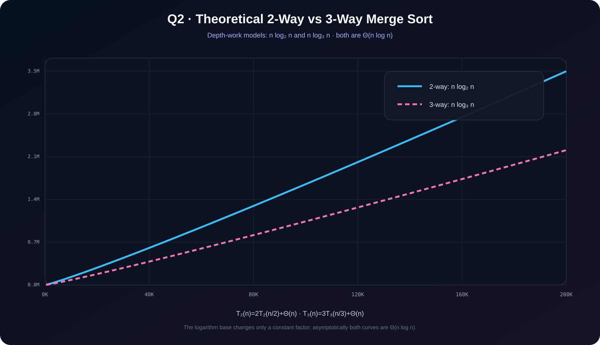

<p align="center"></p>

<p align="center"><a href="../README.md">← Lab 02</a> · <a href="../../README.md">Main repository</a></p>

# Q2 · Merge Sort vs Modified 3-Way Merge Sort

The modified algorithm divides the input into **three** subarrays, recursively sorts each third, and combines them with a three-way merge.

## Worst-case analysis

Standard merge sort:

```text
T₂(n) = 2T₂(n/2) + Θ(n)
      = Θ(n log n)
```

Modified three-way merge sort:

```text
T₃(n) = 3T₃(n/3) + Θ(n)
      = Θ(n log n)
```

The base of the logarithm only changes a constant multiplier. Therefore both algorithms have the same asymptotic worst-case class: **`Θ(n log n)`**.

## Program 1 · Interactive sorter

**File:** `q2_merge_sort_interactive.c`

The program asks for your array, then asks which algorithm to use:

```text
1. Standard merge sort (divide into 2 parts)
2. Modified merge sort (divide into 3 parts)
```

After sorting, it prints:

- the sorted array;
- a correctness check;
- selected algorithm;
- key comparisons;
- element writes;
- merge-call count;
- measured execution time;
- both worst-case recurrences and final asymptotic result.

```bash
gcc -std=c17 -O2 -Wall -Wextra -pedantic q2_merge_sort_interactive.c -o q2_merge_sort_interactive
./q2_merge_sort_interactive
```

## Program 2 · Experimental complexity plot

**File:** `q2_plot_experimental.c`

This program uses its own deterministic pseudo-random input arrays, as required for a clean experiment. It tests **80 sizes**:

```text
2,000, 4,000, 6,000, ... , 160,000
```

For every size it:

1. gives identical input data to both algorithms;
2. counts key comparisons;
3. measures time;
4. verifies that both outputs are sorted;
5. writes `q2_experimental_data.dat`;
6. creates `q2_experimental_complexity.svg`.

The right panel plots `comparisons / (n log₂ n)`. Both traces approach approximately constant levels, which is a strong experimental signature of `Θ(n log n)`.

```bash
gcc -std=c17 -O2 -Wall -Wextra -pedantic q2_plot_experimental.c -lm -o q2_plot_experimental
./q2_plot_experimental
```

<p align="center"></p>

## Program 3 · Theoretical complexity plot

**File:** `q2_plot_theoretical.c`

It plots the depth-work models `n log₂ n` and `n log₃ n`. The curves differ by a constant factor but belong to the same asymptotic class.

```bash
gcc -std=c17 -O2 -Wall -Wextra -pedantic q2_plot_theoretical.c -lm -o q2_plot_theoretical
./q2_plot_theoretical
```

<p align="center"></p>

## Conclusion

Three-way subdivision reduces recursion depth from roughly `log₂ n` to `log₃ n`, but a three-way merge still performs linear work at each level. Changing the branching factor does **not** change the `Θ(n log n)` growth class.
