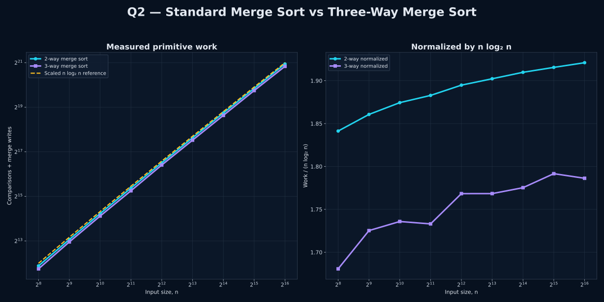

<p align="center">
  
</p>

<p align="center">
  
  
  
</p>

<p align="center"><strong>Changing the branching factor changes the recursion tree — not the asymptotic class.</strong></p>

<p align="center"></p>

## 🎯 Problem

Compare standard merge sort with a modified version that divides the input into **three parts**, recursively sorts each third, and combines the three sorted runs using a three-way merge.

The task is to determine the modified algorithm's worst-case running time and validate the growth of both algorithms experimentally.

## 🧠 Worst-Case Analysis

<table>
<tr>
<td width="50%" valign="top">
<h3 align="center">Standard 2-Way Merge Sort</h3>
<p align="center"><strong>T₂(n) = 2T₂(n/2) + Θ(n)</strong></p>
<p>There are Θ(log₂ n) recursion levels, and each level performs Θ(n) total merging work.</p>
<p align="center"><strong>⇒ Θ(n log n)</strong></p>
</td>
<td width="50%" valign="top">
<h3 align="center">Modified 3-Way Merge Sort</h3>
<p align="center"><strong>T₃(n) = 3T₃(n/3) + Θ(n)</strong></p>
<p>There are Θ(log₃ n) recursion levels, and each level still performs Θ(n) total merging work.</p>
<p align="center"><strong>⇒ Θ(n log n)</strong></p>
</td>
</tr>
</table>

### Why the logarithm base does not change the class

For any two fixed bases greater than 1, logarithms differ only by a constant factor. Therefore Θ(log₂ n) and Θ(log₃ n) describe the same asymptotic growth class.

> **Final result:** both algorithms have worst-case running time **Θ(n log n)**.

<p align="center"></p>

## 📈 Experimental Validation

<p align="center">
  
</p>

The graph has two complementary views:

1. **Measured primitive work** — comparisons plus merge writes for increasing n. Both curves follow the same n log n shape.
2. **Normalized work** — measured work divided by n log₂ n. The ratios remain bounded instead of increasing without limit, which is consistent with Θ(n log n).

The experiment uses the same deterministic input for both algorithms at every n and verifies that both outputs are sorted before recording a measurement.

## 🔬 What the Program Actually Compares

Both implementations use the same array values. The program counts:

- key comparisons performed while merging;
- element writes into the temporary merge buffer;
- correctness of the final nondecreasing order.

This gives a reproducible comparison without relying on noisy wall-clock timing.

## 🧩 Files

| File | Purpose |
|---|---|
| `q2_merge_sort_comparison.c` | Clean, self-contained implementation of both merge-sort versions and the required answer |
| `q2_graph.c` | Self-contained measurement program that creates temporary data and generates the SVG |
| `q2_merge_sort_comparison.gp` | Separate GNUPlot styling and plotting instructions |
| `q2_merge_sort_comparison.svg` | Final comparison graph |

There are exactly **two C programs**. No helper header or extra implementation file is required.

## ▶️ Run the Answer Program

```bash
gcc -std=c17 -O2 -Wall -Wextra -pedantic q2_merge_sort_comparison.c -o q2_merge_sort_comparison
./q2_merge_sort_comparison
```

The terminal output shows the two recurrences, the original input, both sorted outputs, measured comparisons and writes, correctness checks, and the final Θ(n log n) conclusion.

## 🎨 Generate the Graph

```bash
gcc -std=c17 -O2 -Wall -Wextra -pedantic q2_graph.c -o q2_graph
./q2_graph
```

`q2_graph` performs the measurements, verifies every sort, creates temporary data, runs `q2_merge_sort_comparison.gp`, writes `q2_merge_sort_comparison.svg`, and removes the temporary .dat file after a successful plot.

<p align="center"></p>

## ✅ Final Observation

> Splitting into three subproblems reduces the recursion depth from a base-2 logarithm to a base-3 logarithm, but the total work at each level remains linear. The modification changes constant factors, not the asymptotic worst-case order.

<p align="center"><strong>Q2 · Complete · Θ(n log n)</strong></p>
