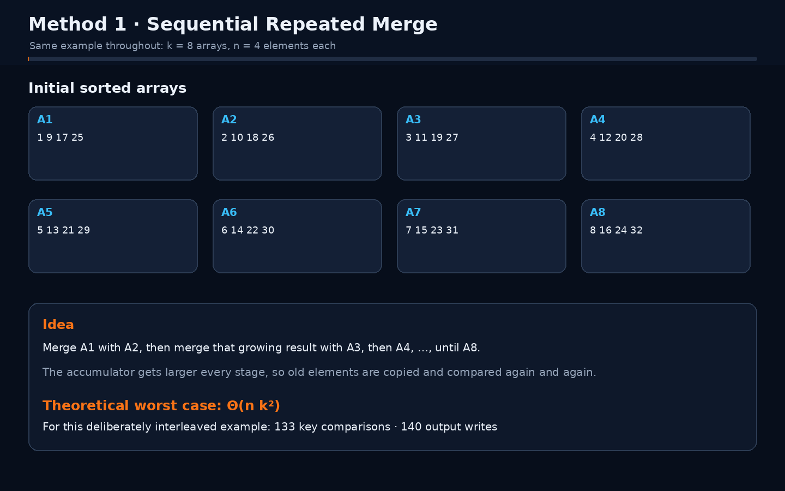
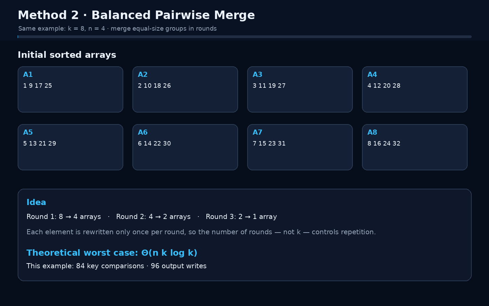

<p align="center"></p>

<p align="center"><a href="../README.md">← Lab 02</a> · <a href="../../README.md">Main repository</a></p>

# Q3 · Merging k Sorted Arrays

Suppose there are `k` sorted arrays and every array contains `n` elements. The final output contains `nk` elements.

## Program · Both methods + user selection

**File:** `q3_merge_k_arrays.c`

The program implements both algorithms. You enter `k`, `n`, and all `k` sorted arrays, then choose which method's merged result you want displayed:

```text
1. Method 1 - sequential repeated merge
2. Method 2 - balanced pairwise merge
```

It validates that every input array is already sorted, runs **both** methods on the same input for a fair measurement, prints the selected merged output first, verifies that both methods produce the same final array, and then prints a side-by-side table containing:

- key comparisons;
- output element writes;
- merge calls;
- stages / rounds;
- measured elapsed time.

It finishes by printing the exact worst-case expression requested for Method 1 and the `n`, `k` complexity derivation for Method 2.

```bash
gcc -std=c17 -O2 -Wall -Wextra -pedantic q3_merge_k_arrays.c -lm -o q3_merge_k_arrays
./q3_merge_k_arrays
```

## Method 1 · Sequential repeated merge

Merge the first two arrays, merge that result with the third, then with the fourth, and continue until the kth array.

The merge output lengths are:

```text
2n, 3n, 4n, ... , kn
```

Total element-level merge work is proportional to:

```text
n(2 + 3 + ... + k)
= n(k(k + 1)/2 - 1)
= Θ(nk²)
```

Worst-case key comparisons are:

```text
n(k(k + 1)/2 - 1) - (k - 1)
```

### Detailed animation · Method 1

The animation uses eight arrays with four elements each:

```text
A1 = [1,  9, 17, 25]    A5 = [5, 13, 21, 29]
A2 = [2, 10, 18, 26]    A6 = [6, 14, 22, 30]
A3 = [3, 11, 19, 27]    A7 = [7, 15, 23, 31]
A4 = [4, 12, 20, 28]    A8 = [8, 16, 24, 32]
```

Every frame shows the arrays being merged, current accumulator size, actual comparisons, writes, cumulative work, and the resulting array.

<p align="center"></p>

For this example Method 1 performs **133 key comparisons** and **140 output writes**.

## Method 2 · Balanced pairwise merge

Pair the arrays and merge each pair. Repeat on the resulting arrays until only one remains.

For `k = 8`:

```text
8 arrays → 4 arrays → 2 arrays → 1 array
```

There are `Θ(log k)` levels. At each level at most all `nk` elements participate, so:

```text
Θ(nk) work per level × Θ(log k) levels
= Θ(nk log k)
```

When `k` is a power of two, the exact worst-case number of key comparisons is:

```text
nk log₂(k) - (k - 1)
```

### Detailed animation · Method 2

The second animation uses the **same input arrays** as Method 1 so the visual comparison is fair. It shows every pair, every round, each pair's comparison ceiling, cumulative counters, and the number of elements rewritten per round.

<p align="center"></p>

For this same example Method 2 performs **84 key comparisons** and **96 output writes** in exactly **3 rounds**.

## Side-by-side conclusion

| Property | Method 1 · Sequential | Method 2 · Balanced |
|---|---:|---:|
| Merge structure | growing accumulator | balanced merge tree |
| Number of merge calls | `k - 1` | `k - 1` |
| Depth / stages | `k - 1` | `⌈log₂ k⌉` rounds |
| Worst-case running time | `Θ(nk²)` | `Θ(nk log k)` |
| Example comparisons | 133 | 84 |
| Example output writes | 140 | 96 |

Both methods are correct. The improvement comes from **how often already-merged elements are processed again**: sequential merging repeatedly revisits a growing prefix, while balanced merging limits each element to logarithmically many merge levels.
