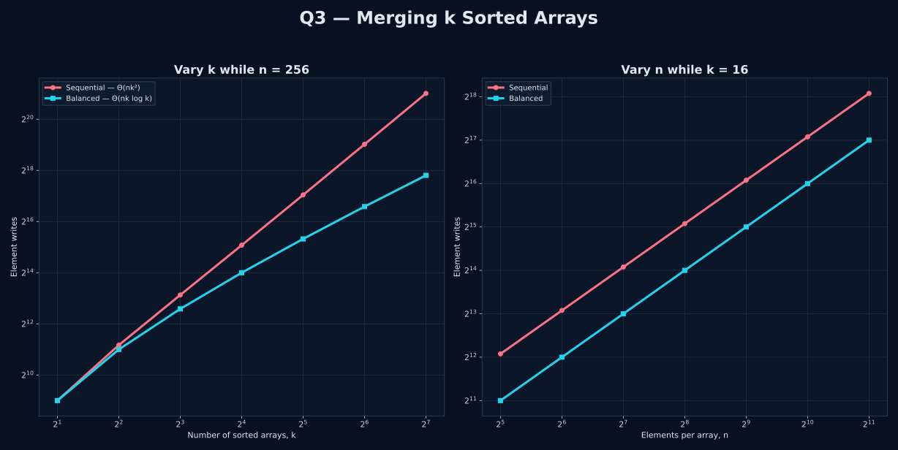

<p align="center">
  
</p>

<p align="center">
  
  
  
</p>

<p align="center"><strong>Same merge primitive. Completely different growth in the number of arrays.</strong></p>

<p align="center"></p>

## 🎯 Problem

There are **k sorted arrays**, each containing **n elements**. The final sorted array contains **kn elements**.

Compare two methods:

- **Method 1:** merge the first two arrays, merge that result with the third, continue sequentially until the kth array is included.
- **Method 2:** merge arrays in balanced pairs, then merge the resulting runs in pairs again, continuing until only one sorted run remains.

Both methods are implemented and validated.

## 🧠 Method 1 · Sequential Merging

The merged result gets larger after every step:

<p align="center"><strong>2n, 3n, 4n, …, kn</strong></p>

Therefore the total amount of merge work is:

<p align="center"><strong>2n + 3n + ⋯ + kn</strong></p>
<p align="center"><strong>= n(2 + 3 + ⋯ + k)</strong></p>
<p align="center"><strong>= n[k(k + 1)/2 − 1]</strong></p>
<p align="center"><strong>⇒ Θ(nk²)</strong></p>

The problem is repeated reprocessing: elements already merged into the growing result are copied again and again.

## ⚡ Method 2 · Balanced Pairwise Merging

At each level, every element participates in at most one merge.

<p align="center"><strong>Work per level = Θ(nk)</strong></p>

The number of balanced merging levels is logarithmic:

<p align="center"><strong>Number of levels = Θ(log k)</strong></p>

Hence:

<p align="center"><strong>Θ(nk) · Θ(log k) = Θ(nk log k)</strong></p>

> **Final comparison:** sequential merging is **Θ(nk²)**, while balanced pairwise merging is **Θ(nk log k)**.

<p align="center"></p>

## 📈 Experimental Validation

<p align="center">
  
</p>

The graph validates the result from two directions:

### Vary k while n = 256

The sequential method bends toward quadratic growth in k, while balanced merging grows much more slowly with k log k.

### Vary n while k = 16

Both methods are linear in n, exactly as the formulas predict. The balanced method still performs substantially fewer element writes.

The graph program runs the real merge algorithms, verifies that both outputs are sorted and identical, and only then records the work count.

## 🔬 Exact Work Count for Powers of Two

When k is a power of two:

- Method 1 writes exactly **n(2 + 3 + ⋯ + k)** elements during merge operations.
- Method 2 has **log₂ k** balanced levels, and each level writes **nk** elements, giving **nk log₂ k** merge writes.

The experiment therefore exposes the asymptotic difference directly through element-write counts.

## 🧩 Files

| File | Purpose |
|---|---|
| `q3_merge_k_sorted_arrays.c` | Clean, self-contained implementation of both methods and the required analysis |
| `q3_graph.c` | Self-contained measurement program that validates both methods and generates the graph |
| `q3_merge_k_sorted_arrays.gp` | Separate GNUPlot styling and plotting instructions |
| `q3_merge_k_sorted_arrays.svg` | Final comparison graph |

There are exactly **two C programs** and no helper header or extra algorithm file.

## ▶️ Run the Answer Program

```bash
gcc -std=c17 -O2 -Wall -Wextra -pedantic q3_merge_k_sorted_arrays.c -o q3_merge_k_sorted_arrays
./q3_merge_k_sorted_arrays
```

The terminal output derives both complexities, prints a correctness demonstration, compares measured work, and verifies that both methods produce the same sorted result.

## 🎨 Generate the Graph

```bash
gcc -std=c17 -O2 -Wall -Wextra -pedantic q3_graph.c -o q3_graph
./q3_graph
```

`q3_graph` runs both methods over a range of k and n values, verifies every output, creates temporary data, invokes `q3_merge_k_sorted_arrays.gp`, writes the final SVG, and removes the temporary .dat file after a successful plot.

<p align="center"></p>

## ✅ Final Observation

> Balanced pairwise merging wins because it prevents an already-large merged result from being copied once for every remaining array. The improvement is from **Θ(nk²)** to **Θ(nk log k)**.

<p align="center"><strong>Q3 · Complete · Balanced merging wins asymptotically</strong></p>
