<p align="center">
  
</p>

<p align="center">
  
  
  
  
</p>

<p align="center">
  <strong>Dictionary representations · merge-sort recursion · balanced multiway merging</strong>
</p>

<p align="center">04 August 2026 · Instructor: Dr. Ajaya Kumar Dash · Student: Satyam Dhal</p>

<p align="center">
  <a href="Q-1/README.md">Q1 · Dictionary Operations</a> ·
  <a href="Q-2/README.md">Q2 · Merge Sort</a> ·
  <a href="Q-3/README.md">Q3 · Merging k Arrays</a> ·
  <a href="Problem-Sheet-Lab-02.pdf">Problem Sheet</a>
</p>

<p align="center"></p>

## 🌌 Lab 02 Dashboard

| Question | What Is Analyzed? | Final Worst-Case Result |
|:--:|---|---|
| **[Q1](Q-1/README.md)** | Search, insert, delete, maximum, minimum, predecessor, and successor across six dictionary representations | **O(1)** · **O(log n)** · **O(n)** trade-offs |
| **[Q2](Q-2/README.md)** | Standard 2-way merge sort against modified 3-way merge sort | Both **Θ(n log n)** |
| **[Q3](Q-3/README.md)** | Sequential merging against balanced pairwise merging for k sorted arrays of n elements each | **Θ(nk²)** versus **Θ(nk log k)** |

## 🧬 The Lab 02 File Rule

Every question contains exactly **two C programs**.

<table>
<tr>
<td width="50%" valign="top">
<h3>🧠 Program 1 · Answer</h3>
<p>Contains the actual algorithm or complexity answer requested by the question.</p>
<p>Its terminal output presents the derivation, result, verification, and observations cleanly.</p>
</td>
<td width="50%" valign="top">
<h3>📈 Program 2 · Graph</h3>
<p>Runs the experiment, writes temporary graph data, invokes GNUPlot, creates the SVG, and removes the temporary data after success.</p>
<p>All file-writing logic stays here — never in the clean answer program.</p>
</td>
</tr>
</table>

Alongside those two C files, each question keeps one separate **GNUPlot .gp file** and the finished **SVG graph**.

> **Nothing else is required to understand or regenerate a Lab 02 result.** No helper headers, no duplicate algorithm libraries, no platform-specific build scripts, and no committed .dat files.

<p align="center">
  
</p>

## ⚡ Generate Any Graph

GNUPlot must be installed and available through the command `gnuplot`. Then enter the question folder and run only these two commands.

### Q1 · Dictionary Operations

```bash
gcc -std=c17 -O2 -Wall -Wextra -pedantic q1_graph.c -o q1_graph
./q1_graph
```

### Q2 · Merge Sort Comparison

```bash
gcc -std=c17 -O2 -Wall -Wextra -pedantic q2_graph.c -o q2_graph
./q2_graph
```

### Q3 · Merging k Sorted Arrays

```bash
gcc -std=c17 -O2 -Wall -Wextra -pedantic q3_graph.c -o q3_graph
./q3_graph
```

Each graph program follows the same sequence:

**measure → verify → create temporary .dat → call GNUPlot → create .svg → remove temporary .dat**

No separate regeneration script is needed.

<p align="center"></p>

## 🎨 Final Visualizations

### Q1 · Dictionary Operation Growth

<p align="center">
  <a href="Q-1/README.md"></a>
</p>

### Q2 · 2-Way vs 3-Way Merge Sort

<p align="center">
  <a href="Q-2/README.md"></a>
</p>

### Q3 · Sequential vs Balanced Merging

<p align="center">
  <a href="Q-3/README.md"></a>
</p>

<p align="center"></p>

## 🧠 Core Conclusions

<table>
<tr>
<td width="33%" valign="top">
<h3 align="center">Q1</h3>
<p align="center"><strong>Representation creates trade-offs.</strong></p>
<p>Unsorted structures favor cheap updates. Sorted arrays favor search and ordered access. Link direction determines whether a known node and its predecessor can be reached immediately.</p>
</td>
<td width="33%" valign="top">
<h3 align="center">Q2</h3>
<p align="center"><strong>More branches do not change the class.</strong></p>
<p>Both recursion trees perform linear merging work per level. The depth changes from logarithm base 2 to logarithm base 3, but both remain Θ(n log n).</p>
</td>
<td width="33%" valign="top">
<h3 align="center">Q3</h3>
<p align="center"><strong>Balance prevents repeated large merges.</strong></p>
<p>Sequential merging repeatedly reprocesses an increasingly large result, producing Θ(nk²). Balanced merging limits the process to Θ(log k) levels of Θ(nk) work.</p>
</td>
</tr>
</table>

## ✅ Submission Checklist

- [x] All three questions answered.
- [x] Exactly two C programs per question.
- [x] Main answer programs contain no graph-data file writing.
- [x] Graph programs verify algorithmic correctness before plotting.
- [x] GNUPlot scripts are separate and readable.
- [x] Finished SVG graphs are included.
- [x] Temporary .dat files are not included.
- [x] Mathematical notation uses readable symbols such as Θ, ², log₂, ⇒, and ⋯ where appropriate.
- [x] All solution programs compile cleanly with `-Wall -Wextra -pedantic`.

<p align="center">
  
</p>

<p align="center"><strong>Satyam Dhal · DAA Laboratory · Lab 02</strong></p>
