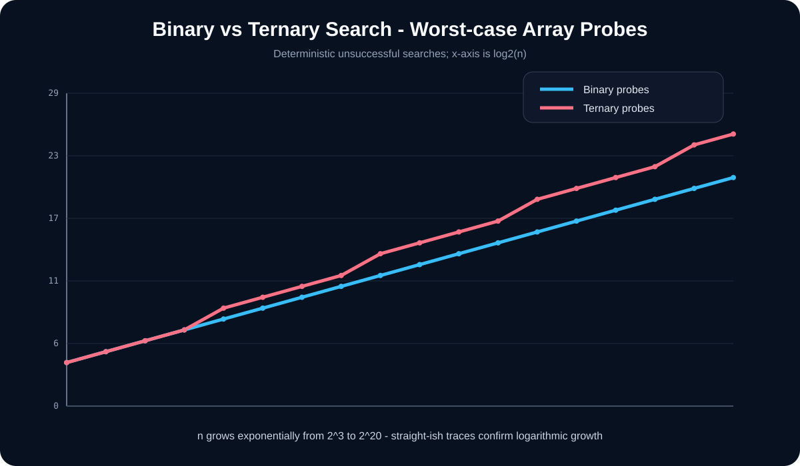

[← Lab 03](../README.md) · [Main repository](../../README.md)

# Q1 · Binary Search vs Ternary Search

The question asks for searching a sorted list using both binary and ternary search and for an implementation-based justification that **binary search is better**.

<p align="center"></p>

## Core idea

Binary search probes one midpoint and keeps one half:

```text
T₂(n) = T₂(n/2) + Θ(1) = Θ(log₂ n)
```

Ternary search creates three intervals, but to determine which interval contains the target it may inspect **two middle positions**:

```text
T₃(n) = T₃(n/3) + Θ(1) = Θ(log₃ n)
```

The base of a logarithm alone is not the whole cost. In the worst-case probe model:

```text
Binary  ≈ log₂ n        = (1/ln 2) ln n ≈ 1.4427 ln n probes
Ternary ≈ 2 log₃ n      = (2/ln 3) ln n ≈ 1.8205 ln n probes
```

So both are logarithmic, but binary search has the smaller dominant comparison/probe constant for a conventional in-memory sorted array.

## Program 1 · Interactive comparison

File: `q1_search_interactive.c`

It validates that the input is sorted, runs both recursive searches on exactly the same array and target, then reports:

- returned index;
- array probes;
- target comparisons;
- recursive calls;
- final asymptotic explanation.

```bash
gcc -std=c17 -O2 -Wall -Wextra -pedantic q1_search_interactive.c -o q1_search_interactive
./q1_search_interactive
```

## Program 2 · Deterministic worst-case experiment

File: `q1_experimental_comparison.c`

The experiment searches for a value larger than the maximum element, forcing an unsuccessful rightmost-path search. It tests powers of two from `2³` through `2²⁰` and writes:

`q1_experimental_data.dat`

The final rows continue to favor binary search in array probes and key comparisons.

```bash
gcc -std=c17 -O2 -Wall -Wextra -pedantic q1_experimental_comparison.c -o q1_experimental_comparison
./q1_experimental_comparison
```

## Program 3 · SVG evidence

File: `q1_plot_comparison.c`

It reads the measured `.dat` file and creates:

<p align="center"></p>

```bash
gcc -std=c17 -O2 -Wall -Wextra -pedantic q1_plot_comparison.c -lm -o q1_plot_comparison
./q1_plot_comparison
```

## Viva conclusion

> Ternary search has fewer recursion levels, but it can require two midpoint probes per level. Binary search therefore has the smaller comparison constant, even though both have `Θ(log n)` asymptotic complexity.
