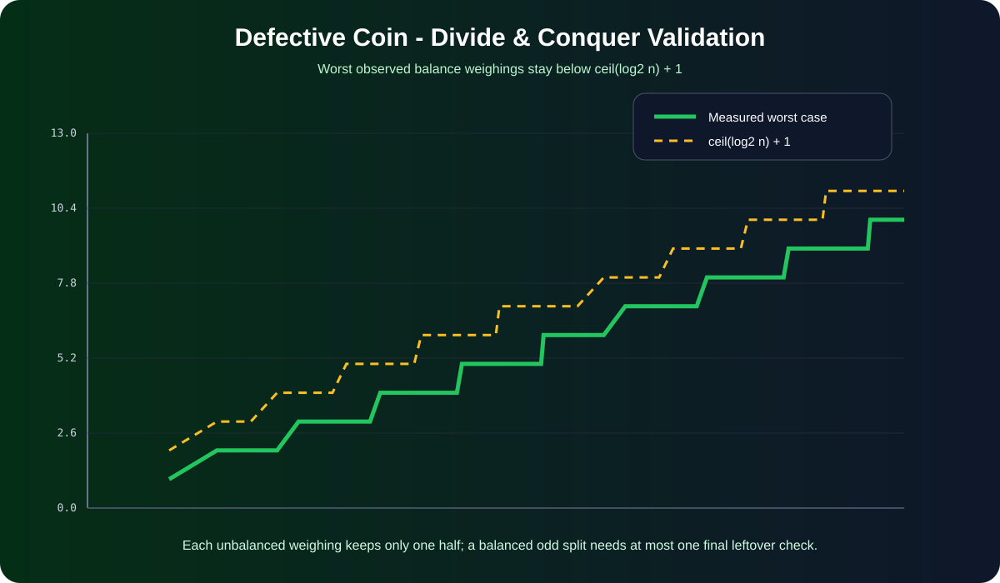

[← Lab 03](../README.md) · [Main repository](../../README.md)

# Q2 · Search the Defective Coin

There are `n` coins. At most one may be lighter; none is heavier. The algorithm has only a **balance scale**, and it must also correctly report the case where every coin is perfect.

<p align="center"></p>

## Divide-and-conquer algorithm

For a current candidate set of size `n`:

1. Put `⌊n/2⌋` coins on the left pan and `⌊n/2⌋` coins on the right pan.
2. If one side is lighter, the possible defective coin is in that side only. Recurse there.
3. If the pans balance and `n` is even, there is no lighter coin in this candidate set.
4. If the pans balance and `n` is odd, the one unweighed leftover is the only remaining suspect. Compare it once against any coin from the balanced groups, which are now certified good.

Every unbalanced weighing reduces the candidate count by about half, so

```text
W(n) = W(⌊n/2⌋) + 1
     = O(log₂ n)
```

The “possibly none” requirement introduces only constant extra work; therefore the requested form `log₂ n + c` is satisfied.

## Program 1 · Balance-scale simulation

File: `q2_defective_coin.c`

The user enters integer weights only to simulate the physical pans. The decision logic uses only the scale result (`left lighter`, `balanced`, `right lighter`). The program also rejects data that violates the question's promise of at most one lighter coin.

```bash
gcc -std=c17 -O2 -Wall -Wextra -pedantic q2_defective_coin.c -o q2_defective_coin
./q2_defective_coin
```

## Program 2 · Exhaustive validation

File: `q2_experimental_validation.c`

For every tested `n`, it checks:

- every possible position of the lighter coin;
- the case where no coin is defective;
- correctness of the returned position;
- the worst number of balance weighings.

The committed experiment verifies:

```text
worst weighings <= ceil(log₂ n) + 1
```

for all generated test sizes.

## Program 3 · Complexity visual

<p align="center"></p>

File: `q2_plot_complexity.c`

The green measured trace stays below the `⌈log₂ n⌉ + 1` reference curve.

## Important edge case

With exactly one coin and no known reference coin, a balance scale alone cannot distinguish “this coin is perfect” from “this coin is lighter.” The implementation therefore requires `n >= 2`, which is the meaningful setting for the stated balance-scale problem.

## Viva conclusion

> A balance comparison of equal-size groups removes approximately half the candidates. An odd leftover after a balanced comparison needs only one extra check, so the complete algorithm uses logarithmic weighings plus a constant.
