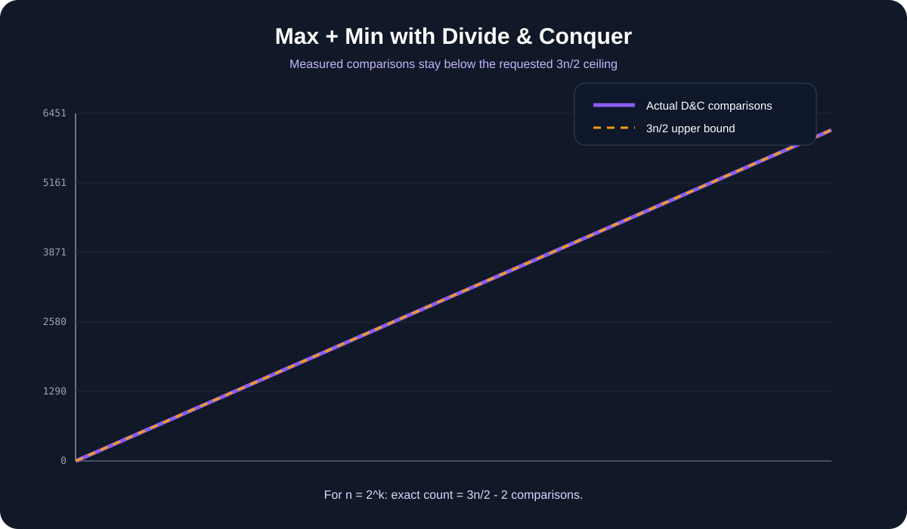

[← Lab 03](../README.md) · [Main repository](../../README.md)

# Q3 · Max and Min using Divide & Conquer

The target is not merely to find the minimum and maximum, but to keep the number of comparisons bounded by `3n/2`.

<p align="center"></p>

## Why the obvious method is wasteful

Finding minimum and maximum independently costs:

```text
(n - 1) + (n - 1) = 2n - 2 comparisons
```

Instead, first compare elements **in pairs**. Every pair immediately supplies one candidate for the minimum tournament and one candidate for the maximum tournament.

## Comparison count

For even `n`:

```text
pair comparisons        = n/2
minimum tournament      = n/2 - 1
maximum tournament      = n/2 - 1
------------------------------------------------
total                   = 3n/2 - 2
```

For odd `n`, leave one element unpaired and insert it into both candidate sets:

```text
total = 3(n - 1)/2
```

Both formulas are at most `3n/2`.

## Program 1 · Interactive D&C tournament

File: `q3_max_min_dc.c`

The code:

1. divides the array into pairs;
2. performs one comparison per pair;
3. builds minimum-candidate and maximum-candidate arrays;
4. recursively finds the final minimum and maximum;
5. prints actual comparisons, the exact formula, and the requested bound.

```bash
gcc -std=c17 -O2 -Wall -Wextra -pedantic q3_max_min_dc.c -o q3_max_min_dc
./q3_max_min_dc
```

## Program 2 · Deterministic validation

File: `q3_experimental_validation.c`

It checks thousands of sizes and requires both conditions to hold before accepting a row:

```text
measured comparisons == exact tournament formula
measured comparisons <= 3n/2
```

## Program 3 · Visual proof

<p align="center"></p>

The measured curve remains below the requested `3n/2` line and almost touches it for large powers of two because the exact even-`n` result is `3n/2 - 2`.

## Viva conclusion

> Comparing elements in pairs makes one comparison do double duty: the loser can only be a minimum candidate and the winner can only be a maximum candidate. That is the source of the reduction from about `2n` comparisons to about `1.5n`.
