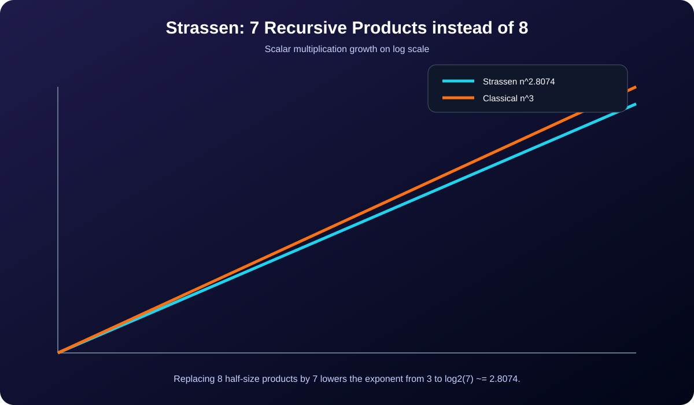

[← Lab 03](../README.md) · [Main repository](../../README.md)

# Q4 · Matrix Multiplication using Strassen's Method

Strassen's method splits both matrices into four blocks but uses **seven** recursive block multiplications instead of the eight used by ordinary block multiplication.

<p align="center"></p>

## Seven products

For

```text
A = [A11 A12]      B = [B11 B12]
    [A21 A22]          [B21 B22]
```

the implementation computes:

```text
M1 = (A11 + A22)(B11 + B22)
M2 = (A21 + A22)B11
M3 = A11(B12 - B22)
M4 = A22(B21 - B11)
M5 = (A11 + A12)B22
M6 = (A21 - A11)(B11 + B12)
M7 = (A12 - A22)(B21 + B22)
```

and reconstructs the four output blocks from those seven products.

## Complexity

```text
T(n) = 7T(n/2) + Θ(n²)
```

By the Master Theorem:

```text
T(n) = Θ(n^log₂7) ≈ Θ(n^2.8074)
```

which grows asymptotically more slowly than classical `Θ(n³)` multiplication.

## Program 1 · Complete implementation

File: `q4_strassen.c`

Features:

- accepts any positive square order `n`;
- zero-pads to the next power of two when necessary;
- recursively applies Strassen down to scalar multiplication;
- counts scalar multiplications, additions/subtractions, and recursive calls;
- computes a classical product independently and requires an exact match.

```bash
gcc -std=c17 -O2 -Wall -Wextra -pedantic q4_strassen.c -o q4_strassen
./q4_strassen
```

## Program 2 · Exact multiplication-count experiment

For `n = 2^k`, the number of scalar multiplications is exactly:

```text
7^k = n^log₂7
```

The validator writes this beside the classical `8^k = n³` count.

## Program 3 · Growth visual

<p align="center"></p>

The gap grows with `n`: reducing one recursive multiplication at every node compounds over the entire recursion tree.

## Viva conclusion

> Strassen does more additions than the classical block formula, but it saves one recursive multiplication at every level. Because multiplication dominates the recurrence, changing 8 recursive products to 7 lowers the exponent from `3` to `log₂7`.
