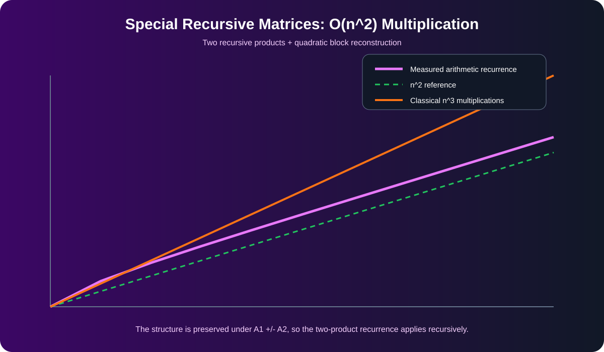

[← Lab 03](../README.md) · [Main repository](../../README.md)

# Q5 · Multiply Special-Pattern Square Matrices using D&C

Every matrix has the recursive form

```text
M = [M1 M2]
    [M2 M1]
```

and each block again has the same structure until the blocks are single integers.

<p align="center"></p>

## First derive the product structure

Let

```text
A = [A1 A2]      B = [B1 B2]
    [A2 A1]          [B2 B1]
```

Then

```text
C = AB = [C1 C2]
         [C2 C1]
```

with

```text
C1 = A1B1 + A2B2
C2 = A1B2 + A2B1
```

Four direct recursive multiplications would not be enough to guarantee the requested `O(n²)` recurrence. The key is to replace those four products by **two**.

## Two-product transform

Compute:

```text
P = (A1 + A2)(B1 + B2) = C1 + C2
Q = (A1 - A2)(B1 - B2) = C1 - C2
```

Then recover:

```text
C1 = (P + Q)/2
C2 = (P - Q)/2
```

The recursive structure is preserved by block addition and subtraction, so the same trick can be applied inside `P` and `Q`.

## Complexity

There are only two recursive multiplications of order `n/2` and `Θ(n²)` block arithmetic/reconstruction work:

```text
T(n) = 2T(n/2) + Θ(n²)
     = Θ(n²)
```

The result contains `n²` entries, so explicitly producing the whole output already needs `Ω(n²)` writes. Thus the algorithm is asymptotically output-optimal.

## Program 1 · Complete special-matrix multiplier

File: `q5_special_matrix_multiply.c`

The code:

- requires `n` to be a power of two as stated in the question;
- recursively verifies the special block pattern before multiplying;
- uses the two-product transform above;
- checks that every `/2` is exact;
- compares the complete result with classical matrix multiplication.

```bash
gcc -std=c17 -O2 -Wall -Wextra -pedantic q5_special_matrix_multiply.c -o q5_special_matrix_multiply
./q5_special_matrix_multiply
```

## Program 2 · Recurrence validation

File: `q5_experimental_validation.c`

For powers of two it records the exact recurrence-level arithmetic. One striking consequence of the recursive structure is that the number of leaf scalar multiplications becomes only `n`; the explicit `n²` output/reconstruction work dominates the total complexity.

## Program 3 · Visual comparison

<p align="center"></p>

The measured recurrence tracks the `n²` reference while classical matrix multiplication follows cubic growth.

## Viva conclusion

> The special symmetry lets us diagonalize the block interaction into a “sum channel” and a “difference channel.” Those two channels are multiplied recursively and then recombined, giving the required `Θ(n²)` full-output algorithm.
