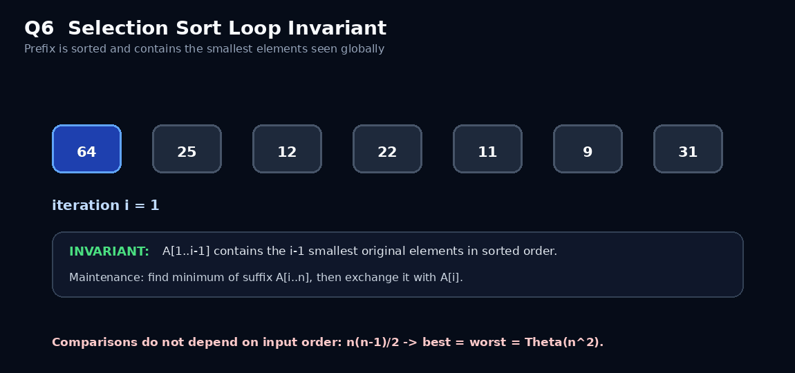
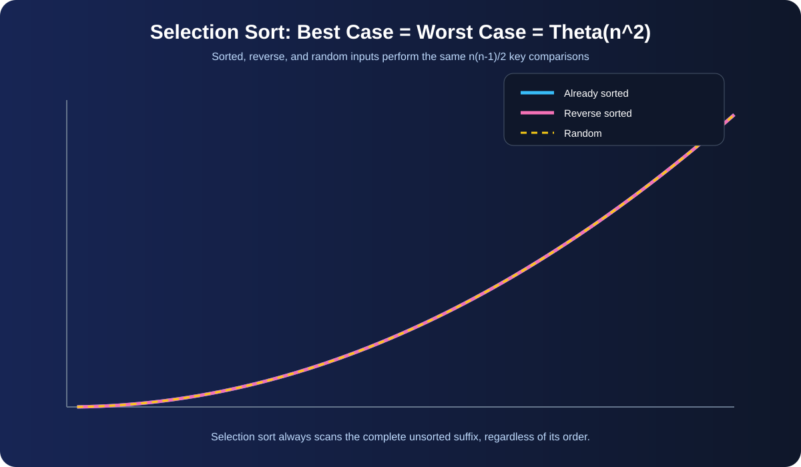

[← Lab 03](../README.md) · [Main repository](../../README.md)

# Q6 · Use of Loop Invariants in Sorting

The described algorithm is **selection sort**: on iteration `i`, find the smallest element in the remaining suffix and exchange it with `A[i]`.

<p align="center"></p>

## Pseudocode

```text
SELECTION-SORT(A, n)
    for i = 1 to n - 1
        min = i
        for j = i + 1 to n
            if A[j] < A[min]
                min = j
        exchange A[i] and A[min]
```

## Loop invariant

At the **start** of each outer-loop iteration `i`:

> `A[1 ... i-1]` contains the `i-1` smallest elements of the original array, in sorted order; therefore every element in this prefix is no larger than any element remaining in `A[i ... n]`.

### Initialization

Before the first iteration, `i = 1`, so `A[1 ... 0]` is empty. The invariant is trivially true.

### Maintenance

The inner loop finds the minimum element in `A[i ... n]`. Swapping it into `A[i]` appends the next-smallest element to the already-correct prefix. Therefore the invariant holds when the next iteration begins.

### Termination

The outer loop runs only for the first `n-1` positions. Once the `n-1` smallest elements are correctly placed, the only element left in position `n` must be the largest; no final search is needed.

## Running time

The number of comparisons is independent of input order:

```text
(n-1) + (n-2) + ... + 1
= n(n-1)/2
= Θ(n²)
```

Therefore:

```text
Worst case = Θ(n²)
Best case  = Θ(n²)
```

The best case is **not** asymptotically better because selection sort still scans the complete remaining suffix even when the array is already sorted.

## Program 1 · Interactive invariant trace

File: `q6_selection_sort_invariant.c`

Trace mode prints the array before and after every outer iteration and explicitly checks the invariant at runtime.

```bash
gcc -std=c17 -O2 -Wall -Wextra -pedantic q6_selection_sort_invariant.c -o q6_selection_sort_invariant
./q6_selection_sort_invariant
```

## Program 2 · Experimental validation

File: `q6_experimental_validation.c`

For each tested `n`, the same algorithm is run on:

- already sorted input;
- reverse-sorted input;
- deterministic random input.

All three must match the exact formula `n(n-1)/2` before the row is written.

## Program 3 · Complexity visual

<p align="center"></p>

The three traces lie on top of one another because the comparison schedule does not depend on the initial arrangement.

## Viva conclusion

> The loop invariant explains correctness, while the fixed suffix scan explains complexity. Selection sort may perform fewer swaps on some inputs, but its key comparisons remain `Θ(n²)` in both the best and worst cases.
