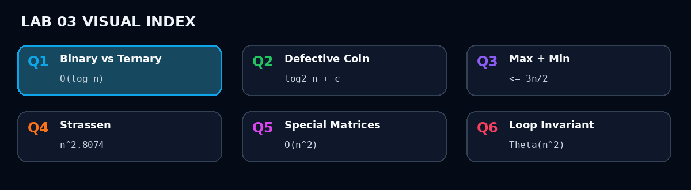
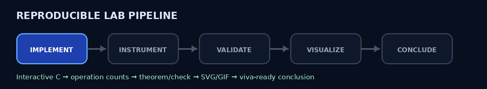

<p align="center">
  
</p>
<p align="center">
  
  
  
  
  
  
</p>
<h1 align="center">DAA Laboratory · Lab 03</h1>
<p align="center"><strong>Search trees · balance-scale D&C · min/max tournament · Strassen · structured matrices · loop invariants</strong></p>
<p align="center">Student: <strong>Satyam Dhal</strong> · Instructor: <strong>Dr. Ajaya Kumar Dash</strong> · 11 August 2026</p>

<p align="center"></p>
<p align="center"><strong><a href="../README.md">← Main repository</a></strong> · <a href="Problem-Sheet-Lab-03.pdf">Original problem sheet</a></p>

## Laboratory dashboard

| Question | What the implementation validates | Final result |
|---|---|---|
| **[Q1 · Binary vs Ternary Search](Q-1/README.md)** | Runs both searches on identical sorted data, counts probes/comparisons, and plots deterministic worst-case misses | Both `O(log n)`; binary has the smaller comparison/probe constant |
| **[Q2 · Defective Coin](Q-2/README.md)** | Simulates a physical balance scale, handles the “possibly none” case, and exhaustively checks every defect location for many `n` | At most `⌈log₂ n⌉ + O(1)` weighings |
| **[Q3 · Max and Min using D&C](Q-3/README.md)** | Pairwise tournament plus recursive min/max trees; exact comparison count is checked for thousands of sizes | `≤ 3n/2` comparisons |
| **[Q4 · Strassen Multiplication](Q-4/README.md)** | Full Strassen implementation with padding, operation counters, and classical multiplication cross-check | `Θ(n^log₂7) ≈ Θ(n^2.8074)` |
| **[Q5 · Special-Pattern Matrices](Q-5/README.md)** | Uses a two-product sum/difference transform, verifies the recursive matrix structure, and checks against classical multiplication | `Θ(n²)` |
| **[Q6 · Loop Invariant in Sorting](Q-6/README.md)** | Implements selection sort, prints invariant traces, and compares sorted/reverse/random experiments | Best = worst = `Θ(n²)` |

<p align="center">
  
</p>

## What makes this submission evidence-driven

This lab keeps the **algorithm**, **proof idea**, **measured evidence**, and **visual explanation** together.

- **Q1** records worst-case array probes from `n = 2³` through `2²⁰` and shows why “three pieces” does not automatically mean fewer comparisons.
- **Q2** checks every possible lighter-coin position plus the all-perfect case for each tested size, then verifies the logarithmic weighing bound.
- **Q3** uses the comparison-optimal pairwise tournament formulation, giving `3n/2 - 2` comparisons for even `n` and `3(n-1)/2` for odd `n`.
- **Q4** verifies Strassen numerically against ordinary multiplication and separately plots `7^k` versus `8^k` scalar-multiplication growth.
- **Q5** derives `P=(A₁+A₂)(B₁+B₂)` and `Q=(A₁-A₂)(B₁-B₂)`, so only two recursive products are needed; the result is checked against classical multiplication.
- **Q6** validates the loop invariant at runtime when trace mode is enabled and experimentally shows that the comparison count is always exactly `n(n-1)/2`.

<p align="center"></p>

## Repository map

```text
DAA-Lab/
└── lab3/
    ├── README.md
    ├── Problem-Sheet-Lab-03.pdf
    ├── assets/
    │   ├── lab3_banner.gif
    │   ├── animated_divider.gif
    │   ├── pipeline.gif
    │   └── divide_conquer_gallery.gif
    │
    ├── Q-1/
    │   ├── README.md
    │   ├── q1_search_interactive.c
    │   ├── q1_experimental_comparison.c
    │   ├── q1_plot_comparison.c
    │   ├── q1_experimental_data.dat
    │   ├── q1_binary_vs_ternary.svg
    │   ├── q1_binary_vs_ternary.gif
    │   ├── q1_sample_output.txt
    │   └── q1_experiment_output.txt
    │
    ├── Q-2/
    │   ├── README.md
    │   ├── q2_defective_coin.c
    │   ├── q2_experimental_validation.c
    │   ├── q2_plot_complexity.c
    │   ├── q2_experimental_data.dat
    │   ├── q2_defective_coin_complexity.svg
    │   ├── q2_balance_scale.gif
    │   ├── q2_sample_output.txt
    │   └── q2_experiment_output.txt
    │
    ├── Q-3/
    │   ├── README.md
    │   ├── q3_max_min_dc.c
    │   ├── q3_experimental_validation.c
    │   ├── q3_plot_comparisons.c
    │   ├── q3_experimental_data.dat
    │   ├── q3_max_min_comparisons.svg
    │   ├── q3_pairwise_tournament.gif
    │   ├── q3_sample_output.txt
    │   └── q3_experiment_output.txt
    │
    ├── Q-4/
    │   ├── README.md
    │   ├── q4_strassen.c
    │   ├── q4_experimental_validation.c
    │   ├── q4_plot_multiplications.c
    │   ├── q4_experimental_data.dat
    │   ├── q4_strassen_vs_classical.svg
    │   ├── q4_strassen_seven_products.gif
    │   ├── q4_sample_output.txt
    │   └── q4_experiment_output.txt
    │
    ├── Q-5/
    │   ├── README.md
    │   ├── q5_special_matrix_multiply.c
    │   ├── q5_experimental_validation.c
    │   ├── q5_plot_complexity.c
    │   ├── q5_experimental_data.dat
    │   ├── q5_special_matrix_complexity.svg
    │   ├── q5_two_product_transform.gif
    │   ├── q5_sample_output.txt
    │   └── q5_experiment_output.txt
    │
    └── Q-6/
        ├── README.md
        ├── q6_selection_sort_invariant.c
        ├── q6_experimental_validation.c
        ├── q6_plot_comparisons.c
        ├── q6_experimental_data.dat
        ├── q6_selection_sort_complexity.svg
        ├── q6_loop_invariant.gif
        ├── q6_sample_output.txt
        └── q6_experiment_output.txt
```

## Run from the repository sequence

Every algorithm and every experiment is standalone C17. The plotting programs read the committed `.dat` files and write SVG directly, so **GNUPlot is not required for Lab 03**.

Example:

```bash
cd lab3/Q-3
gcc -std=c17 -O2 -Wall -Wextra -pedantic q3_max_min_dc.c -o q3_max_min_dc
./q3_max_min_dc

gcc -std=c17 -O2 -Wall -Wextra -pedantic q3_experimental_validation.c -o q3_experimental_validation
./q3_experimental_validation

gcc -std=c17 -O2 -Wall -Wextra -pedantic q3_plot_comparisons.c -o q3_plot_comparisons
./q3_plot_comparisons
```

The committed `.dat`, `.svg`, `.gif`, and sample-output files make the repository visually complete immediately after upload.

<p align="center"></p>

## Final conclusions

| Topic | Validated conclusion |
|---|---|
| Binary vs ternary search | Same logarithmic class; binary normally performs fewer array probes in the comparison model |
| Defective coin | Equal-size balance comparisons discard about half the candidates per level; the “none” case costs only constant extra work |
| Max + min | Pairing elements before the recursive tournaments stays within `3n/2` comparisons |
| Strassen | Seven half-size products reduce the exponent from `3` to `log₂7 ≈ 2.8074` |
| Special recursive matrix | Sum/difference diagonalization reduces four block products to two recursive products; full-output time is `Θ(n²)` |
| Selection sort invariant | The sorted-smallest prefix grows by one each iteration; comparisons remain quadratic even on already sorted input |

<p align="center">
  
  
  
</p>
<p align="center">
  
  
  
</p>

<p align="center"><strong>Every requested claim is paired with either a counted experiment, a numerical cross-check, or a frame-by-frame visual.</strong></p>
<p align="center"><strong><a href="../README.md">← Back to the DAA Laboratory repository</a></strong></p>
