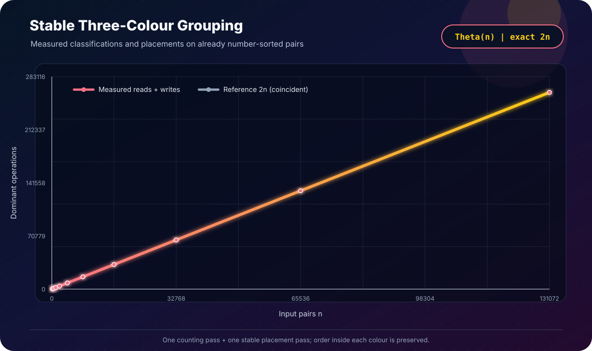

[← Lab 04](../README.md) · [Main repository](../../README.md)

# Q1 · Stable Three-Colour Sorting in Linear Time

The input contains pairs `(number, colour)`, the numbers are already sorted, and the required colour order is:

```text
RED  →  BLUE  →  YELLOW
```

The important condition is **stability**: within one colour, the original number order must remain unchanged.

<p align="center"></p>

## Input representation

```c
typedef struct {
    long long number;
    Colour colour;
    size_t original_position;
} Item;
```

The colour is stored as `RED = 0`, `BLUE = 1`, or `YELLOW = 2`. The original position is retained only to validate stability.

## Algorithm · stable counting distribution

```text
STABLE-COLOUR-SORT(A, n)
    count[RED..YELLOW] = {0, 0, 0}

    for each item in A
        count[item.colour]++

    next[RED]    = 0
    next[BLUE]   = count[RED]
    next[YELLOW] = count[RED] + count[BLUE]

    scan A from left to right
        output[next[item.colour]] = item
        next[item.colour]++
```

This is counting sort specialized to a three-value key. The second pass always visits equal-colour items from left to right, so it is stable.

## Why it is correct

1. The counts reserve three non-overlapping output ranges: all red positions, then blue, then yellow.
2. Every input item is written exactly once into the range belonging to its colour.
3. A colour's `next` pointer only moves to the right, and the input is scanned left to right.
4. Therefore equal-colour items keep their original relative order. Since the original numbers were sorted, the numbers inside every colour remain sorted.

## Complexity

```text
Counting pass     = n classifications
Distribution pass = n placements
Total             = 2n = Θ(n)
Auxiliary output  = Θ(n)
```

No comparison sort is necessary because the colour universe has constant size three.

## Program 1 · interactive solution

File: [`q1_stable_colour_sort.c`](q1_stable_colour_sort.c)

The program validates the sorted-number precondition, accepts full colour names or `r/b/y`, prints the stable result, and checks colour order, within-colour number order, and original positions.

```bash
gcc -std=c17 -O2 -Wall -Wextra -Wpedantic q1_stable_colour_sort.c -o q1_stable_colour_sort
./q1_stable_colour_sort
```

The committed [`q1_sample_output.txt`](q1_sample_output.txt) shows `1,3,6` staying ordered in red, `2,5,8` in blue, and `4,7` in yellow.

## Program 2 · deterministic validation

File: [`q1_experimental_validation.c`](q1_experimental_validation.c)

For `n = 128 ... 131072`, it generates sorted numbers with deterministic pseudo-random colours, runs the algorithm, validates stability, and records the exact two-pass work in [`q1_experimental_data.dat`](q1_experimental_data.dat).

## Program 3 · SVG evidence

File: [`q1_plot_linear.c`](q1_plot_linear.c)

<p align="center"></p>

The measured line coincides with `2n`, not merely an informal linear reference.

## Edge cases handled

- only one colour appears;
- repeated numbers are allowed while stability remains testable;
- upper/lower-case colour names and single-letter names;
- unsorted number input is rejected because it violates the question's precondition;
- invalid colours and allocation failures are reported.

## Viva conclusion

> The key is not a general-purpose comparison sort. With only three colours, one count pass reserves the colour blocks and one stable placement pass fills them. The exact dominant work is `2n`, so the algorithm is `Θ(n)`.
