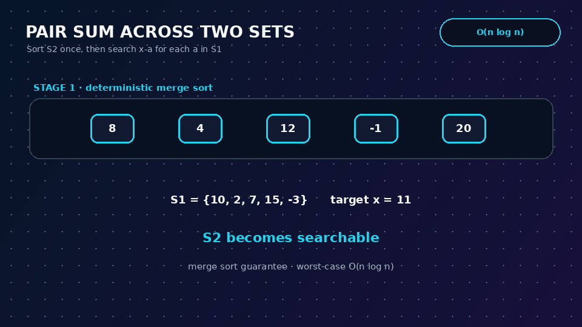
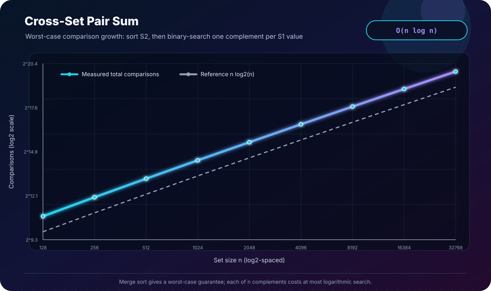

[← Lab 04](../README.md) · [Main repository](../../README.md)

# Q2 · Pair Sum Across Two Sets

Given sets `S1`, `S2`, and target `x`, determine whether some `a ∈ S1` and `b ∈ S2` satisfy:

```text
a + b = x
```

<p align="center"></p>

## Input representation

Both sets are represented as one-dimensional `long long` arrays. A copy of `S2` is sorted so the user's original input is not destroyed.

## Algorithm · sort one set, search every complement

```text
PAIR-SUM(S1, S2, n, x)
    merge-sort S2

    for each a in S1
        needed = x - a
        if BINARY-SEARCH(S2, needed)
            return (a, needed)

    return NOT-FOUND
```

The implementation uses merge sort instead of relying on library `qsort`, because merge sort provides an explicit **worst-case** `O(n log n)` guarantee.

## Correctness argument

- If the algorithm reports `(a, b)`, then `a` was read from `S1`, binary search found `b = x-a` in `S2`, and hence `a+b=x`.
- Conversely, suppose a valid pair `(a*, b*)` exists. The outer loop eventually examines `a*`. Its complement is exactly `x-a* = b*`; binary search on sorted `S2` must find it. Therefore the algorithm cannot miss an existing pair.

## Complexity

```text
Sort S2                   O(n log n)
n binary searches         n · O(log n)
Total                     O(n log n)
Auxiliary merge-sort copy O(n)
```

## Program 1 · interactive solution

File: [`q2_cross_set_pair_sum.c`](q2_cross_set_pair_sum.c)

It reports the found values, sorted `S2`, merge-sort comparisons, binary-search comparisons, and how many values of `S1` were examined. Complement arithmetic is checked before subtraction to avoid signed-overflow undefined behaviour.

```bash
gcc -std=c17 -O2 -Wall -Wextra -Wpedantic q2_cross_set_pair_sum.c -o q2_cross_set_pair_sum
./q2_cross_set_pair_sum
```

The committed sample finds `7 ∈ S1` and `4 ∈ S2` for target `11`.

## Program 2 · worst-case experiment

File: [`q2_experimental_validation.c`](q2_experimental_validation.c)

For powers of two through `32768`, both sets contain even integers while the target is odd. No pair can exist, so every value in `S1` forces a complete unsuccessful binary search. The program also verifies that merge sort produced an ordered array.

The measured data are committed in [`q2_experimental_data.dat`](q2_experimental_data.dat), with the full terminal table in [`q2_experiment_output.txt`](q2_experiment_output.txt).

## Program 3 · complexity plot

<p align="center"></p>

File: [`q2_plot_complexity.c`](q2_plot_complexity.c)

The plot compares measured sort-plus-search comparisons with `n log₂n` on logarithmic axes.

## Why not use a hash table here?

Expected-time hashing can solve a related version in expected `O(n)`, but the question asks for a sorting application and an `O(n log n)` algorithm. Merge sort plus binary search gives a deterministic worst-case bound and makes the requested technique explicit.

## Viva conclusion

> Sorting converts membership queries in `S2` from linear scans to logarithmic searches. Performing one such search for every element of `S1` gives the required worst-case `O(n log n)` time.
