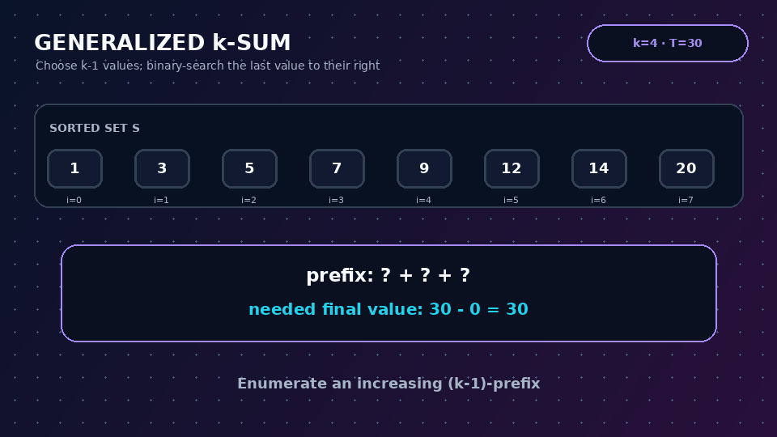
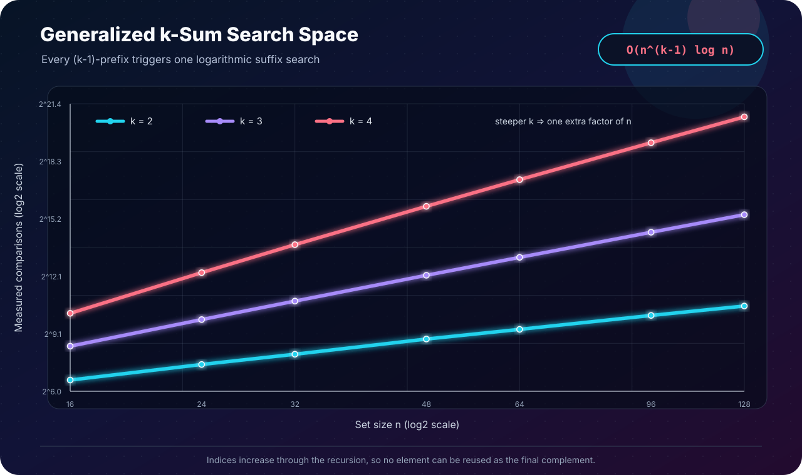

[← Lab 04](../README.md) · [Main repository](../../README.md)

# Q3 · Generalized k-Sum in `O(n^(k-1) log n)`

Given a set `S` of `n` integers, a fixed `k ≥ 2`, and target `T`, determine whether **k distinct set elements** add to `T`.

<p align="center"></p>

## Algorithm

1. Merge-sort `S`.
2. Enumerate every increasing-index choice of the first `k-1` values.
3. Let their sum be `s`; binary-search for `T-s` only in the suffix after the last selected index.

```text
CHOOSE(depth, start, partial)
    if depth = k - 1
        return BINARY-SEARCH(S[start ... n-1], T - partial)

    for i = start to the last index that leaves enough elements
        chosen[depth] = i
        if CHOOSE(depth + 1, i + 1, partial + S[i])
            return true

    return false
```

## The distinctness detail

The binary search is **not** performed over the whole array. Every recursive choice increases the index, and the final value is searched strictly to the right of all `k-1` chosen indices.

```text
i1 < i2 < ... < i(k-1) < ik
```

Therefore one array position can never be used twice. This also prevents different permutations of the same k-element subset from being enumerated.

## Correctness

- Every reported solution uses increasing indices, so it contains `k` distinct set positions and its final value is exactly `T - partial`; hence its sum is `T`.
- For any valid k-element subset, sort its indices as `i1 < ... < ik`. The recursion enumerates the prefix `i1 ... i(k-1)`, then binary search examines the suffix containing `ik` and finds its value. Thus every valid solution is reachable.

## Complexity

There are at most `C(n, k-1) = O(n^(k-1))` candidate prefixes. Each invokes one `O(log n)` binary search:

```text
O(n log n) + O(C(n,k-1) log n)
    = O(n^(k-1) log n)       for fixed k >= 2
```

The recursion uses `O(k)` stack/selection space in addition to merge sort's `O(n)` temporary array.

## Program 1 · interactive solution

File: [`q3_generalized_k_sum.c`](q3_generalized_k_sum.c)

The program:

- verifies `2 ≤ k ≤ n`;
- rejects duplicate input because the problem specifies a set;
- verifies that k-term arithmetic is safe in signed 64-bit range;
- prints a complete found expression;
- counts candidate prefixes and binary comparisons.

```bash
gcc -std=c17 -O2 -Wall -Wextra -Wpedantic q3_generalized_k_sum.c -o q3_generalized_k_sum
./q3_generalized_k_sum
```

The sample finds `1 + 3 + 12 + 14 = 30` using four distinct values.

## Program 2 · complete-prefix experiment

File: [`q3_experimental_validation.c`](q3_experimental_validation.c)

For `k = 2, 3, 4` and `n = 16 ... 128`, the target `-1` is impossible because every generated set value is positive. Consequently, the experiment cannot exit early and must exhaust every `(k-1)`-prefix.

## Program 3 · growth comparison

<p align="center"></p>

File: [`q3_plot_complexity.c`](q3_plot_complexity.c)

Each increment of `k` adds one enumeration dimension, visibly steepening the measured log-log curve.

## Practical note

The requested bound is polynomial only when `k` is treated as a fixed constant. If `k` grows with `n`, the number of subsets becomes combinatorial; the implementation therefore reports its counters so that this growth is visible rather than hidden.

## Viva conclusion

> Enumerating `k-1` elements costs `O(n^(k-1))`; sorting lets the final required value be tested in `O(log n)`. Suffix-only search is the key correctness detail that prevents reusing a chosen element.
