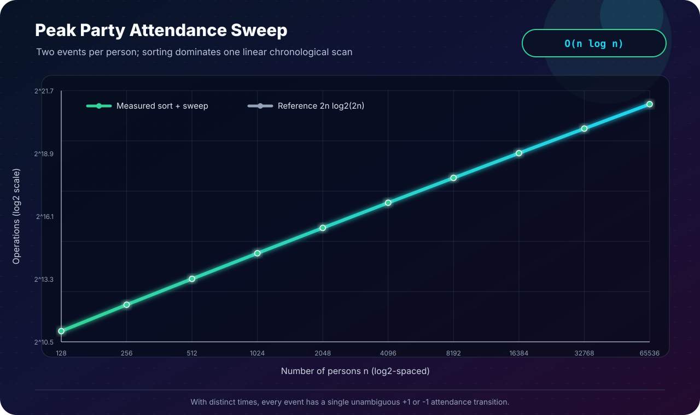

[← Lab 04](../README.md) · [Main repository](../../README.md)

# Q4 · Time of Maximum Party Attendance

For person `Pi`, the camera records an entry time `ai` and an exit time `bi`, with `bi > ai`. Every one of the `2n` times is distinct.

<p align="center"></p>

## Event representation

```c
typedef struct {
    long long time;
    int delta;       /* +1 entry, -1 exit */
    size_t person;
} Event;
```

Each attendance interval is interpreted as `[entry, exit)`: a person is present immediately after entry and no longer present at the exit time.

## Algorithm · chronological sweep

```text
events = all (ai, +1) and (bi, -1)
merge-sort events by time

present = 0
maximum = 0

for event in chronological order
    present += event.delta
    if present > maximum
        maximum = present
        peak_time = event.time
```

Because the question guarantees distinct times, no entry/exit tie rule is needed here.

## Why it is correct

Between consecutive event times, nobody enters or exits, so attendance is constant. At an event, updating by `+1` or `-1` produces exactly the attendance for the interval immediately following it. The sweep examines every such constant-attendance interval, so the largest counter value is the true maximum. Updating only on a strict improvement returns the earliest peak.

## Complexity

```text
Create 2n events  Θ(n)
Sort 2n events    O(n log n)
Sweep 2n events   Θ(n)
Total             O(n log n)
Space             O(n)
```

## Program 1 · interactive solution

File: [`q4_party_peak.c`](q4_party_peak.c)

It validates `entry < exit`, confirms all `2n` times are distinct, prints the complete event trace, identifies the earliest peak interval, and performs a second linear pass to list the people present at the peak without changing the asymptotic bound.

```bash
gcc -std=c17 -O2 -Wall -Wextra -Wpedantic q4_party_peak.c -o q4_party_peak
./q4_party_peak
```

The sample reaches four people first at `t = 5` and reports the peak interval `[5,7)`.

## Program 2 · deterministic stress validation

File: [`q4_experimental_validation.c`](q4_experimental_validation.c)

For each `n`, it assigns every entry a distinct time in `[0,n-1]` and every exit a distinct time in `[n,2n-1]`, then shuffles the assignments. The expected peak is exactly `n`. A valid run must:

- sort all times strictly increasingly;
- never let the active count become negative;
- reach peak `n`;
- finish with active count zero.

## Program 3 · measured complexity

<p align="center"></p>

File: [`q4_plot_complexity.c`](q4_plot_complexity.c)

The plot shows merge-sort comparisons plus exactly `2n` sweep events against the `2n log₂(2n)` reference.

## Q4 versus Q6

| Detail | Q4 · party attendance | Q6 · closed intervals |
|---|---|---|
| Endpoint guarantee | All event times distinct | Ties are allowed |
| Right endpoint | Exit means no longer present: `[a,b)` | Endpoint belongs to interval: `[l,r]` |
| Tie processing | Unnecessary | START → measure → END |

## Viva conclusion

> Attendance can change only at an entry or exit. Sorting those `2n` changes and sweeping once examines every possible attendance level, giving `O(n log n)` time.
