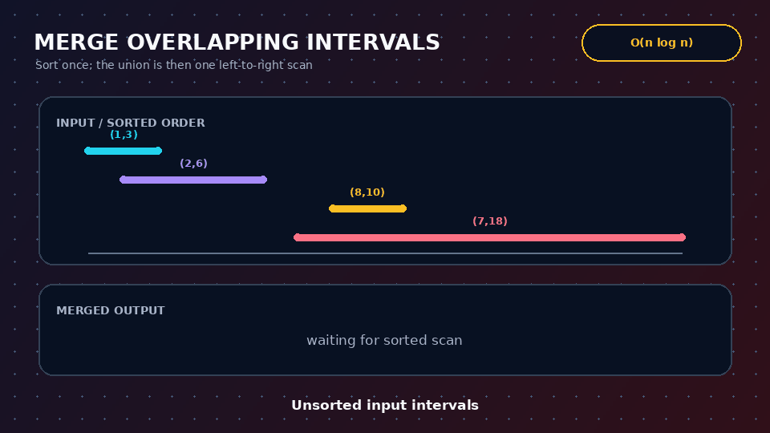
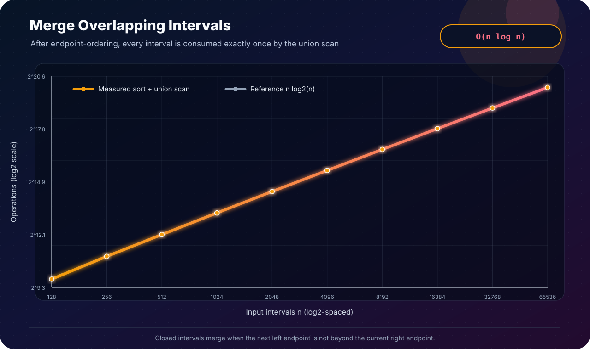

[← Lab 04](../README.md) · [Main repository](../../README.md)

# Q5 · Merge Overlapping Intervals

Given an unsorted list of closed intervals, return the union as a sorted list of pairwise non-overlapping intervals.

<p align="center"></p>

For the problem-sheet example:

```text
Input  = {(1,3), (2,6), (8,10), (7,18)}
Output = {(1,6), (7,18)}
```

## Representation

```c
typedef struct {
    long long left;
    long long right;
} Interval;
```

The program requires `left ≤ right` and treats intervals as closed. Therefore `(1,3)` and `(3,5)` overlap at `3` and are merged.

## Algorithm

```text
MERGE-INTERVALS(I, n)
    merge-sort I by (left, then right)
    output = [ I[0] ]

    for each next interval I[i]
        current = last interval in output

        if I[i].left <= current.right
            current.right = max(current.right, I[i].right)
        else
            append I[i] to output

    return output
```

## Correctness invariant

After processing the first `i` sorted intervals, `output` is exactly their union, in sorted pairwise-disjoint form.

- **Initialization:** the first interval alone is its own union.
- **Maintenance:** because starts are sorted, the next interval either touches/overlaps only the final output component and extends it, or begins strictly after it and must start a new component.
- **Termination:** after all intervals are processed, the output is exactly the union of the entire input.

## Complexity

```text
Merge sort     O(n log n)
Union scan     Θ(n)
Total          O(n log n)
Output/temps   O(n)
```

## Program 1 · interactive solution

File: [`q5_merge_intervals.c`](q5_merge_intervals.c)

It prints both the sorted input and merged result, then verifies in linear time that:

- output intervals are sorted;
- no two output intervals overlap;
- every sorted input interval is fully contained in one output interval.

```bash
gcc -std=c17 -O2 -Wall -Wextra -Wpedantic q5_merge_intervals.c -o q5_merge_intervals
./q5_merge_intervals
```

The committed [`q5_sample_output.txt`](q5_sample_output.txt) reproduces the exact result required in the sheet.

## Program 2 · deterministic experiment

File: [`q5_experimental_validation.c`](q5_experimental_validation.c)

For powers of two through `65536`, it creates unsorted intervals containing both overlaps and containment, measures merge-sort and scan comparisons, and rejects a row unless union-coverage properties pass.

## Program 3 · SVG evidence

<p align="center"></p>

File: [`q5_plot_complexity.c`](q5_plot_complexity.c)

The linear scan contributes only `n-1` overlap tests; sorting determines the worst-case asymptotic cost.

## Edge cases handled

- one interval;
- nested intervals such as `(1,10), (3,5)`;
- equal endpoints and point intervals `(4,4)`;
- equal starting points;
- already sorted or reverse-ordered input;
- invalid `left > right` input.

## Viva conclusion

> Sorting makes every possible future overlap local to the last merged component. That structural simplification reduces the union phase to one scan, so the complete algorithm is `O(n log n)`.
