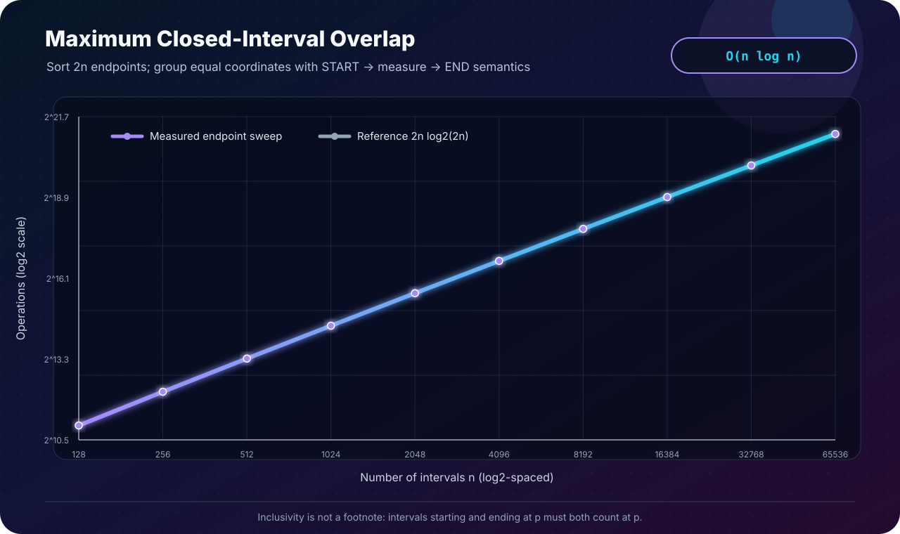

[← Lab 04](../README.md) · [Main repository](../../README.md)

# Q6 · Point Contained in the Maximum Number of Intervals

For closed intervals `[li,ri]`, identify a point `p` contained in as many intervals as possible. Endpoints count as part of their intervals.

<p align="center"></p>

## Endpoint representation

Each interval contributes:

```text
(li, START)
(ri, END)
```

Events are sorted by coordinate. Equal coordinates are grouped rather than treated independently.

## The essential inclusivity rule

At coordinate `x`:

```text
active += number of START events at x
measure active at x
active -= number of END events at x
```

This is **START → measure → END**. An interval ending at `x` remains active during the measurement, while an interval starting at `x` has already become active. Both must count because intervals are closed.

## Algorithm

```text
sort all 2n endpoints by coordinate
active = maximum = 0

for each distinct coordinate x
    active += starts_at_x

    if active > maximum
        maximum = active
        p = x

    active -= ends_at_x
```

Updating only for a strict improvement returns the earliest maximizing endpoint.

## Correctness

For any open region between consecutive endpoint coordinates, interval membership is constant. At an endpoint coordinate, the grouped rule computes the closed-interval membership exactly. Therefore every location where the overlap count can differ is represented either by an endpoint measurement or by the unchanged count after it. The maximum recorded by the sweep is consequently global.

## Complexity

```text
Create endpoints   Θ(n)
Sort 2n endpoints  O(n log n)
Grouped sweep      Θ(n)
Total              O(n log n)
Space              O(n)
```

## Program 1 · interactive solution

File: [`q6_max_interval_overlap.c`](q6_max_interval_overlap.c)

It prints the number of starts, ends, and closed-interval memberships at every endpoint coordinate. After finding `p`, it independently scans the original intervals and verifies that exactly `maximum` intervals contain it.

```bash
gcc -std=c17 -O2 -Wall -Wextra -Wpedantic q6_max_interval_overlap.c -o q6_max_interval_overlap
./q6_max_interval_overlap
```

### Problem-sheet example

For `{(10,40),(20,60),(50,90),(15,70)}`, the sheet gives `p = 50`, which is valid with overlap three. The implementation deliberately returns the **earliest** maximizer, `p = 20`, also with overlap three. This is not a disagreement: the question asks for a point, and both are correct.

## Program 2 · tied-endpoint validation

File: [`q6_experimental_validation.c`](q6_experimental_validation.c)

The generated datasets intentionally contain many equal starts and ends. A row is accepted only if the sweep finishes at zero and a direct containment count at the reported point matches the peak.

## Program 3 · SVG evidence

<p align="center"></p>

File: [`q6_plot_complexity.c`](q6_plot_complexity.c)

The experiment measures endpoint sort comparisons plus grouped sweep work and compares it with `2n log₂(2n)`.

## Q4 and Q6 are not identical

Q4 assumes all event times are distinct and models presence as `[entry,exit)`. Q6 allows ties and explicitly declares both endpoints included. Reusing Q4's exit handling unchanged would undercount points where intervals meet.

## Viva conclusion

> Sorting reveals the only coordinates where overlap can change. For closed intervals, processing starts before measurement and ends afterward is the crucial tie rule; the resulting sweep is `O(n log n)`.
