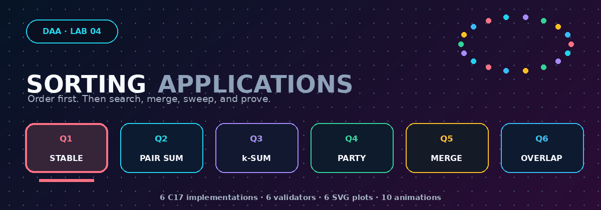

<p align="center">
  
</p>

<p align="center">
  
  
  
  
  
</p>

<h1 align="center">DAA Laboratory · Lab 04</h1>
<p align="center"><strong>Stable distribution · complement search · k-sum · chronological sweeps · interval union · closed endpoints</strong></p>
<p align="center">Student: <strong>Satyam Dhal</strong> · Instructor: <strong>Dr. Ajaya Kumar Dash</strong> · 18 August 2026</p>

<p align="center"></p>
<p align="center"><strong><a href="../README.md">← Main repository</a></strong> · <a href="Problem-Sheet-Lab-04.pdf">Original problem sheet</a></p>

## Laboratory dashboard

| Question | Algorithmic application | Validation performed | Final bound |
|:---:|---|---|:---:|
| **[Q1 · Stable Colour Sort](Q-1/README.md)** | Three-bucket stable counting distribution | Checks colour blocks, original positions, within-colour number order, and exact `2n` work | `Θ(n)` |
| **[Q2 · Cross-Set Pair Sum](Q-2/README.md)** | Merge-sort `S2`; binary-search `x-a` for every `a ∈ S1` | Impossible-target worst case + sortedness + comparison counters | `O(n log n)` |
| **[Q3 · Generalized k-Sum](Q-3/README.md)** | Enumerate `k-1` increasing indices; binary-search the final complement | Exhausts all prefixes for impossible targets at `k=2,3,4` | `O(n^(k-1) log n)` |
| **[Q4 · Peak Party Time](Q-4/README.md)** | Sort entry/exit events; sweep a live attendance counter | Distinct timeline, nonnegative count, exact peak, final zero | `O(n log n)` |
| **[Q5 · Merge Intervals](Q-5/README.md)** | Sort by left endpoint; extend or emit one union component | Sorted/disjoint output + linear union-coverage check | `O(n log n)` |
| **[Q6 · Maximum Overlap Point](Q-6/README.md)** | Sort/group closed endpoints; START → measure → END | Tied endpoints + direct containment cross-check | `O(n log n)` |

<p align="center">
  
</p>

## Six applications, three reusable patterns

<table>
<tr>
<td width="33%" valign="top">

### 1 · Stable placement

Q1 exploits a constant-size key universe. Counting reserves the red, blue, and yellow output blocks; scanning left to right fills them without destroying within-colour order.

```text
count → offsets → stable write
```

</td>
<td width="33%" valign="top">

### 2 · Sort, then search

Q2 and Q3 pay for sorting once so that many complement-membership questions become logarithmic binary searches.

```text
x - a
T - sum(k-1 values)
```

</td>
<td width="33%" valign="top">

### 3 · Sort, then sweep

Q4, Q5, and Q6 turn geometry/time into an ordered event stream. Once ordered, one linear pass maintains exactly the state needed for the answer.

```text
events → sort → local update
```

</td>
</tr>
</table>

<p align="center"></p>

## Visual gallery

<table>
<tr>
<td width="50%" align="center" valign="top">

### Q1 · Stable colour lanes

<a href="Q-1/README.md"></a>

**Watch:** equal-colour items move in original order into precomputed blocks.

</td>
<td width="50%" align="center" valign="top">

### Q2 · Sort and search

<a href="Q-2/README.md"></a>

**Watch:** `S2` first becomes ordered, then a shrinking window searches each complement.

</td>
</tr>
<tr>
<td width="50%" align="center" valign="top">

### Q3 · Choose and complete

<a href="Q-3/README.md"></a>

**Watch:** `k-1` positions are fixed in increasing order before the final suffix search.

</td>
<td width="50%" align="center" valign="top">

### Q4 · Live attendance

<a href="Q-4/README.md"></a>

**Watch:** each chronological entry/exit changes the live counter by exactly one.

</td>
</tr>
<tr>
<td width="50%" align="center" valign="top">

### Q5 · Interval union

<a href="Q-5/README.md"></a>

**Watch:** sorted overlapping spans collapse into one connected union component.

</td>
<td width="50%" align="center" valign="top">

### Q6 · Closed endpoints

<a href="Q-6/README.md"></a>

**Watch:** starts are added and ends are retained while the overlap at `p` is measured.

</td>
</tr>
</table>

## Correctness details that matter

| Question | Easy-to-miss detail | How the implementation protects it |
|:---:|---|---|
| Q1 | Grouping by colour can destroy number order | A stable left-to-right placement pass plus original-position validation |
| Q2 | Average-case library sorting would weaken the stated worst-case claim | Explicit merge sort is used |
| Q3 | The complement search can accidentally reuse a selected element | Search range begins strictly after the final selected prefix index |
| Q4 | Reporting one instant can hide how long the peak lasts | Earliest peak interval `[event_i,event_(i+1))` is reported |
| Q5 | Nested intervals may fail to extend but still belong to the current union | The current right endpoint changes only when the next right endpoint is larger |
| Q6 | Processing END before START undercounts a shared endpoint | Equal coordinates are grouped as START → measure → END |

## Complexity evidence

| Q | Measured dominant work | Reference used in the SVG |
|:---:|---|---|
| 1 | classifications + placements | exact `2n` |
| 2 | merge-sort comparisons + unsuccessful complement searches | `n log₂n` |
| 3 | merge-sort comparisons + suffix binary comparisons | `n^(k-1) log₂n`, with separate `k=2,3,4` series |
| 4 | event-sort comparisons + `2n` sweep updates | `2n log₂(2n)` |
| 5 | interval-sort comparisons + `n-1` overlap tests | `n log₂n` |
| 6 | endpoint-sort comparisons + grouped closed-endpoint sweep | `2n log₂(2n)` |

Every measurement uses a deterministic generator and is rejected before writing the row if its correctness checks fail.

## Repository map

```text
lab4/
├── README.md
├── Problem-Sheet-Lab-04.pdf
├── Makefile
├── build_windows.bat
├── common/
│   └── svg_plot.h                    ← shared C-only SVG theme
├── assets/
│   ├── lab4_banner.gif
│   ├── animated_divider.gif
│   ├── pipeline.gif
│   └── sorting_applications_gallery.gif
└── Q-1/ ... Q-6/
    ├── README.md
    ├── q*_main_algorithm.c
    ├── q*_experimental_validation.c
    ├── q*_plot_*.c
    ├── q*_experimental_data.dat
    ├── q*_complexity.svg
    ├── q*_algorithm_animation.gif
    ├── q*_sample_output.txt
    ├── q*_experiment_output.txt
    └── output/                       ← Windows executables after build
```

The descriptive names differ slightly by question; the complete exact filenames are listed in each question README.

## Build everything

### Linux / macOS / MSYS2 shell

```bash
cd lab4
make all          # compile all 18 C programs into bin/
make evidence     # rerun validators and regenerate all six SVGs
make strict       # compile every C source with warnings treated as errors
```

### Windows Command Prompt

```bat
cd lab4
build_windows.bat
```

This writes native `.exe` files into each question's `output` directory using the same C17 warning flags.

### Compile one question manually

```bash
cd lab4/Q-6
gcc -std=c17 -O2 -Wall -Wextra -Wpedantic q6_max_interval_overlap.c -o q6_max_interval_overlap
./q6_max_interval_overlap
```

The committed `.dat`, `.svg`, `.gif`, and output transcripts make the repository complete immediately after upload; rebuilding is optional.

<p align="center"></p>

## Final conclusions

| Application | Structural decision | Result |
|---|---|---|
| Stable colour sort | Replace comparisons by constant-key counting | Exact `Θ(n)` |
| Pair sum | Sort one set and reuse logarithmic membership queries | `O(n log n)` |
| k-sum | Enumerate only `k-1` values and search the final one | `O(n^(k-1) log n)` |
| Party peak | Turn visits into chronological `+1/-1` events | `O(n log n)` |
| Interval merging | Sort once so only the current union tail matters | `O(n log n)` |
| Maximum overlap | Sort endpoints and encode closed-endpoint ties correctly | `O(n log n)` |

<p align="center">
  
  
  
</p>
<p align="center">
  
  
  
</p>

<p align="center"><strong>Six sorting applications, each paired with proof, deterministic evidence, and a frame-by-frame visual explanation.</strong></p>
<p align="center"><strong><a href="../README.md">← Back to the DAA Laboratory repository</a></strong></p>
