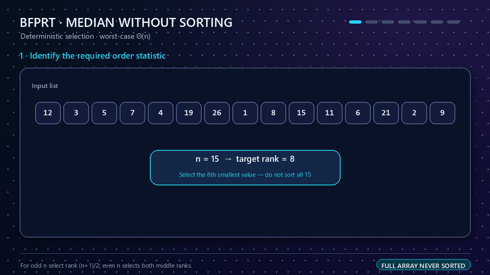
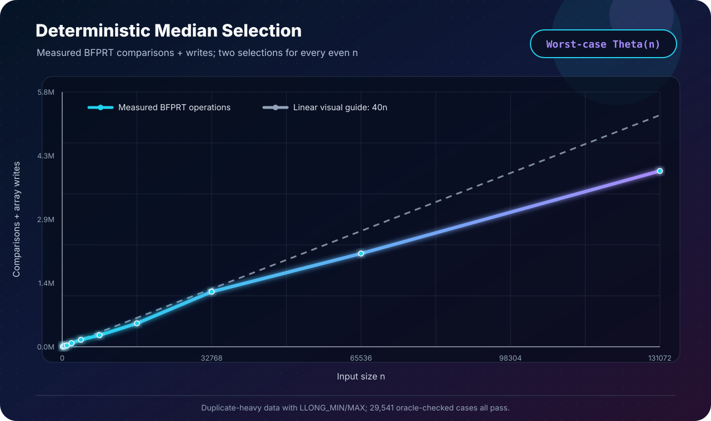

[← Lab 05](../README.md) · [Main repository](../../README.md)

# Q1 · Median Without Sorting — Deterministic BFPRT

Find the median of `n` signed integers **without sorting the complete list** and analyse the algorithm. This solution uses the deterministic BFPRT / median-of-medians selection algorithm, so its linear running time is a **worst-case guarantee**, not an average-case claim.

<p align="center"></p>

## Median definition

Using one-based ranks:

```text
n odd  : median = SELECT(A, (n + 1) / 2)
n even : median = (SELECT(A, n / 2) + SELECT(A, n / 2 + 1)) / 2
```

The C program uses zero-based targets `(n - 1) / 2` and `n / 2`. For even `n`, it prints the exact integer or half-integer median. It never forms `lower + upper`, so values such as `LLONG_MIN` and `LLONG_MAX` cannot overflow. It also avoids floating-point conversion, which would lose precision for large 64-bit integers.

## Algorithm

```text
BFPRT-SELECT(A[left..right], target)
    if the range has at most 5 values
        insertion-sort this tiny range
        return A[target]

    split the range into groups of at most 5
    insertion-sort each tiny group
    move each group median into a prefix M

    pivot = BFPRT-SELECT(M, middle rank of M)
    (L, E, G) = THREE-WAY-PARTITION(A, pivot)

    if target lies in L: continue on L
    if target lies in E: return pivot
    otherwise:           continue on G
```

Only constant-size groups are sorted. The complete input is never sorted. Selection is performed in place; the input order may therefore change.

The three-way partition is important for duplicates: it creates `< pivot`, `= pivot`, and `> pivot` regions in one pass. If the target rank falls anywhere in the equal region, the algorithm returns immediately.

## Correctness

**Claim.** `BFPRT-SELECT(A, k)` returns the value with rank `k` in `A`, counting duplicates.

**Proof by induction on the range length.**

1. For at most five values, the tiny range is sorted and the requested indexed value is returned directly.
2. For a larger range, recursively selecting the median of the group medians produces a pivot that is present in the range.
3. Three-way partitioning preserves every value and places all values smaller than the pivot before all pivot copies, followed by all larger values.
4. The number of values in the first two regions determines exactly which region contains rank `k`. The algorithm recurses only into that region, or returns the pivot when `k` lies in the equal region.
5. The selected recursive region is smaller, so the induction hypothesis applies.

Thus each requested middle order statistic is correct. An odd-size median is that single statistic; an even-size median is the exact average of the two correct middle statistics. ∎

## Worst-case complexity

Let `g = ceil(n / 5)` be the number of groups. At least half of the group medians are no smaller than the pivot, and each complete such group contributes at least three values no smaller than the pivot. The symmetric argument holds below the pivot. Allowing for an incomplete group and boundary effects, at least `3n/10 - 6` values can be discarded from either side.

The worst-case recurrence is therefore:

```text
T(n) ≤ T(ceil(n/5)) + T(7n/10 + 6) + cn
```

The recursive fractions sum to `1/5 + 7/10 = 9/10 < 1`, so substitution gives `T(n) = O(n)`. Selection also has an `Ω(n)` lower bound, hence:

```text
Worst-case time              Θ(n)
Odd-n selections             1
Even-n selections            2 · Θ(n) = Θ(n)
Algorithm auxiliary storage  O(log n) recursion stack
Input storage                O(n)
```

The main selection loop is iterative; recursion is used only while selecting successively smaller median prefixes, so the stack depth is logarithmic.

## Program 1 · interactive solution

File: [`q1_median_bfprt.c`](q1_median_bfprt.c)

```bash
gcc -std=c17 -O2 -Wall -Wextra -Wpedantic -Werror \
    q1_median_bfprt.c -o q1_median_bfprt
./q1_median_bfprt
```

The program accepts `1 ≤ n ≤ 1,000,000`, uses `long long` elements, reports the selected middle rank(s), validates them using rank counts, and prints instrumented comparisons, array writes, and partitions. See [`q1_sample_output.txt`](q1_sample_output.txt) for odd and even examples, including both signed 64-bit extremes.

## Program 2 · deterministic experimental validation

File: [`q1_experimental_validation.c`](q1_experimental_validation.c)

The independent test oracle sorts a copy with `qsort`; the submitted median algorithm never calls it. Validation includes:

- seven targeted cases: singleton, all equal, ordered, reverse ordered, mixed signs, duplicates, and `LLONG_MIN`/`LLONG_MAX`;
- every one of the `29,523` arrays over `{-1, 0, 1}` with lengths 1 through 9;
- eleven duplicate-heavy scaling runs from `n = 128` through `n = 131,072`, with both 64-bit extremes injected.

All **29,541** cases pass. The scaling runs use even `n`, so every row performs both middle selections. Measured work remains a bounded constant per element (approximately `29.1`–`40.3` comparisons-plus-writes per element in this deterministic dataset).

Generated evidence:

- [`q1_experiment_output.txt`](q1_experiment_output.txt) — complete validation transcript;
- [`q1_experimental_data.dat`](q1_experimental_data.dat) — machine-readable measurements.

## Program 3 · dependency-free SVG plot

File: [`q1_plot_complexity.c`](q1_plot_complexity.c)

```bash
gcc -std=c17 -O2 -Wall -Wextra -Wpedantic -Werror \
    q1_experimental_validation.c -o q1_experimental_validation
./q1_experimental_validation

gcc -std=c17 -O2 -Wall -Wextra -Wpedantic -Werror \
    q1_plot_complexity.c -o q1_plot_complexity
./q1_plot_complexity
```

<p align="center"></p>

The graph is produced directly by portable C—no plotting package is needed. `40n` is a visual linear guide, not an asserted exact operation bound; the recurrence above supplies the formal worst-case proof.

## Edge cases handled

- `n = 1`;
- odd and even list lengths;
- repeated values, including an all-equal list;
- already ordered and reverse-ordered inputs;
- negative and positive medians;
- exact `.5` results, including `-0.5`;
- `LLONG_MIN` and `LLONG_MAX` without addition overflow or floating-point rounding;
- invalid `n`, malformed input, and allocation failure.

## Viva summary

> BFPRT sorts only groups of five, recursively selects their median as a guaranteed-good pivot, and uses a three-way partition to discard a constant fraction of the remaining range. Its recurrence solves to `Θ(n)` in the worst case. For even `n`, two linear selections are still linear, and the two middle values are averaged without overflow.
