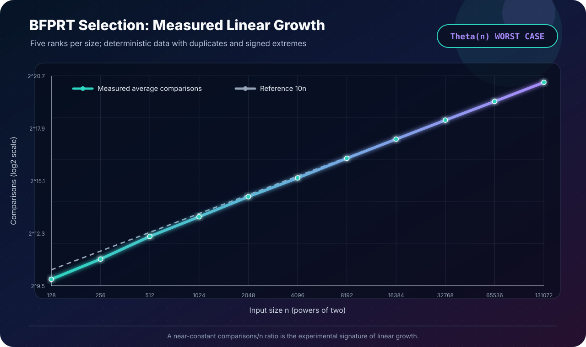

[← Lab 05](../README.md) · [Main repository](../../README.md)

# Q2 · K-th Smallest without Sorting

Find the `k`-th smallest value in a list of `n` integers **without sorting the
complete list**, and analyse the algorithm's complexity. Here `k` is one-based:
`k = 1` means the minimum and `k = n` means the maximum.

<p align="center"></p>

## Solution at a glance

| Property | Choice |
|---|---|
| Algorithm | BFPRT / deterministic median of medians |
| Pivot strategy | Recursively select the median of medians of groups of five |
| Partition | Three-way: values `< pivot`, `== pivot`, and `> pivot` |
| Worst-case time | **Theta(n)** |
| Algorithmic extra space | `O(log n)` recursion stack |
| Input preservation | `O(n)` working copy; the original list is unchanged |
| Value type | `long long`, including duplicates and signed extremes |

Randomized Quickselect is often fast, but its unlucky worst case is quadratic.
BFPRT makes the stronger guarantee required here: its running time is linear
for **every** input order.

## Algorithm

```text
SELECT(A, left, right, targetIndex)
    if the active range contains at most 5 values
        insertion-sort only that tiny range
        return A[targetIndex]

    split the active range into groups of at most 5
    insertion-sort each tiny group and move its median to the front
    pivot <- SELECT(the compacted medians, their middle index)

    three-way partition the active range around pivot
        [left, less)     contains values < pivot
        [less, greater)  contains values = pivot
        [greater, right) contains values > pivot

    if targetIndex is in the left part, continue there
    if targetIndex is in the right part, continue there
    otherwise return pivot
```

Only constant-sized groups are locally ordered to discover their medians. The
complete input is never sorted: after selection, the working copy is merely
partitioned enough to identify the requested rank.

## Worked example

For

```text
A = [29, -4, 17, 8, 3, 21, 14, 6, 11, 1, 25, 9, 19, 5, 13]
k = 8
```

the sorted five-element groups and their medians are:

```text
[-4, 3, 8, 17, 29]    -> 8
[ 1, 6, 11, 14, 21]   -> 11
[ 5, 9, 13, 19, 25]   -> 13
```

The median of `[8, 11, 13]` is pivot `11`. Three-way partitioning gives seven
values smaller than `11`, one value equal to `11`, and seven values greater
than `11`. Therefore rank 8 lies in the equal band and the answer is `11`.

## Why it is correct

**Lemma 1 — pivot validity.** Every group median is an element of the active
range. Recursively selecting the median of those medians therefore returns a
pivot that is also an element of the active range.

**Lemma 2 — partition invariant.** During the Dutch-national-flag partition,
all positions before `less` contain values smaller than the pivot, all settled
positions from `less` to `scan` equal the pivot, and all positions at or after
`greater` contain values greater than the pivot. Each step expands a settled
region, so at termination the three claimed bands are exact.

**Lemma 3 — rank preservation.** If the target index is before the equal band,
its value must be in the smaller band. If it is after the equal band, its value
must be in the greater band. If it lies inside the equal band, the requested
value is the pivot. Thus discarding either outside band never discards the
requested order statistic.

Each recursive/iterative continuation uses a strictly smaller active range.
The base case returns the exact indexed value after ordering at most five
items. By the lemmas and induction on active-range size, the algorithm always
returns the `k`-th smallest value.

## Worst-case complexity

With groups of five, at least half of the full-group medians are at least the
median-of-medians pivot, and each such median has at least three group members
at least as large. Symmetrically, a comparable number are at most the pivot.
After allowing for an incomplete group and the pivot's own group, the next
selection range has size at most `7n/10 + 6`.

```text
T(n) <= T(ceil(n/5)) + T(7n/10 + 6) + c*n
```

The two recursive fractions sum to `1/5 + 7/10 = 9/10 < 1`, so the recurrence
is `O(n)`. General selection also needs `Omega(n)` work in the worst case;
therefore BFPRT is **Theta(n) worst-case time**.

The in-place selection procedure uses `O(log n)` call-stack space. The
interactive program deliberately spends another `O(n)` space on a working copy
so it can prove that the user's original array was not modified.

## Program 1 · interactive solution

Files: [`q2_kth_smallest.c`](q2_kth_smallest.c) and
[`q2_bfprt.h`](q2_bfprt.h)

```bash
gcc -std=c17 -O2 -Wall -Wextra -Wpedantic -Werror \
    q2_kth_smallest.c -o q2_kth_smallest
./q2_kth_smallest
```

The program validates `1 <= k <= n`, accepts duplicate/negative `long long`
values, preserves the input, and reports comparisons, partitions, tiny-group
sorts, and maximum recursion depth. The committed run is in
[`q2_sample_output.txt`](q2_sample_output.txt).

## Program 2 · deterministic validation experiment

File: [`q2_experimental_validation.c`](q2_experimental_validation.c)

The validation has two layers:

1. It checks **every rank** of singleton, duplicate-heavy, `LLONG_MIN` /
   `LLONG_MAX`, ascending, descending, and all-equal arrays.
2. It checks 2,000 reproducible, duplicate-heavy fuzz arrays with varied sizes,
   ranks, and periodically injected signed extremes.
3. For powers of two from `128` through `131072`, it checks five representative
   ranks against an independently sorted oracle. The generated arrays and PRNG
   seed are fixed, so every run is reproducible.

The solution itself never calls `qsort`; the experiment uses it only on a
separate oracle copy to verify results. All 55 scaling trials pass, and the
measured `comparisons / n` ratio stays bounded (about `7.05` to `10.05` in the
committed run), which is the expected signature of linear growth.

- Data: [`q2_experimental_data.dat`](q2_experimental_data.dat)
- Terminal table: [`q2_experiment_output.txt`](q2_experiment_output.txt)

## Program 3 · generated complexity plot

<p align="center"></p>

File: [`q2_plot_complexity.c`](q2_plot_complexity.c)

```bash
gcc -std=c17 -O2 -Wall -Wextra -Wpedantic -Werror \
    q2_experimental_validation.c -o q2_experimental_validation
./q2_experimental_validation

gcc -std=c17 -O2 -Wall -Wextra -Wpedantic -Werror \
    q2_plot_complexity.c -lm -o q2_plot_complexity
./q2_plot_complexity
```

The logarithmic-axis SVG compares average measured comparisons with the linear
reference `10n`. Nearly parallel/overlapping curves show that doubling `n`
approximately doubles the measured work.

## Robustness notes

- A three-way partition handles repeated pivot values without quadratic
  duplicate-by-duplicate recursion.
- Comparisons never subtract values, so `LLONG_MIN` and `LLONG_MAX` cannot cause
  signed-overflow bugs.
- Array sizes and one-based `k` are validated before selection.
- The deterministic pivot rule uses no random state and has no unlucky input.

## Viva conclusion

> Median of medians spends linear work choosing a pivot but guarantees that a
> fixed fraction of candidates is discarded. That balance yields deterministic
> `Theta(n)` worst-case selection without sorting the complete list.
