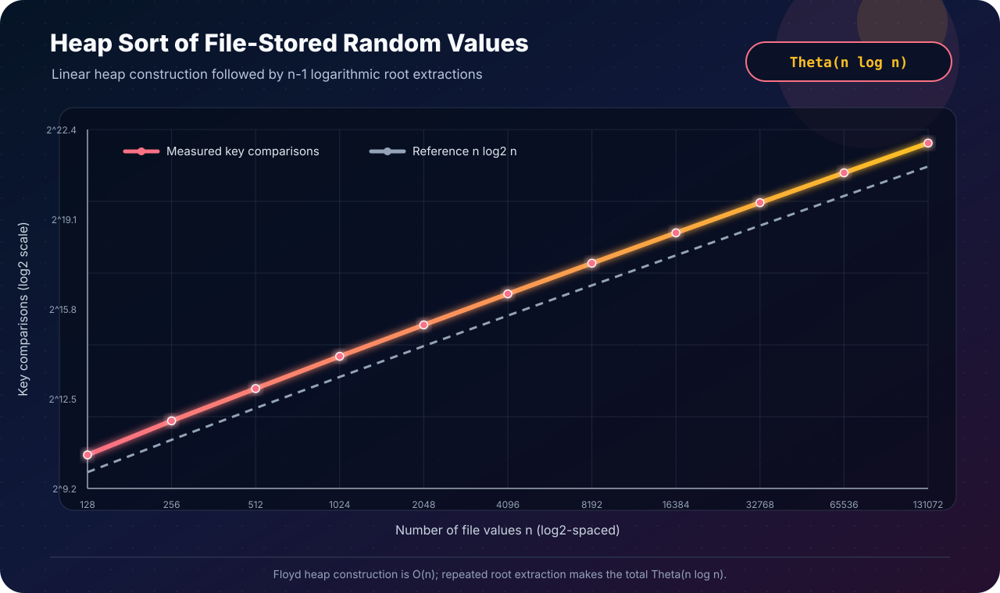

[← Lab 05](../README.md) · [Main repository](../../README.md)

# Q4 · Heap Sort of Random File-Stored Values

The program generates `N` pseudo-random integers, stores them in a text file,
reads exactly those values back, sorts them with **heap sort**, and writes a
second file containing the nondecreasing result.

<p align="center"></p>

## File format

Both the generated and sorted files are deliberately simple and portable:

```text
N
value_1 value_2 ... value_N
```

The reader rejects a zero or excessive count, missing values, trailing tokens,
and allocation or file errors. The committed
[`q4_random_input.txt`](q4_random_input.txt) and
[`q4_sorted_output.txt`](q4_sorted_output.txt) form one reproducible example.

## Algorithm · build once, extract repeatedly

```text
HEAP-SORT(A, n)
    for parent = floor(n/2) - 1 downto 0
        SIFT-DOWN(A, parent, n)          // Floyd max-heap construction

    for end = n - 1 downto 1
        swap A[0], A[end]                // maximum reaches final position
        SIFT-DOWN(A, 0, end)             // repair the smaller heap
```

The array representation uses children `2i + 1` and `2i + 2`. Only indices
strictly below `heap_size` are examined, and the implementation avoids unsigned
index underflow by writing the reverse build loop as `start > 0` followed by
`start - 1`.

## Why it is correct

### Lemma 1 · heap construction

All leaves are already one-element max-heaps. Processing the internal nodes
from right to left and bottom to top calls `SIFT-DOWN` only after both child
subtrees are heaps. The larger child is promoted whenever it exceeds its
parent, so the subtree rooted at the current node becomes a max-heap. By
induction, the entire array is a max-heap.

### Lemma 2 · extraction invariant

Before an extraction, `A[0..end]` is a max-heap and `A[end+1..n-1]` is sorted,
contains the globally largest removed values, and is no smaller than any heap
value. The root is therefore the largest remaining value. Swapping it with
`A[end]` extends the sorted suffix by one, and sifting the new root restores the
heap without touching that suffix.

When `end = 1` has been processed, the heap has one element and the suffix has
the remaining elements in order. Thus the whole array is sorted. Swaps only
rearrange existing values, so the output is a permutation of the input.

## Complexity analysis

| Stage | Time | Why |
|---|---:|---|
| Generate and write the random file | `Θ(n)` | one generated value and one write per element |
| Read the file | `Θ(n)` | exactly `n` values are parsed |
| Floyd max-heap construction | `Θ(n)` | most nodes are near the leaves and travel only a few levels |
| `n - 1` maximum extractions | `Θ(n log n)` | each root repair has height at most `log₂n` |
| Write the sorted file | `Θ(n)` | one output value per element |
| **Complete pipeline** | **`Θ(n log n)`** | heap sort dominates the linear file passes |

Unlike quick sort, standard heap sort has `Θ(n log n)` time in the best,
average, and worst cases. The sorting phase itself uses `O(1)` auxiliary space.
The complete file program holds the `n` loaded values in memory, so its total
array storage is `Θ(n)`.

## Program 1 · complete file workflow

File: [`q4_heap_sort_file.c`](q4_heap_sort_file.c)

```bash
gcc -std=c17 -O2 -Wall -Wextra -Wpedantic q4_heap_sort_file.c -o q4_heap_sort_file
./q4_heap_sort_file
```

The generator is deterministic for the same `N` and seed, making a failed run
reproducible. The program reports a preview and verifies:

- the array after Floyd's build phase satisfies the max-heap property;
- the final array is nondecreasing;
- three order-independent 64-bit fingerprints are unchanged, protecting the
  input multiset while keeping heap sort's in-place implementation intact.

The complete example interaction is in
[`q4_sample_output.txt`](q4_sample_output.txt).

## Program 2 · deterministic validation

File: [`q4_experimental_validation.c`](q4_experimental_validation.c)

The validator first covers empty, singleton, duplicate-heavy, already sorted,
and reverse-sorted arrays. For every measured size from `128` through `131072`,
it then:

1. builds a deterministic random input;
2. heap-sorts one copy;
3. independently sorts another copy with the C library;
4. requires the arrays to match byte for byte;
5. records build comparisons, extraction comparisons, and swaps.

All checks must pass before a row remains in
[`q4_experimental_data.dat`](q4_experimental_data.dat). The run transcript is
[`q4_experiment_output.txt`](q4_experiment_output.txt).

## Program 3 · visual complexity evidence

File: [`q4_plot_complexity.c`](q4_plot_complexity.c)

<p align="center"></p>

The log-scale measured curve stays parallel to the `n log₂n` reference. The
ratio rises slowly toward a constant (about `1.82` at the largest committed
size), which is the expected signature of `Θ(n log n)` growth.

## Edge cases handled

- `N = 1` and a heap with no internal nodes;
- repeated, negative, and zero values;
- already sorted and reverse-sorted inputs;
- a final heap of size one;
- deterministic seed `0`;
- invalid counts, malformed/truncated files, extra file tokens, and failed I/O;
- memory allocation failure;
- safe child indexing for the declared maximum `N`.

## Viva conclusion

> Floyd's bottom-up pass builds the max-heap in linear time. Each of the
> `n - 1` extractions moves the maximum into its final slot and repairs a heap
> of logarithmic height. Therefore heap sort is `Θ(n log n)` in every case and
> needs only `O(1)` space beyond the array being sorted; the surrounding file
> workflow adds only linear work.
