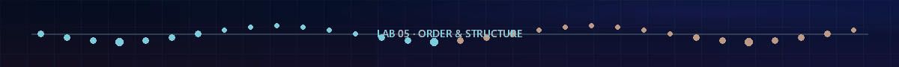

<p align="center">
  
</p>

<p align="center">
  
  
  
  
  
</p>

<h1 align="center">DAA Laboratory · Lab 05</h1>
<p align="center"><strong>Median without sorting · k-th order statistics · randomized three-way Quick Sort · worst-case Heap Sort</strong></p>
<p align="center">Student: <strong>Satyam Dhal</strong> · Instructor: <strong>Dr. Ajaya Kumar Dash</strong> · 25 August 2026</p>

<p align="center"></p>
<p align="center"><strong><a href="../README.md">← Main repository</a></strong> · <a href="Problem-Sheet-Lab-05.jpeg">Original problem sheet</a></p>

## Laboratory dashboard

| Question | Required task | Submitted algorithm | Validation performed | Final bound |
|:---:|---|---|---|:---:|
| **[Q1 · Median](Q-1/README.md)** | Find the median without sorting the list | Deterministic BFPRT; select one middle rank for odd `n`, two for even `n` | 29,541 oracle-checked cases, exact half-integer output, signed extremes | `Θ(n)` worst-case |
| **[Q2 · K-th Smallest](Q-2/README.md)** | Find the `k`-th smallest without sorting the list | Deterministic BFPRT with 1-based rank and three-way partitioning | Every rank on edge families, 2,000 fuzz arrays, 55 scaling trials | `Θ(n)` worst-case |
| **[Q3 · Quick Sort File](Q-3/README.md)** | Quick-sort `N` random elements stored in a file | Seeded randomized three-way Quick Sort with smaller-side recursion | Both file round trips, exact sorted oracle, multiset fingerprint, stack bound | Expected `Θ(n log n)`; worst `Θ(n²)` |
| **[Q4 · Heap Sort File](Q-4/README.md)** | Heap-sort `N` random elements stored in a file | Floyd max-heap construction followed by repeated extraction | Heap invariant, exact sorted oracle, multiset fingerprint, file outputs | `Θ(n log n)` all cases |

<p align="center">
  
</p>

## Four questions, three structural ideas

<table>
<tr>
<td width="33%" valign="top">

### 1 · Select only one rank

Q1 and Q2 never establish the complete order. Groups of five produce a guaranteed pivot, and a linear three-way partition discards a fixed fraction before selection continues.

```text
groups of 5 → pivot → rank band
```

</td>
<td width="33%" valign="top">

### 2 · Partition around a pivot

Q3 uses a uniformly selected seeded pivot. Three-way partitioning resolves all duplicates equal to that pivot at once; smaller-side recursion keeps the stack logarithmic.

```text
< pivot | = pivot | > pivot
```

</td>
<td width="33%" valign="top">

### 3 · Maintain a global structure

Q4 first makes the array a max-heap. The root is always the largest active value, so each extraction fixes one final output position with a deterministic bound.

```text
build heap → extract max → repair
```

</td>
</tr>
</table>

<p align="center"></p>

## Visual gallery

<table>
<tr>
<td width="50%" align="center" valign="top">

### Q1 · Median via BFPRT

<a href="Q-1/README.md"></a>

**Watch:** local groups reveal a pivot; only the side containing a middle rank continues.

</td>
<td width="50%" align="center" valign="top">

### Q2 · Any requested rank

<a href="Q-2/README.md"></a>

**Watch:** the requested one-based rank is updated as proven-discarded bands disappear.

</td>
</tr>
<tr>
<td width="50%" align="center" valign="top">

### Q3 · Three-way Quick Sort

<a href="Q-3/README.md"></a>

**Watch:** generated file values pass through `<`, `=`, and `>` pivot bands before the verified output file is written.

</td>
<td width="50%" align="center" valign="top">

### Q4 · Heap tree to sorted suffix

<a href="Q-4/README.md"></a>

**Watch:** the active heap shrinks while the final nondecreasing suffix grows from the right.

</td>
</tr>
</table>

## Correctness details that matter

| Question | Easy-to-miss detail | How the implementation protects it |
|:---:|---|---|
| Q1 | Even `n` needs the exact average of two ranks; adding signed extremes can overflow | Two BFPRT selections plus an integer/half-integer formatter that never forms `lower + upper` |
| Q2 | Duplicates can make two-way selection recurse one pivot copy at a time | One three-way partition resolves the complete equal band; `1 ≤ k ≤ n` is checked before selection |
| Q3 | A correct in-memory result does not prove that the required file was used | Generated and sorted files are reopened, parsed, counted, fingerprinted, and checked after writing |
| Q3 | Conventional recursion can use `Θ(n)` stack on bad partitions | Recurse only on the smaller strict side and iterate over the larger side |
| Q4 | Treating heap construction as `n` independent height-`log n` operations gives a loose analysis | Floyd's bottom-up sum is derived as `Θ(n)`; extraction supplies the `Θ(n log n)` term |
| Q4 | Sortedness alone could hide a lost or duplicated value | The validator compares with an independent exact sorted copy; the interactive run also checks an order-independent fingerprint |

## Complexity evidence

| Q | Measured dominant work | Reference used in the SVG | Result |
|:---:|---|---|---|
| 1 | BFPRT comparisons + array writes for both even-`n` middle selections | linear guide `40n` | bounded work per element; worst-case proof is `Θ(n)` |
| 2 | Average BFPRT comparisons across five ranks | linear guide `10n` | bounded comparisons per element; worst-case proof is `Θ(n)` |
| 3 | Seeded randomized Quick Sort comparisons and swaps | `n log₂n` | expected-growth curves remain parallel to the reference |
| 4 | Heap construction + extraction key comparisons | `n log₂n` | measured/reference ratio approaches a constant |

Every scaling row is produced by deterministic input and is rejected if its correctness checks fail. `qsort` is used only inside separate validators as an oracle—never by any submitted solution.

## Repository map

```text
lab5/
├── README.md
├── Problem-Sheet-Lab-05.jpeg
├── Makefile
├── build_windows.bat
├── common/
│   └── svg_plot.h
├── assets/
│   ├── lab5_banner.gif
│   ├── animated_divider.gif
│   ├── pipeline.gif
│   └── selection_sorting_gallery.gif
├── Q-1/                              ← median via BFPRT
├── Q-2/                              ← k-th smallest via BFPRT
├── Q-3/                              ← generated-file Quick Sort
└── Q-4/                              ← generated-file Heap Sort
```

Each question folder keeps its main solution, validator, plot generator, measured `.dat`, SVG, GIF, sample transcript, experiment transcript, and proof-oriented README together.

## Build everything

### Linux / macOS / MSYS2 shell

```bash
cd lab5
make all          # compile all 12 C programs into bin/
make evidence     # rerun every validator and regenerate all four SVGs
make strict       # compile every C source with warnings treated as errors
```

### Windows Command Prompt

```bat
cd lab5
build_windows.bat
```

This writes native `.exe` files into each question's `output` directory using the same C17 warning flags.

### Compile one question manually

```bash
cd lab5/Q-2
gcc -std=c17 -O2 -Wall -Wextra -Wpedantic q2_kth_smallest.c -o q2_kth_smallest
./q2_kth_smallest
```

The committed `.dat`, `.svg`, `.gif`, random input/output examples, and transcripts make the repository complete immediately after download; rebuilding is optional.

<p align="center"></p>

## Final conclusions

| Task | Structural decision | Final result |
|---|---|---|
| Median | Select only the middle rank(s) with a guaranteed BFPRT pivot | `Θ(n)` worst-case |
| K-th smallest | Preserve the target rank through duplicate-safe partitions | `Θ(n)` worst-case |
| Quick Sort file | Use seeded random pivots, three-way bands, and smaller-side recursion | Expected `Θ(n log n)`, worst `Θ(n²)`, `O(log n)` stack |
| Heap Sort file | Build a max-heap once, then fix one suffix position per extraction | `Θ(n log n)` best/average/worst, `O(1)` sorting space |

<p align="center">
  
  
  
  
</p>

<p align="center"><strong>Four complete solutions, each tied to a proof, an independent check, measured evidence, and a frame-by-frame visual explanation.</strong></p>
<p align="center"><strong><a href="../README.md">← Back to the DAA Laboratory repository</a></strong></p>
