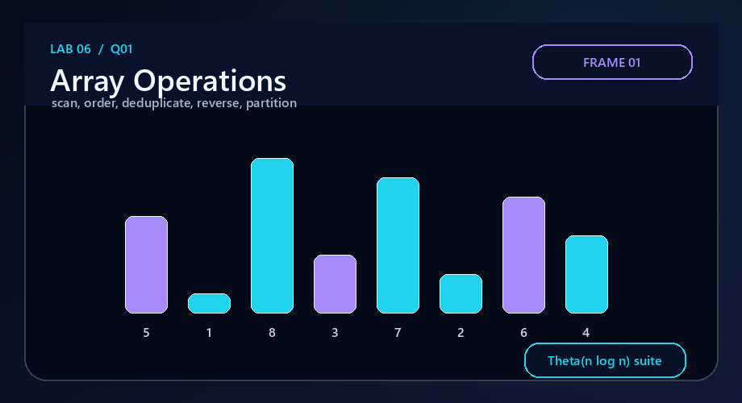
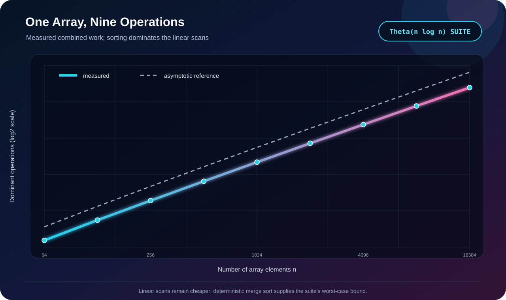

# Q1 · One-Dimensional Array Operations



[← Lab 06 dashboard](../README.md) · [Problem sheet](../Problem-Sheet-Lab-06.pdf)

## Problem

For one unsorted integer array, implement and analyse maximum, first/second largest, mean, median, population standard deviation, mode, duplicate removal, reversal, and the requested reverse-direction pivot partition (`>= pivot` before `< pivot`).

## Representation and decisions

The input stays in a contiguous `long long` array. Read-only scans preserve it. Operations that need order use a deterministic merge-sorted copy, making their worst-case bound explicit instead of relying on an implementation-dependent library sort. “Second largest” means the second **distinct** value; if it does not exist, the program says so. Mode ties resolve to the smallest value because the sorted scan encounters it first.

| Operation | Method | Worst-case time | Auxiliary space |
|---|---|:---:|:---:|
| Maximum | complete scan | `Θ(n)` | `Θ(1)` |
| Largest + second distinct | one candidate-maintaining scan | `Θ(n)` | `Θ(1)` |
| Mean | exact long-double accumulation | `Θ(n)` | `Θ(1)` |
| Median | deterministic merge sort + middle rank(s) | `Θ(n log n)` | `Θ(n)` |
| Population standard deviation | mean, then squared-deviation scan | `Θ(n)` | `Θ(1)` |
| Mode | sorted run-length scan | `Θ(n log n)` | `Θ(n)` |
| Remove duplicates | sorted adjacent compaction | `Θ(n log n)` | `Θ(n)` |
| Reverse | symmetric copy | `Θ(n)` | `Θ(n)` output |
| Partition | two stable passes: `>= pivot`, then `< pivot` | `Θ(n)` | `Θ(n)` output |

## Correctness sketch

The max and two-largest invariants retain exactly the largest one/two distinct values of every processed prefix. Merge sort establishes nondecreasing order, so middle positions define the median, equal runs define frequencies, and one representative per run is exactly the unique set. The partition writes every input value once to exactly one of two exhaustive predicates; therefore it preserves the multiset and establishes the requested boundary.

## Evidence



The validator checks sort order, exact reversal, and both sides of every generated partition. The combined suite follows the `n log n` reference because deterministic sorting dominates its linear scans.

## Files and run

| File | Purpose |
|---|---|
| `q1_algorithms.h` | reusable implementations and operation counter |
| `q1_array_operations.c` | interactive solution |
| `q1_experimental_validation.c` | deterministic invariant checks and `.dat` generation |
| `q1_plot_complexity.c` | SVG evidence generator |
| `q1_sample_output.txt` / `q1_experiment_output.txt` | reproducible transcripts |

```bash
gcc -std=c17 -O2 -Wall -Wextra -Wpedantic q1_array_operations.c -lm -o q1
./q1
```

**Conclusion:** the suite is `Θ(n log n)` in the worst case as implemented; every scan-only operation remains individually `Θ(n)`.
