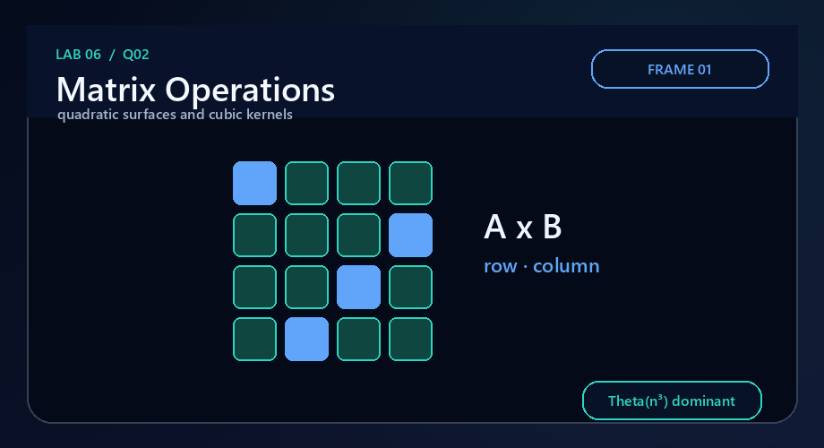
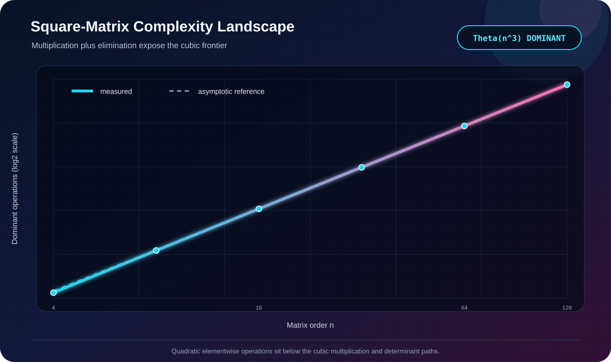

# Q2 · Square-Matrix Operations



[← Lab 06 dashboard](../README.md) · [Problem sheet](../Problem-Sheet-Lab-06.pdf)

## Problem

Implement and analyse square-matrix addition, multiplication, zero and symmetry tests, determinant, in-place transpose, and an eigenvalue/eigenvector procedure.

## Representation and algorithms

Matrices use one contiguous row-major `double[n*n]` block. This makes element indexing explicit and keeps allocation/cleanup simple.

| Operation | Algorithm | Worst-case work |
|---|---|:---:|
| Addition | one pass over all entries | `Θ(n²)` |
| Multiplication | classical `i-k-j` triple loop | `Θ(n³)` |
| Zero test | scan with numerical tolerance | `Θ(n²)` |
| Symmetry test | compare strict upper/lower triangles | `Θ(n²)` |
| Determinant | Gaussian elimination with partial pivoting | `Θ(n³)` |
| In-place transpose | swap entries above the diagonal | `Θ(n²)` |
| Dominant eigenpair | normalized power iteration + Rayleigh quotient | `Θ(kn²)` for `k` iterations |

The eigen routine intentionally states its numerical contract: it approximates the dominant eigenpair until tolerance or a fixed iteration cap. It is not presented as an exact symbolic eigensolver.

## Correctness sketch

Addition and multiplication follow their definitions entry-by-entry. The zero/symmetry predicates inspect every relevant entry in the worst case. Each transpose swap exchanges `(i,j)` with `(j,i)` exactly once. Row swaps change determinant sign; elimination preserves determinant after accounting for the diagonal pivots, so their product gives `det(A)`. Under the standard power-method condition of a unique dominant-magnitude eigenvalue with a nonorthogonal start vector, repeated normalization converges to its eigenvector.

## Validation and evidence



The validator checks multiplication by identity, transposing twice, a known determinant, and a diagonal matrix whose dominant eigenvalue is exactly `9`. Scaling runs accept data only when all generated outputs remain finite.

```bash
gcc -std=c17 -O2 -Wall -Wextra -Wpedantic q2_matrix_operations.c -lm -o q2
./q2
```

**Conclusion:** the complete suite is dominated by the `Θ(n³)` multiplication/determinant kernels; power iteration is `Θ(kn²)` and all remaining operations are quadratic.
