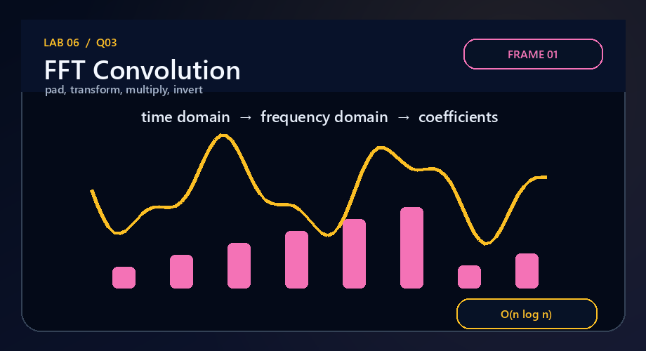
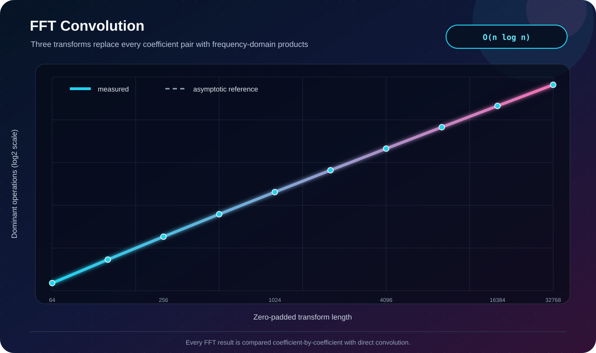

# Q3 · Convolution in `O(n log n)`



[← Lab 06 dashboard](../README.md) · [Problem sheet](../Problem-Sheet-Lab-06.pdf)

## Problem

For vectors `A` and `B` of lengths `m` and `n` (`n ≥ m`), compute the `m+n-1` convolution coefficients faster than the direct `Θ(mn)` pair enumeration.

## Algorithm

1. Choose power-of-two length `L ≥ m+n-1` and zero-pad both vectors.
2. Compute both discrete Fourier transforms with radix-2 Cooley-Tukey butterflies.
3. Multiply corresponding frequency values.
4. Apply the inverse FFT and keep the first `m+n-1` real coefficients.

The implementation uses an iterative bit-reversed layout, which executes the same divide-and-conquer butterfly recursion without recursive stack overhead.

```text
T(L) = 2T(L/2) + Θ(L) = Θ(L log L)
```

Because `L < 2(m+n)`, time is `O((m+n) log(m+n))`; under `n ≥ m`, this is `O(n log n)`. Space is `Θ(m+n)`.

## Why it is correct

Zero-padding prevents circular wraparound. The convolution theorem says the DFT of the coefficient convolution is the componentwise product of the two DFTs. The inverse transform therefore recovers exactly the desired linear-convolution coefficients, subject only to floating-point roundoff.

## Independent validation



Every generated vector pair is also convolved by the direct double loop. All coefficients must agree within a scale-aware tolerance before the row is written. The measured quantity is FFT butterflies, producing the expected `L log₂L` signature.

```bash
gcc -std=c17 -O2 -Wall -Wextra -Wpedantic q3_fft_convolution.c -lm -o q3
./q3
```

**Conclusion:** frequency-domain multiplication reduces convolution from quadratic pair work to `O(n log n)` for the required `n ≥ m` case.
