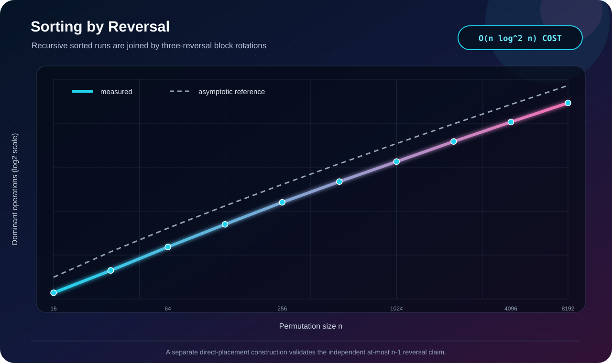

# Q4 · Sorting with Reversals Only


[← Lab 06 dashboard](../README.md) · [Problem sheet](../Problem-Sheet-Lab-06.pdf)

## Two required claims

### Any permutation needs only `O(n)` reversals

For target position `i`, find value `i+1` and reverse the segment from `i` through that value. The reversal fixes position `i`; later reversals start to its right and never disturb it. At most one reversal is used for each of the first `n-1` positions, so the count is at most `n-1 = O(n)`. Its length cost can be quadratic.

### Sorting with `O(n log² n)` reversal-length cost

The second implementation is merge sort whose merge is performed in place by block rotations. A rotation

```text
A B  →  B A
```

uses exactly three allowed operations: `reverse(A)`, `reverse(B)`, `reverse(AB)`. Binary searches choose cuts in two sorted runs; one rotation moves the middle blocks, and two smaller merge problems remain.

## Proof and bounds

The recursive merge preserves sorted subranges and partitions their values around the chosen cut; by induction, both recursive merges are sorted and their boundary order is valid. Therefore the entire interval is sorted. Merge rotation work satisfies `M(n)=O(n log n)` in reversal-length cost. The outer recurrence is

```text
S(n) = 2S(n/2) + O(n log n) = O(n log² n).
```

The same implementation uses only reversals to move elements; comparisons and binary searches do not mutate the permutation.

## Evidence



Each deterministic permutation is sorted by both methods. The validator requires nondecreasing output and checks the direct method’s exact `≤ n-1` reversal bound. The plot counts total reversed-segment length for the cost-efficient method.

```bash
gcc -std=c17 -O2 -Wall -Wextra -Wpedantic q4_reversal_sort.c -lm -o q4
./q4
```

**Conclusion:** direct placement proves the linear reversal-count claim; recursive rotate-merge provides the required `O(n log² n)` length-cost guarantee.
