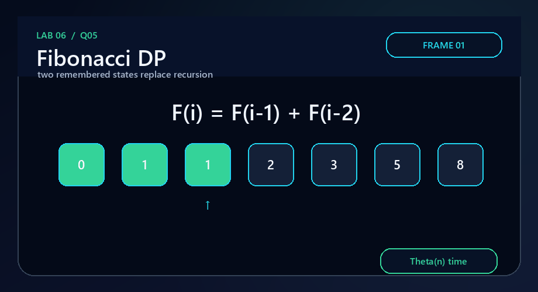
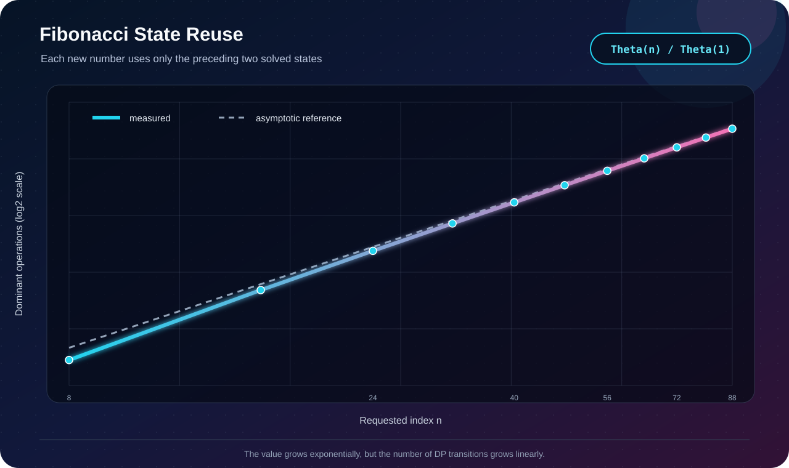

# Q5 · Fibonacci by Dynamic Programming



[← Lab 06 dashboard](../README.md) · [DP supplement](../Problem-Sheet-Lab-06-DP-Supplement.jpeg)

## Algorithm

Bottom-up dynamic programming computes every state once. Since state `i` needs only states `i-1` and `i-2`, the full table collapses to two `uint64_t` variables.

```text
previous = F(0), current = F(1)
for i = 2..n:
    previous, current = current, previous + current
```

The program accepts `0 ≤ n ≤ 93`; `F(94)` does not fit in unsigned 64-bit arithmetic.

## Correctness

Initially the two variables equal `F(0)` and `F(1)`. One transition replaces them by `F(i-1)` and `F(i)` using the Fibonacci recurrence. Induction establishes that the final `current` is `F(n)`.

| Measure | Bound |
|---|:---:|
| Time | `Θ(n)` |
| Auxiliary space | `Θ(1)` |



Validation locks the first eleven values and the largest safe endpoint `F(93) = 12200160415121876738`.

```bash
gcc -std=c17 -O2 -Wall -Wextra -Wpedantic q5_fibonacci_dp.c -o q5
./q5
```
