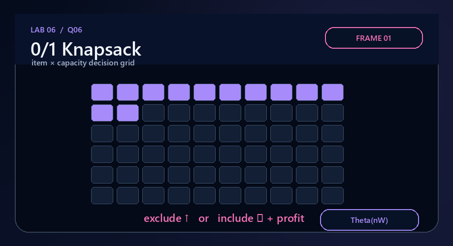
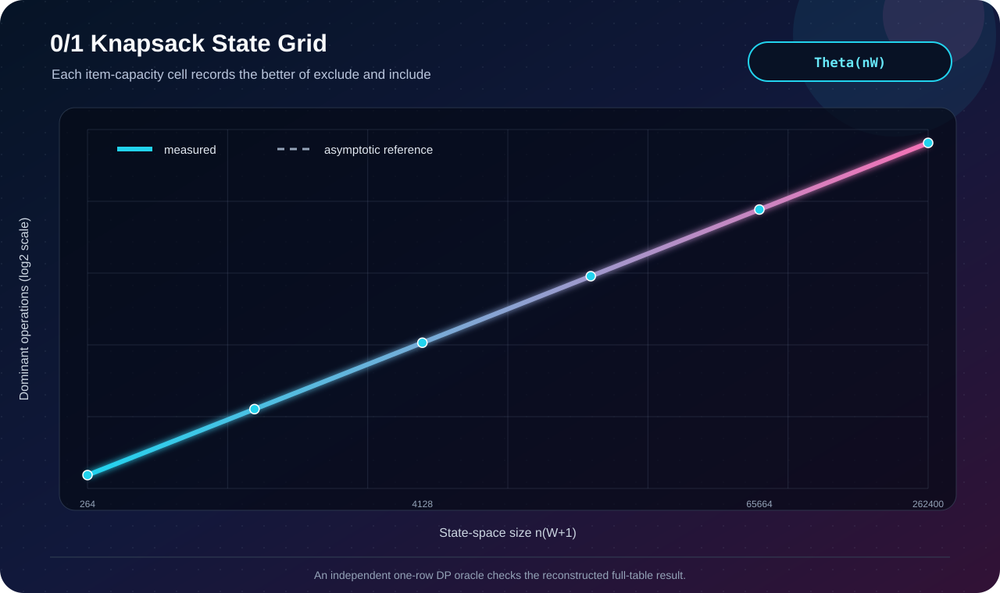

# Q6 · 0/1 Knapsack by Dynamic Programming



[← Lab 06 dashboard](../README.md) · [DP supplement](../Problem-Sheet-Lab-06-DP-Supplement.jpeg)

## State and recurrence

`dp[i][w]` is the best profit available from the first `i` items at capacity `w`.

```text
dp[i][w] = dp[i-1][w]                                  if weight[i] > w
dp[i][w] = max(dp[i-1][w], profit[i] + dp[i-1][w-weight[i]]) otherwise
```

Rows use only the preceding row, so each item is either excluded or included exactly once. The committed solution retains the full table because the question benefits from reconstructing and printing the chosen items.

## Correctness

Every feasible solution over the first `i` items either excludes item `i` or includes it. The two recurrence branches are therefore exhaustive and disjoint; taking their better profit is optimal. Induction on `i` proves every cell, and backtracking through unequal adjacent-row values recovers one optimal subset.

| Measure | Bound |
|---|:---:|
| Time | `Θ(nW)` |
| DP + reconstruction space | `Θ(nW)` |



The validator compares the result against an independently implemented one-row 0/1 DP oracle and checks the canonical capacity-50 answer `220`.

```bash
gcc -std=c17 -O2 -Wall -Wextra -Wpedantic q6_knapsack_dp.c -o q6
./q6
```
