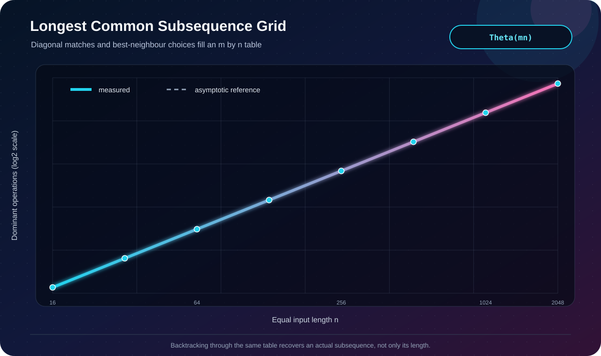

# Q7 · Longest Common Subsequence


[← Lab 06 dashboard](../README.md) · [DP supplement](../Problem-Sheet-Lab-06-DP-Supplement.jpeg)

## State and recurrence

For prefixes `A[0..i)` and `B[0..j)`, `dp[i][j]` stores the LCS length.

```text
A[i-1] == B[j-1] : dp[i][j] = 1 + dp[i-1][j-1]
otherwise         : dp[i][j] = max(dp[i-1][j], dp[i][j-1])
```

After filling the table, backtracking moves diagonally on a match and toward a maximum neighbor on a mismatch. Characters collected in reverse form an actual longest common subsequence.

## Correctness

If final characters match, an optimal common subsequence can include that character after an optimal solution for both shorter prefixes. If they differ, an LCS must omit at least one of them, and the better of the two shorter-prefix states is optimal. This exhaustive case split proves the recurrence; backtracking follows only equality-preserving predecessor states.

| Measure | Bound |
|---|:---:|
| Time | `Θ(mn)` |
| Space with subsequence recovery | `Θ(mn)` |



The validator checks the classic `AGGTAB` / `GXTXAYB` length `4`, confirms the reported text is a subsequence of both inputs, and compares every scaling run with an independent two-row length oracle.

```bash
gcc -std=c17 -O2 -Wall -Wextra -Wpedantic q7_lcs_dp.c -o q7
./q7
```
