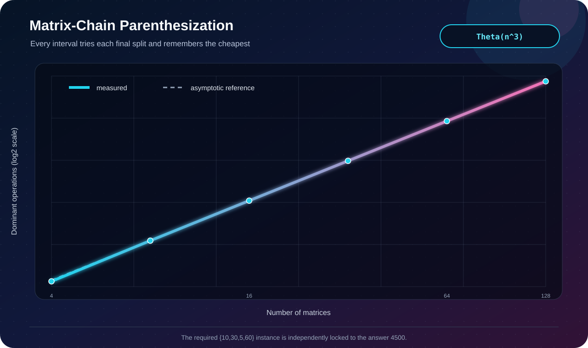

# Q8 · Matrix-Chain Multiplication


[← Lab 06 dashboard](../README.md) · [DP supplement](../Problem-Sheet-Lab-06-DP-Supplement.jpeg)

## Problem and state

Given dimensions `p[0..N-1]` for `N-1` compatible matrices, choose only the parenthesization—the mathematical product is unchanged—to minimize scalar multiplications.

`cost[i][j]` is the minimum cost of multiplying matrices `Ai..Aj`. For every possible final split `k`:

```text
cost[i][j] = min(cost[i][k] + cost[k+1][j]
                 + p[i] * p[k+1] * p[j+1])
```

A parallel split table reconstructs the complete optimal parenthesization.

## Correctness

Every full parenthesization has exactly one final multiplication, splitting the chain at some `k`. The subchains on both sides must themselves be optimally parenthesized—otherwise replacing one would improve the full solution. Trying every `k` and taking the minimum is therefore both exhaustive and optimal.

| Measure | Bound |
|---|:---:|
| Time | `Θ(n³)` for `n=N-1` matrices |
| Cost + split tables | `Θ(n²)` |



The required example is locked into the validator:

```text
dimensions = {10, 30, 5, 60}
optimal     = ((A1 x A2) x A3)
cost        = 4500
```

The independent CLRS case must also return `15125`; small-chain recursion supplies an oracle outside the DP implementation.

```bash
gcc -std=c17 -O2 -Wall -Wextra -Wpedantic q8_matrix_chain_dp.c -o q8
./q8
```
