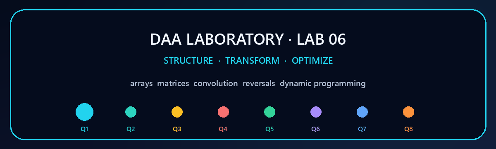
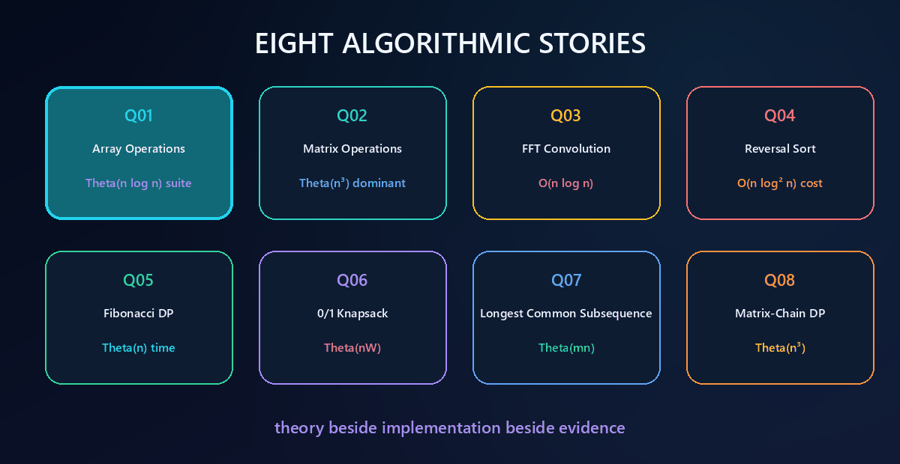
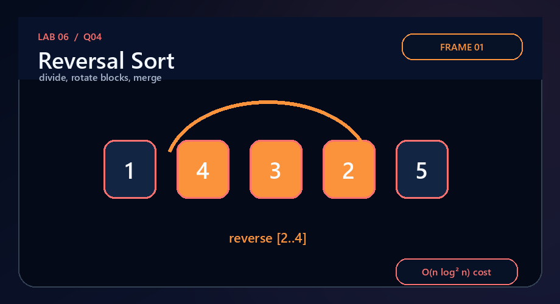
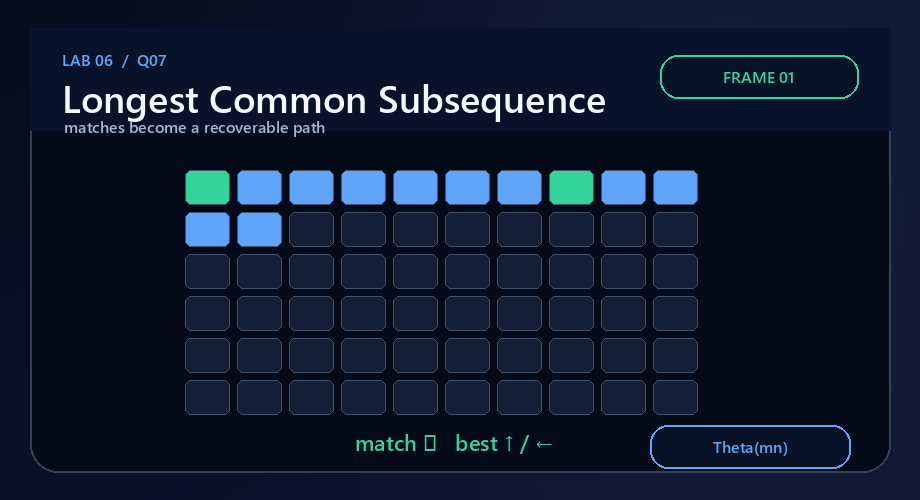
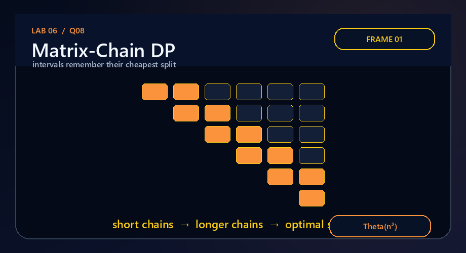
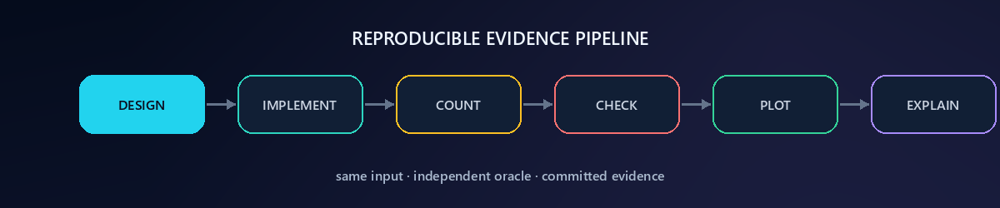

<p align="center">
  
</p>

<p align="center">
  
  
  
  
  
</p>

<h1 align="center">DAA Laboratory · Lab 06</h1>
<p align="center"><strong>Array and matrix kernels · FFT convolution · reversal-cost sorting · four dynamic programs</strong></p>
<p align="center">Student: <strong>Satyam Dhal</strong> · Instructor: <strong>Dr. Ajaya Kumar Dash</strong> · 31 August 2026</p>

<p align="center"></p>
<p align="center"><strong><a href="../README.md">← Main repository</a></strong> · <a href="Problem-Sheet-Lab-06.pdf">Official problem sheet</a> · <a href="Problem-Sheet-Lab-06-DP-Supplement.jpeg">DP supplement</a></p>

## Source map

The two supplied documents contain different question sets. Nothing was discarded or silently merged:

| Source | Lab 06 folders | Content |
|---|---|---|
| Official two-page PDF | Q1–Q4 | 1D arrays, square matrices, `O(n log n)` convolution, reversal-only sorting |
| Attached DP image | Q5–Q8 | Fibonacci, 0/1 knapsack, LCS, matrix-chain multiplication |

That produces one coherent eight-question Lab 06 while preserving traceability to both originals.

## Laboratory dashboard

| Q | Required task | Submitted algorithm | Independent validation | Final bound |
|:---:|---|---|---|:---:|
| **[1](Q-1/README.md)** | Nine operations over one unsorted array | linear scans + deterministic merge-sorted working copy + stable reverse partition | sorted/reversal/partition invariants across deterministic data | suite `Θ(n log n)` |
| **[2](Q-2/README.md)** | Seven square-matrix operations | row-major kernels, partial-pivot elimination, power iteration | identity product, transpose involution, determinant and known eigenpair | dominant `Θ(n³)` |
| **[3](Q-3/README.md)** | Convolution in `O(n log n)` | zero-padded radix-2 FFT, pointwise multiply, inverse FFT | every coefficient compared with direct convolution | `O(n log n)` |
| **[4](Q-4/README.md)** | Sort using only reversals | direct placement + recursive three-reversal rotate-merge | sortedness plus exact `≤ n-1` direct reversal count | `O(n log² n)` cost |
| **[5](Q-5/README.md)** | `n`th Fibonacci via DP | bottom-up two-state recurrence | known values through the `uint64_t` boundary | `Θ(n)` / `Θ(1)` |
| **[6](Q-6/README.md)** | 0/1 knapsack with chosen items | full item-capacity DP + backtracking | independent one-row 0/1 DP oracle | `Θ(nW)` |
| **[7](Q-7/README.md)** | LCS length and subsequence | prefix DP + path reconstruction | two-row length oracle + subsequence predicates | `Θ(mn)` |
| **[8](Q-8/README.md)** | Minimum matrix-chain cost | interval DP + split reconstruction | required `4500`, CLRS `15125`, recursive oracle | `Θ(n³)` |

<p align="center">
  
</p>

## Visual gallery

<table>
<tr>
<td width="50%" align="center" valign="top"><h3>Q1 · Array workbench</h3><a href="Q-1/README.md"></a><br><sub>Watch scans give way to sorted runs and the requested reversed partition.</sub></td>
<td width="50%" align="center" valign="top"><h3>Q2 · Matrix kernels</h3><a href="Q-2/README.md"></a><br><sub>Watch quadratic surfaces feed cubic multiplication and elimination.</sub></td>
</tr>
<tr>
<td width="50%" align="center" valign="top"><h3>Q3 · FFT butterflies</h3><a href="Q-3/README.md"></a><br><sub>Watch coefficients move through frequency space instead of all pairs.</sub></td>
<td width="50%" align="center" valign="top"><h3>Q4 · Reversal merge</h3><a href="Q-4/README.md"></a><br><sub>Watch a block rotation emerge from three legal reversals.</sub></td>
</tr>
<tr>
<td width="50%" align="center" valign="top"><h3>Q5 · Fibonacci states</h3><a href="Q-5/README.md"></a><br><sub>Watch exponential recursion collapse to one linear stream of states.</sub></td>
<td width="50%" align="center" valign="top"><h3>Q6 · Knapsack grid</h3><a href="Q-6/README.md"></a><br><sub>Watch include/exclude decisions fill item-capacity cells.</sub></td>
</tr>
<tr>
<td width="50%" align="center" valign="top"><h3>Q7 · LCS backtrack</h3><a href="Q-7/README.md"></a><br><sub>Watch diagonal matches become a recoverable common subsequence.</sub></td>
<td width="50%" align="center" valign="top"><h3>Q8 · Matrix-chain splits</h3><a href="Q-8/README.md"></a><br><sub>Watch solved short intervals assemble an optimal parenthesization.</sub></td>
</tr>
</table>

<p align="center"></p>

## What is measured—and why

| Q | Dominant measured event | Oracle / invariant | Plot interpretation |
|:---:|---|---|---|
| 1 | comparisons and writes across scans + merge sort | order, exact reverse, partition predicates | sorting sets the suite’s `n log n` ceiling |
| 2 | arithmetic/comparisons in multiply + elimination | known algebraic identities/results | cubic kernels dominate elementwise work |
| 3 | FFT butterflies | direct `Θ(mn)` coefficient oracle | butterflies follow padded `L log L` |
| 4 | total reversed-segment length | two independently sorted outputs | rotate-merge remains under `n log²n` |
| 5 | recurrence transitions | exact values including `F(93)` | work increases one step per index |
| 6 | item-capacity states | independent one-row DP | work is linear in the DP grid size |
| 7 | prefix-pair states | two-row DP + subsequence checks | equal lengths expose quadratic growth |
| 8 | candidate final splits | fixed and recursive oracles | interval × interval × split gives cubic growth |

## Repository map

```text
lab6/
├── README.md
├── Problem-Sheet-Lab-06.pdf
├── Problem-Sheet-Lab-06-DP-Supplement.jpeg
├── Makefile
├── build_windows.bat
├── common/
│   └── plot_from_dat.h              ← shared polished SVG renderer
├── tools/
│   └── generate_gifs.py             ← deterministic visual regeneration
├── assets/                           ← banner, divider, pipeline, gallery
└── Q-1/ ... Q-8/
    ├── README.md
    ├── q*_algorithms.h / focused helper header
    ├── q*_main_solution.c
    ├── q*_experimental_validation.c
    ├── q*_plot_complexity.c
    ├── q*_experimental_data.dat
    ├── q*_evidence.svg
    ├── q*_walkthrough.gif
    └── sample + experiment transcripts
```

## Build everything

### Linux / macOS / MSYS2

```bash
cd lab6
make all
make evidence
make strict
```

### Windows

```bat
cd lab6
build_windows.bat
```

The strict check is equivalent to:

```bash
gcc -std=c17 -O2 -Wall -Wextra -Wpedantic -Werror source.c -lm
```

All 24 C sources pass those flags. The committed `.dat`, `.svg`, `.gif`, and transcripts make the lab reviewable immediately; rebuilding is optional.

## Final complexity map

| Growth | Lab 06 examples | Structural reason |
|---|---|---|
| `Θ(n)` | array scans, Fibonacci transitions | each state/element is processed once |
| `O(n log n)` | FFT convolution | logarithmic butterfly levels, linear work per level |
| `Θ(n log n)` | sorted array suite | deterministic divide-and-merge ordering |
| `O(n log² n)` | reversal-length sorting cost | `O(n log n)` rotation merge across merge-sort levels |
| `Θ(n²)` | elementwise matrix surface, equal-length LCS | every coordinate/prefix pair matters |
| `Θ(nW)` | 0/1 knapsack | every item-capacity combination is a state |
| `Θ(n³)` | matrix multiply, determinant, matrix chain | three independent indices / split choice |

<p align="center"></p>
<p align="center"><strong>Eight complete solutions: each implementation is attached to a proof, an independent check, measured evidence, and a frame-by-frame visual explanation.</strong></p>
<p align="center"><strong><a href="../README.md">← Back to the DAA Laboratory repository</a></strong></p>
