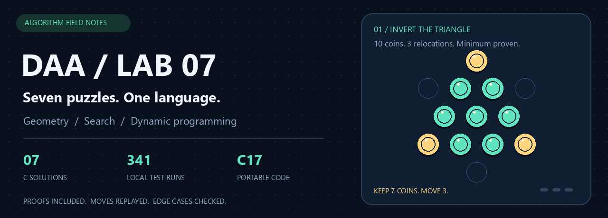

<p align="center">
  
</p>
<p align="center"></p>

<h1 align="center">DAA Laboratory · Lab 07</h1>
<p align="center"><strong>Coin geometry · egg testing · puzzle state graphs · moving-target search · sweep lines · matrix-chain DP</strong></p>
<p align="center">Student: <strong>Satyam Dhal</strong> · Instructor: <strong>Dr. Ajaya Kumar Dash</strong> · 8 September 2026</p>

<p align="center"><a href="https://github.com/b425050-prog/DAA-Lab">← Main repository</a> · <a href="Problem-Sheet-Lab-07.pdf">Official problem sheet</a> · <a href="INPUTS.md">Input guide</a> · <a href="VERIFICATION.md">Verification report</a></p>

## Laboratory dashboard

| Q | Required task | Submitted algorithm | Main C file |
|:---:|---|---|---|
| **[1](Q-1/README.md)** | Invert the Coin Triangle | Balanced corner relocation | [q1_coin_triangle.c](Q-1/q1_coin_triangle.c) |
| **[2](Q-2/README.md)** | Super Egg Testing | Coverage dynamic programming | [q2_egg_dropping_dp.c](Q-2/q2_egg_dropping_dp.c) |
| **[3](Q-3/README.md)** | Reve’s Puzzle | Frame–Stewart dynamic programming | [q3_reves_puzzle.c](Q-3/q3_reves_puzzle.c) |
| **[4](Q-4/README.md)** | Security Switches | Inverse Gray-code path | [q4_security_switches.c](Q-4/q4_security_switches.c) |
| **[5](Q-5/README.md)** | Hitting a Moving Target | Two sweeps and exhaustive belief sets | [q5_moving_target.c](Q-5/q5_moving_target.c) |
| **[6](Q-6/README.md)** | The Best Time to Be Alive | Death-before-birth event sweep | [q6_best_time_alive.c](Q-6/q6_best_time_alive.c) |
| **[7](Q-7/README.md)** | Matrix-Chain Multiplication | Interval DP and split reconstruction | [q7_matrix_chain_dp.c](Q-7/q7_matrix_chain_dp.c) |

The pictured four-row triangle needs **3 moves**; two eggs and 100 floors need **14 drops**; eight disks and four pegs need **33 moves**. Each question folder contains its code, proof, complexity analysis, sample input, and captured sample output.

## Repository map

```text
lab7/
├── README.md
├── Problem-Sheet-Lab-07.pdf
├── INPUTS.md + VERIFICATION.md
├── Makefile + build_windows.bat
├── common/
│   └── lab7_common.h
├── tools/
│   ├── build.py
│   ├── test_all.py
│   ├── capture_samples.py
│   └── generate_gifs.py
├── assets/
│   ├── lab7_banner.gif
│   ├── lab7_banner.png
│   └── lab7_badges.svg
└── Q-1/ ... Q-7/
    ├── README.md
    ├── q*_descriptive_solution.c
    ├── q*_sample_input.txt
    ├── q*_sample_output.txt
    └── output/                    ← native Windows build products (ignored)
```

The `lab7/Q-*` naming, descriptive `q*_*.c` files, `common/`, `tools/`, Makefile, and Windows build layout follow Labs 05–06. All algorithms remain in C; the build helper and independent test runner use Python's standard library. The optional GIF generator requires Pillow.

## Build and run

### Windows PowerShell

From the existing `DAA-Lab` repository:

```powershell
cd lab7
.\build_windows.bat
Get-Content Q-2/q2_sample_input.txt | .\Q-2\output\q2_egg_dropping_dp.exe
Get-Content Q-7/q7_sample_input.txt | .\Q-7\output\q7_matrix_chain_dp.exe
```

To enter your own values, pipe them into the executable:

```powershell
"2 100" | .\Q-2\output\q2_egg_dropping_dp.exe
"8" | .\Q-3\output\q3_reves_puzzle.exe --count
```

You can edit each `q*_sample_input.txt` file and rerun the same command. Full input formats, ranges, and interactive end-of-input keys are in [INPUTS.md](INPUTS.md).

### Linux / macOS / MSYS2

```bash
cd lab7
make all
./bin/Q-2/q2_egg_dropping_dp < Q-2/q2_sample_input.txt
make strict
make evidence
```

`make evidence` runs the independent tests and refreshes the sample output files. It requires Python 3.9+. It does not generate performance datasets or claim measured timing results.

### Compile a single question

```bash
cd lab7/Q-7
gcc -std=c17 -O2 -Wall -Wextra -Wpedantic -Werror q7_matrix_chain_dp.c -o q7
./q7 < q7_sample_input.txt
```

Keep `common/` in the lab folder; the source includes `../common/lab7_common.h`. Each question has its own build and input instructions.

## Verification

From `lab7/`:

```powershell
py -3 tools/test_all.py
```

Use `python3 tools/test_all.py` on Linux/macOS. The runner builds all seven programs using C17, treats warnings as errors, and checks **341 program executions** against independent oracles and move replays. See [VERIFICATION.md](VERIFICATION.md) for the local run and its coverage.

The additive `.github/workflows/lab7.yml` file included beside this folder runs GCC and Clang with sanitizers when Lab 07 changes. Its working directory is `lab7`, so it fits the existing repository. The remote workflow has not yet been run.

## Add to DAA-Lab

Copy **`lab7/`** into the repository root beside `lab6/`. Copy the supplied **`.github/workflows/lab7.yml`** into the repository's `.github/workflows/` folder. These are additions; the package does not replace the course README, root Makefile, or earlier labs.

Run Lab 07 from the repository root with `make -C lab7 all` or `make -C lab7 evidence`. The existing root Makefile is unchanged and will still select its original labs until you add a Lab 07 target.

To add a navigation entry to your existing course README:

```markdown
| [07](lab7/README.md) | 08 Sep 2026 | 7 | puzzles, adversarial search, sweep lines, and dynamic programming | Complete |
```

## Regenerate the animation

```bash
python3 -m pip install -r tools/requirements-art.txt
python3 tools/generate_gifs.py
```

The GIF depicts exactly three coin relocations. A static PNG is included beside it. Local assets render without an external animation service.

## References

- [Supplied Lab 07 handout](Problem-Sheet-Lab-07.pdf), dated 8 September 2026; question numbering is preserved.
- [McCaffrey and Atwill, *Inverting the 10-Coin Triangle Puzzle and Other Shapes*](https://arxiv.org/abs/1810.02202), for related coin geometry.
- [Bousch, *La quatrième tour de Hanoï*](https://www.imo.universite-paris-saclay.fr/~thierry.bousch/preprints/), for four-peg Hanoi optimality.
- [Britnell and Wildon, *Finding a princess in a palace*](https://arxiv.org/abs/1204.5490), for the related moving-target graph problem.
